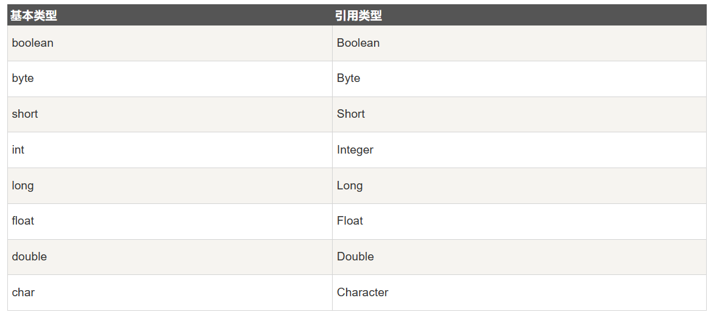

# 1.1 ArrayList

**ArrayList** 的实现是基于动态可扩容数组，底层是数组队列。与Java本身的数组不同，**ArrayList** 的大小不固定，可以随着添加元素来动态修改。

ArrayList 类位于 java.util 包中，使用前需要引入它，语法格式如下：

```java
import java.util.ArrayList; // 引入 ArrayList 类

ArrayList<E> objectName =new ArrayList<>();　 // 初始化
```

ArrayList 继承于 AbstractList ，实现了 List, RandomAccess, Cloneable, java.io.Serializable 这些接口。

```java
public class ArrayList<E> extends AbstractList<E>
        implements List<E>, RandomAccess, Cloneable, java.io.Serializable{

  }
```

- **List :** 表明它是一个列表，支持添加、删除、查找等操作，并且可以通过下标进行访问。

- **RandomAccess ：** 这是一个标志接口，表明实现这个接口的 List 集合是支持 快速随机访问 的。在 ArrayList 中，我们即可以通过元素的序号快速获取元素对象，这就是快速随机访问。

- **Cloneable ：** 表明它具有拷贝能力，可以进行深拷贝或浅拷贝操作。

- **Serializable :** 表明它可以进行序列化操作，也就是可以将对象转换为字节流进行持久化存储或网络传输，非常方便。

## **(1)传入是引用类型数据**

ArrayList 中的元素实际上是对象，在以上实例中，数组列表元素都是字符串 String 类型。

如果我们要存储其他类型，而 <E> 只能为引用数据类型，这时我们就需要使用到基本类型的包装类。

**基本类型对应的包装类表如下：**


**ArrayList** 传入引用类型数据的实例：

```java
import java.util.ArrayList;

public class RunoobTest {
    public static void main(String[] args) {
        ArrayList<Integer> myNumbers = new ArrayList<Integer>();
        myNumbers.add(10);
        myNumbers.add(15);
        myNumbers.add(20);
        myNumbers.add(25);
        for (int i : myNumbers) {
            System.out.println(i);
        }
    }
}
```

## **(2)Vector和ArrayList的区别**

- **ArrayList** 是 List 的主要实现类，底层使用 Object[]存储，适用于频繁的查找工作，线程不安全 。

- **Vector** 是 List 的古老实现类，底层使用Object[] 存储，线程安全。

## **(3)ArrayList可以添加NULL值吗？**

ArrayList 中可以存储任何类型的对象，包括 null 值。不过，不建议向ArrayList 中添加 null 值， null 值无意义，会让代码难以维护比如忘记做判空处理就会导致空指针异常。

**示例代码：**

```java
ArrayList<String> listOfStrings = new ArrayList<>();
listOfStrings.add(null);
listOfStrings.add("java");
System.out.println(listOfStrings);

[null, java]
```
## **(3)ArrayList的常用方法**

**ArrayList** 的常用方法都是继承于Collections接口的方法

**添加元素 add()**

add()方法默认是插入到数组的最后一个位置上

```java
import java.util.ArrayList;

public class RunoobTest {
    public static void main(String[] args) {
        ArrayList<String> sites = new ArrayList<String>();
        sites.add("Google");
        sites.add("Runoob");
        sites.add("Taobao");
        sites.add("Weibo");
        System.out.println(sites);
    }
}
```

**删除元素 remove()**

remove()方法传入的参数是元素的索引

```java
import java.util.ArrayList;

public class RunoobTest {
    public static void main(String[] args) {
        ArrayList<String> sites = new ArrayList<String>();
        sites.add("Google");
        sites.add("Runoob");
        sites.add("Taobao");
        sites.add("Weibo");
        sites.remove(3); // 删除第四个元素
        System.out.println(sites);
    }
}
```

**访问元素 get()**

get()方法传入的参数是元素的索引位置

```java
import java.util.ArrayList;

public class RunoobTest {
    public static void main(String[] args) {
        ArrayList<String> sites = new ArrayList<String>();
        sites.add("Google");
        sites.add("Runoob");
        sites.add("Taobao");
        sites.add("Weibo");
        System.out.println(sites.get(1));  // 访问第二个元素
    }
}
```

**计算大小 size()**

如果要计算 ArrayList 中的元素数量可以使用 size() 方法：

```java
import java.util.ArrayList;

public class RunoobTest {
    public static void main(String[] args) {
        ArrayList<String> sites = new ArrayList<String>();
        sites.add("Google");
        sites.add("Runoob");
        sites.add("Taobao");
        sites.add("Weibo");
        System.out.println(sites.size());
    }
}


//Output:4
```
**修改元素 set()**

**set()** 方法传入的第一个参数是索引位置,第二个参数是要修改的值


```java
import java.util.ArrayList;

public class RunoobTest {
    public static void main(String[] args) {
        ArrayList<String> sites = new ArrayList<String>();
        sites.add("Google");
        sites.add("Runoob");
        sites.add("Taobao");
        sites.add("Weibo");
        sites.set(2, "Wiki"); // 第一个参数为索引位置，第二个为要修改的值
        System.out.println(sites);
    }
}
```
**迭代数组列表** 

ArrayList类继承了**Iterable接口**

我们可以使用 for 来迭代数组列表中的元素：

```java
import java.util.ArrayList;

public class RunoobTest {
    public static void main(String[] args) {
        ArrayList<String> sites = new ArrayList<String>();
        sites.add("Google");
        sites.add("Runoob");
        sites.add("Taobao");
        sites.add("Weibo");
        for (int i = 0; i < sites.size(); i++) {
            System.out.println(sites.get(i));
        }
    }
}
```

## **(4)使用Collections类对ArrayList进行排序**

**Collections.sort()** 是最常用的方法来对ArrayList进行排序，它适用于所有实现了List接口的集合。这个方法默认按自然顺序排序（即元素必须实现Comparable接口），也可以接受一个自定义的 [Comparator对象](Comparator.md) 来指定排序顺序。

**示例：默认自然排序**
```java
import java.util.ArrayList;
import java.util.Collections;

ArrayList<Integer> numbers = new ArrayList<>();
numbers.add(5);
numbers.add(1);
numbers.add(3);
Collections.sort(numbers);
System.out.println(numbers);  // 输出：[1, 3, 5]

```

**示例：自定义Comparator对象**
```java
import java.util.ArrayList;
import java.util.Collections;
import java.util.Comparator;

ArrayList<String> names = new ArrayList<>();
names.add("John");
names.add("Alice");
names.add("Bob");
//通过匿名内部类的方法来传入Comarator对象并重写
Collections.sort(names, new Comparator<String>() {
    @Override
    public int compare(String o1, String o2) {
        return o1.compareTo(o2);
    }
});
System.out.println(names);  // 输出：[Alice, Bob, John]
```

## (5)ArrayList插入和删除的时间复杂度

### 对于删除

- **头部删除** 由于需要将向前移动一个位置，因此时间复杂度是**O(n)**
- **尾部删除** 当需要删除的元素位于列表尾部，时间复杂度是**O(1)**
- **指定位置的删除** 需要将目标元素之后的元素全部向前移动一位，因此时间复杂度是**O(n)**

### 对于插入

- **头部插入** 由于需要将所有元素向后移动一个位置，因此时间复杂度是**O(n)**
- **尾部插入** 当需要插入的元素位于列表尾部，时间复杂度是**O(1)**
- **指定位置的插入** 当需要向指定位置插入的时候，需要先把该位置后的所有元素向后移动来空出一位，因此时间复杂度是**O(n)**

```bash
// ArrayList的底层数组大小为10，此时存储了7个元素
+---+---+---+---+---+---+---+---+---+---+
| 1 | 2 | 3 | 4 | 5 | 6 | 7 |   |   |   |
+---+---+---+---+---+---+---+---+---+---+
  0   1   2   3   4   5   6   7   8   9
// 在索引为1的位置插入一个元素8，该元素后面的所有元素都要向右移动一位
+---+---+---+---+---+---+---+---+---+---+
| 1 | 8 | 2 | 3 | 4 | 5 | 6 | 7 |   |   |
+---+---+---+---+---+---+---+---+---+---+
  0   1   2   3   4   5   6   7   8   9
// 删除索引为1的位置的元素，该元素后面的所有元素都要向左移动一位
+---+---+---+---+---+---+---+---+---+---+
| 1 | 2 | 3 | 4 | 5 | 6 | 7 |   |   |   |
+---+---+---+---+---+---+---+---+---+---+
  0   1   2   3   4   5   6   7   8   9
```

### 与LinkedList对比

**LinkedList**是基于双向链表实现的，因此在头尾插入和删除的时候时间复杂度都是**O(1)**,在指定位置的插入删除和查询的时间复杂度都是**O(n)**

**ArrayList**是基于可扩容的动态数组实现的，因此在头部插入删除的时候时间复杂度都是**O(n)**,在指定位置的插入删除的时间复杂度也是**O(n)**

**ArrayList**与**LinkedList**的最大区别就是访问元素的效率不同，因为**LinkedList**储存的元素储存空间不连续而**ArrayList**储存的元素都是在连续的空间上储存的。

- **ArrayList**访问任意位置的元素都可以直接通过索引访问，**时间复杂度O(1)**

- **LinkedList**访问任意位置的元素的都只能通过遍历来访问，**时间复杂度O(n)**

## ArrayList的扩容机制

Java中的ArrayList是一个可以动态调整大小的数组。在内部，ArrayList使用一个数组来存储其元素。当元素被添加到ArrayList中，并且内部数组已满时，ArrayList需要进行扩容以便能够容纳更多的元素。

**1.初始化**

当一个ArrayList被创建时，它会初始化一个默认大小的数组。如果不指定初始容量，ArrayList的默认容量通常是10（这可能因Java版本的不同而有所变化）。

**2.添加元素**

当向一个ArrayList中添加元素的时候，会先确定容器是否满容

```java
/**
* 将指定的元素追加到此列表的末尾。
*/
public boolean add(E e) {
    // 加元素之前，先调用ensureCapacityInternal方法
    ensureCapacityInternal(size + 1);  // Increments modCount!!
    // 这里看到ArrayList添加元素的实质就相当于为数组赋值
    elementData[size++] = e;
    return true;
}

```

如果达到了最大容量，则会先通过grow()方法进行数组扩容再插入新的元素。

```java
/**
 * 要分配的最大数组大小
 */
private static final int MAX_ARRAY_SIZE = Integer.MAX_VALUE - 8;

/**
 * ArrayList扩容的核心方法。
 */
private void grow(int minCapacity) {
    // oldCapacity为旧容量，newCapacity为新容量
    int oldCapacity = elementData.length;
    // 将oldCapacity 右移一位，其效果相当于oldCapacity /2，
    // 我们知道位运算的速度远远快于整除运算，整句运算式的结果就是将新容量更新为旧容量的1.5倍，
    int newCapacity = oldCapacity + (oldCapacity >> 1);

    // 然后检查新容量是否大于最小需要容量，若还是小于最小需要容量，那么就把最小需要容量当作数组的新容量，
    if (newCapacity - minCapacity < 0)
        newCapacity = minCapacity;

    // 如果新容量大于 MAX_ARRAY_SIZE,进入(执行) `hugeCapacity()` 方法来比较 minCapacity 和 MAX_ARRAY_SIZE，
    // 如果minCapacity大于最大容量，则新容量则为`Integer.MAX_VALUE`，否则，新容量大小则为 MAX_ARRAY_SIZE 即为 `Integer.MAX_VALUE - 8`。
    if (newCapacity - MAX_ARRAY_SIZE > 0)
        newCapacity = hugeCapacity(minCapacity);

    // minCapacity is usually close to size, so this is a win:
    elementData = Arrays.copyOf(elementData, newCapacity);
}
```
而每次扩容的大小并不一定是1.5倍
```java
// 我们知道位运算的速度远远快于整除运算，整句运算式的结果就是将新容量更新为旧容量的1.5倍，
    int newCapacity = oldCapacity + (oldCapacity >> 1);

```

如果**oldCapacity%2==1**，那么对**oldCapacity进行位运算/2的时候会出现小数点后尾数丢失的情况**，导致扩容倍数并不一定是1.5倍，而是1.5倍左右

## 如何获取ArrayList的大小

在Java中，length和size通常用来获取集合或数组的大小，但它们是不同的，适用于不同的数据类型。

- size()是**泛型类的一个方法**集合类的元素个数都是通过size()方法获得的

- length是Java数组的一个属性，数组的大小通过length来获得

- length()方法是**独属于字符串的方法**，获取字符串长度通过调用length()方法

**length**

**数组属性**：length 是数组的一个属性，用于获取数组的大小（也就是数组能够容纳的元素数量）。它不是一个方法，因此使用时不加括号。

```java
int[] myArray = new int[10];
int lengthOfArray = myArray.length; // 数组的长度是10
```

**size()**

**集合方法**：size 是集合（如ArrayList, LinkedList, HashSet等）中的一个方法，用于获取集合中的元素数量。它是一个方法，因此在使用时需要加上括号。

```java
ArrayList<String> myList = new ArrayList<>();
myList.add("Hello");
myList.add("World");
int sizeOfList = myList.size(); // 列表中的元素数量是2
```

## 

