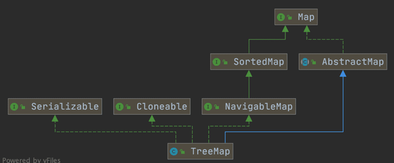
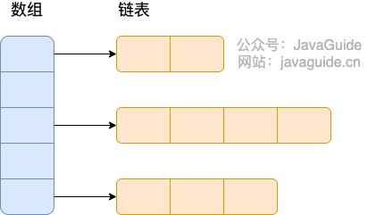
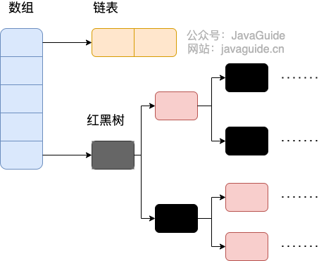

# HashMap

HashMap 是 Java 集合框架中的一个重要实现类，用于存储键值对（key-value pairs）。**它基于哈希表实现**，提供了高效的插入、删除和查找操作。HashMap 是非同步的，即线程不安全的，如果在多线程环境下使用需要额外的同步机制。


---

**HashMap 的主要特性**

**无序**：HashMap 中的元素没有顺序，元素的顺序取决于哈希函数和哈希表的大小。
**不允许重复键**：每个键只能映射一个值，如果插入的键已经存在，则会覆盖原来的值。
**允许 null 键和 null 值**：HashMap 允许一个 null 键和多个 null 值。

## HashMap的基础操作

**HashMap**是继承了**Map**接口的一个集合类，**HashMap**的方法也都在**Map**接口中被定义，包括插入、删除、查询、判断是否存在以及遍历等操作。

**示例**
```java
import java.util.HashMap;
import java.util.Map;

public class HashMapExample {
    public static void main(String[] args) {
        // 创建一个 HashMap 实例
        HashMap<String, Integer> map = new HashMap<>();

        // 插入元素
        map.put("apple", 1);
        map.put("banana", 2);
        map.put("cherry", 3);

        // 获取元素
        System.out.println("Value for apple: " + map.get("apple")); // 输出: Value for apple: 1
        System.out.println("Value for banana: " + map.get("banana")); // 输出: Value for banana: 2

        // 获取不存在的键的值，使用 getOrDefault 提供默认值
        System.out.println("Value for grape: " + map.getOrDefault("grape", 0)); // 输出: Value for grape: 0

        // 删除元素
        map.remove("banana");
        System.out.println("After removing banana, value for banana: " + map.get("banana")); // 输出: After removing banana, value for banana: null

        // 判断键是否存在
        boolean hasApple = map.containsKey("apple");
        System.out.println("Contains key 'apple': " + hasApple); // 输出: Contains key 'apple': true

        // 判断值是否存在
        boolean hasValue2 = map.containsValue(2);
        System.out.println("Contains value 2: " + hasValue2); // 输出: Contains value 2: false

        // 遍历键值对
        System.out.println("Entries in map:");
        for (Map.Entry<String, Integer> entry : map.entrySet()) {
            System.out.println("Key: " + entry.getKey() + ", Value: " + entry.getValue());
        }

        // 遍历键
        System.out.println("Keys in map:");
        for (String key : map.keySet()) {
            System.out.println("Key: " + key);
        }

        // 遍历值
        System.out.println("Values in map:");
        for (Integer value : map.values()) {
            System.out.println("Value: " + value);
        }

        // 获取 HashMap 的大小
        System.out.println("Size of the map: " + map.size()); // 输出: Size of the map: 2

        // 清空 HashMap
        map.clear();
        System.out.println("Is the map empty after clearing? " + map.isEmpty()); // 输出: Is the map empty after clearing? true
    }
}
```
## 与HashTable的对比
## 与HashSet的对比

## HashMap的底层原理

**HashMap**的底层思想是**哈希表**并使用链表法来避免**哈希冲突**。

### 1.底层数据结构

**HashMap**的底层都是**基于动态扩容数组**实现的哈希表，避免哈希冲突的方法都是链地址法而不是开放地址法

#### (1) JDK1.8前

**JDK1.8** 前**HashMap**是 使用的是 **数组+链表 = 链表散列** 来存储数据，将链表和数组相结合。也就是说创建一个链表数组，数组中每一格就是一个链表。若遇到哈希冲突，则将冲突的值加到链表中即可。




#### (2) JDK1.8之后

**JDK1.8** 之后**HashMap** 使用的是 **数组+链表+红黑树** 来储存数据。

当**链表的长度大于8的时候**,首先会调用**treeifyBin()** 方法检测是否要将链表转化为红黑树。只有当**哈希数组的长度超过64**时才会将链表转化为红黑树来进一步储存数据。如果**哈希数组的长度没有超过64**，则继续调用**resize()** 来将数组扩容




### 2.哈希数组的扩容机制

首先来看一下**HashMap**的源码

```java
public class HashMap<K,V> extends AbstractMap<K,V> implements Map<K,V>, Cloneable, Serializable {
    // 序列号
    private static final long serialVersionUID = 362498820763181265L;
    // 默认的初始容量是16
    static final int DEFAULT_INITIAL_CAPACITY = 1 << 4;
    // 最大容量
    static final int MAXIMUM_CAPACITY = 1 << 30;
    // 默认的负载因子
    static final float DEFAULT_LOAD_FACTOR = 0.75f;
    // 当桶(bucket)上的结点数大于等于这个值时会转成红黑树
    static final int TREEIFY_THRESHOLD = 8;
    // 当桶(bucket)上的结点数小于等于这个值时树转链表
    static final int UNTREEIFY_THRESHOLD = 6;
    // 桶中结构转化为红黑树对应的table的最小容量
    static final int MIN_TREEIFY_CAPACITY = 64;
    // 存储元素的数组，总是2的幂次倍
    transient Node<k,v>[] table;
    // 一个包含了映射中所有键值对的集合视图
    transient Set<map.entry<k,v>> entrySet;
    // 存放元素的个数，注意这个不等于数组的长度。
    transient int size;
    // 每次扩容和更改map结构的计数器
    transient int modCount;
    // 阈值(容量*负载因子) 当实际大小超过阈值时，会进行扩容
    int threshold;
    // 负载因子
    final float loadFactor;
}
```

**HashMap** 的哈希数组是基于动态扩容数组实现的

#### **DEFAULT_INITIAL_CAPACITY**

这个动态扩容数组的默认初始容量是16
```
// 默认的初始容量是16
    static final int DEFAULT_INITIAL_CAPACITY = 1 << 4;
```

#### **MAXIMUM_CAPACITY** 

这个动态扩容的数组的大小一旦达到最大值，则不会进一步动态扩容而是直接给分配最大化的大小

```java
static final int MAXIMUM_CAPACITY = 1 << 30;

//resize方法的一部分
if (oldCap > 0) {
        // 超过最大值就不再扩充了，就只好随你碰撞去吧
        if (oldCap >= MAXIMUM_CAPACITY) {
            threshold = Integer.MAX_VALUE;
            return oldTab;
        }
        // 没超过最大值，就扩充为原来的2倍
        else if ((newCap = oldCap << 1) < MAXIMUM_CAPACITY && oldCap >= DEFAULT_INITIAL_CAPACITY)
            newThr = oldThr << 1; // double threshold
    }
    else if (oldThr > 0) // initial capacity was placed in threshold
        // 创建对象时初始化容量大小放在threshold中，此时只需要将其作为新的数组容量
        newCap = oldThr;
    else {
        // signifies using defaults 无参构造函数创建的对象在这里计算容量和阈值
        newCap = DEFAULT_INITIAL_CAPACITY;
        newThr = (int)(DEFAULT_LOAD_FACTOR * DEFAULT_INITIAL_CAPACITY);
    }

```

#### **DEFAULT_LOAD_FACTOR**

**负载因子(LoadFactor)** 表示的是哈希数组存放数据的稀疏程度

\[ LoadFactor=\frac{size}{capacity}\]

- 当负载因子接近1的时候导致元素的查询效率过低
- 当负载因子接近0的时候导致数组的利用效率过低

**默认值为 0.75f 是官方给出的一个比较好的临界值。**

给定的默认容量为 16，负载因子为 0.75。Map 在使用过程中不断的往里面存放数据，当数量超过了 16 * 0.75 = 12 就需要将当前 16 的容量进行扩容。


####  **threshold**

是衡量数组是否需要扩增的一个标准

\[threshold = loadFactor \times capacity\]

\[threshold > size \gets 不用扩容\]

\[threshold \leq size \gets 扩容\]

**哈希数组**的扩容每次都是二倍扩容，而**ArrayList**每次则是1.5倍扩容

### 3.Hash映射原理

**HashMap** 是基于哈希表的思想设计的数据结构。哈希表的精髓就在于对**键**的哈希函数映射

\[key \to HashFunction() \to index\]

而**HashMap**中的哈希函数是由存储的**Object类实现的HashCode()和容器类中的Hash()扰动函数组成的**

#### 3.1 HashCode()是什么？


**hashCode** 方法是 Java 中所有对象都继承自 Object 类的一个方法。它返回一个整数哈希值，用于在基于哈希的数据结构（如 HashMap, HashSet, HashTable 等）中对对象进行快速查找和检索。哈希值的目的是将对象映射到一个整数范围内，从而在哈希表中确定该对象的位置。

```java
public int hashCode()
```

**hashCode()规则**
- **1.一致性**： 在应用程序执行期间，如果对象的状态没有被修改，那么对**同一个对象多次调用 hashCode 方法应该返回相同的整数**。

- **2.相等对象的hashCode相等**: 如果两个对象根据 equals 方法被认为是相等的，那么它们的哈希码必须相等。

- **3.不相等对象的hashCode尽量保证不同**：如果两个对象不相等，根据 equals 方法的定义，它们的哈希码不要求必须不同，但生成不同哈希码可以提高哈希表的性能。


**hashCode()的实现示例**
- **1.'Object'类的默认实现**

Object 类的 hashCode 方法是**基于对象的内存地址实现的**，因此对于每个对象实例，它会返回一个独特的整数值。这个默认实现对于大多数自定义类来说通常是不够的，需要重写 hashCode 方法。


- **2.自定义类重写hashCode()**

对于自定义类，需要根据类的属性来重写 hashCode 方法。以下是一个自定义类 Person 的 hashCode 方法实现示例：

```java
public class Person {
    private String name;
    private int age;
    
    // 构造函数
    public Person(String name, int age) {
        this.name = name;
        this.age = age;
    }

    // 重写 equals 方法
    @Override
    public boolean equals(Object obj) {
        if (this == obj) return true;
        if (obj == null || getClass() != obj.getClass()) return false;
        Person person = (Person) obj;
        return age == person.age && Objects.equals(name, person.name);
    }

    // 重写 hashCode 方法
    @Override
    public int hashCode() {
        return Objects.hash(name, age);
    }

    public static void main(String[] args) {
        Person p1 = new Person("Alice", 30);
        Person p2 = new Person("Alice", 30);
        Person p3 = new Person("Bob", 25);
        
        System.out.println(p1.hashCode()); // 输出 hashCode 值
        System.out.println(p2.hashCode()); // 输出与 p1 相同的 hashCode 值，因为 p1.equals(p2)
        System.out.println(p3.hashCode()); // 输出不同的 hashCode 值
    }
}
```
#### 3.2 Hash()是什么？

### 4.HashMap中的Hash数组存储的是什么？

**Hash数组**中存储的是**Node<k,v>**,每个节点的在**Hash数组**中的索引由哈希映射决定：
\[Key->HashCode()->Hash()->index\]

#### 4.1 储存过程
**向HashMap中插入<key,value>，首先创建一个Node<key,value>**

1.计算**key**的HashCode
2.调用**Hash()** 将HashCode进行扰动，得到**索引index**
3.将Node插入到哈希数组**Arr[index]** 处。
4.如果发生哈希冲突则会通过**链表或红黑树** 将Node插入


#### 4.2 查询过程

**查询HashMap中是否有<key,value>**

1.计算**key**的HashCode
2.调用**Hash()** 方法计算 **索引index**
3.调用**equals()** 比较 **Arr[index]** 处储存的节点

