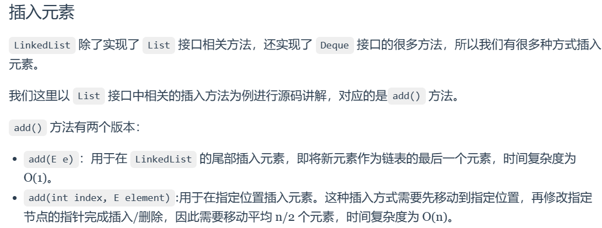

# 1.2 LinkedList

**LinkedList** 是一个基于双向链表实现的集合类，经常被拿来与**Array List** 做比较


**LinkedList操作的时间复杂度？**

- **头部插入/删除**：只需要修改头结点的指针即可完成插入/删除操作，因此时间复杂度为 O(1)。
- **尾部插入/删除**：只需要修改尾结点的指针即可完成插入/删除操作，因此时间复杂度为 O(1)。
- **指定位置插入/删除**：需要先移动到指定位置，再修改指定节点的指针完成插入/删除，因此需要移动平均 n/2 个元素，时间复杂度为 O(n)。

**为什么LinkedList不支持随机访问？**

因为LinkedList实现的底层数据结构是**双向链表** ，双向链表的节点元素在存储的空间不连续。

>**RandomAccess** 是一个标记接口，用来表明实现该接口的类支持随机访问（即可以通过索引快速访问元素）。由于 LinkedList 底层数据结构是链表，内存地址不连续，只能通过指针来定位，不支持随机快速访问，所以不能实现 RandomAccess 接口。
## **常用方法**
### (1)创建
**LinkedList类**是一个泛型类，需要确定传入的引用类型
```java
// 引入 LinkedList 类
import java.util.LinkedList;

public class RunoobTest {
    public static void main(String[] args) {
        //普通创建方法,无参构造
        LinkedList<String> sites = new LinkedList<String>();
        //通过集合创建，有参构造
        LinkedList<E> list = new LinkedList(Collection<? extends E> c); // 使用集合创建链表
    }
}
```
### (2)插入

在进行头插尾插的时候 LinkedList 效率比ArrayList更高。



**在列表开头添加元素：**
```java
// 引入 LinkedList 类
import java.util.LinkedList;

public class RunoobTest {
    public static void main(String[] args) {
        LinkedList<String> sites = new LinkedList<String>();
        sites.add("Google");
        sites.add("Runoob");//普通的插入方法
        sites.add("Taobao");
        // 使用 addFirst() 在头部添加元素
        sites.addFirst("Wiki");
        System.out.println(sites);
    }
}

//Output: [Wiki, Google, Runoob, Taobao]
```
**在尾部插入**
```java
// 引入 LinkedList 类
import java.util.LinkedList;

public class RunoobTest {
    public static void main(String[] args) {
        LinkedList<String> sites = new LinkedList<String>();
        sites.add("Google");
        sites.add("Runoob");
        sites.add("Taobao");
        // 使用 addLast() 在尾部添加元素
        sites.addLast("Wiki");
        System.out.println(sites);
    }
}
```


### (3)删除

LinkedList在头删和尾删的时候效率更高


**在头部删除**
```java
// 引入 LinkedList 类
import java.util.LinkedList;

public class RunoobTest {
    public static void main(String[] args) {
        LinkedList<String> sites = new LinkedList<String>();
        sites.add("Google");
        sites.add("Runoob");
        sites.add("Taobao");
        sites.add("Weibo");
        // 使用 removeFirst() 移除头部元素
        sites.removeFirst();
        System.out.println(sites);
    }
}
```

**在尾部删除**

```java
// 引入 LinkedList 类
import java.util.LinkedList;

public class RunoobTest {
    public static void main(String[] args) {
        LinkedList<String> sites = new LinkedList<String>();
        sites.add("Google");
        sites.add("Runoob");
        sites.add("Taobao");
        sites.add("Weibo");
        // 使用 removeLast() 移除尾部元素
        sites.removeLast();
        System.out.println(sites);
    }
}
```
**删除指定元素**

```java
// 引入 LinkedList 类
import java.util.LinkedList;

public class RunoobTest {
    public static void main(String[] args) {
        LinkedList<String> sites = new LinkedList<String>();
        sites.add("Google");
        sites.add("Runoob");
        sites.add("Taobao");
        sites.add("Weibo");
        // 使用 remove(E e) 移除尾部元素
        sites.remove("Weibo");
        System.out.println(sites);
    }
}
```


### (4)查找

**LinkedList**提供了三种查找的方法，分别可以查找头部尾部和任意位置


```java
// 引入 LinkedList 类
import java.util.LinkedList;

public class RunoobTest {
    public static void main(String[] args) {
        LinkedList<String> sites = new LinkedList<String>();
        sites.add("Google");
        sites.add("Runoob");
        sites.add("Taobao");
        sites.add("Weibo");
        // 使用 getFirst() 获取头部元素
        System.out.println(sites.getFirst());
        // 使用 getLast() 获取尾部元素
        System.out.println(sites.getLast());
        // 使用 get(int index) 获取特定位置的元素
        System.out.println(sites.get(1));//获取第二个元素
    }
}

//Output：Google Weibo Runoob
```
### (5)迭代

**可以用size()配合for来遍历**
```java
// 引入 LinkedList 类
import java.util.LinkedList;

public class RunoobTest {
    public static void main(String[] args) {
        LinkedList<String> sites = new LinkedList<String>();
        sites.add("Google");
        sites.add("Runoob");
        sites.add("Taobao");
        sites.add("Weibo");
        for (int size = sites.size(), i = 0; i < size; i++) {
            System.out.println(sites.get(i));
        }
    }
}
```

**也可以使用for-each来遍历**
```java
// 引入 LinkedList 类
import java.util.LinkedList;

public class RunoobTest {
    public static void main(String[] args) {
        LinkedList<String> sites = new LinkedList<String>();
        sites.add("Google");
        sites.add("Runoob");
        sites.add("Taobao");
        sites.add("Weibo");
        for (String i : sites) {
            System.out.println(i);
        }
    }
}
```
## **源码分析**

### (1) 类的定义

**LinkedList** 的继承关系：

#### 1.继承于**AbstactSequentialList类** 而**AbstactSequentialList类**又继承于**AbstractList**

**AbstractList**是一个抽象类，为所有的列表抽象类提供了方法骨架。

作为一个抽象类，AbstractList 要求子类至少实现以下两个方法：

- get(int index)：返回在列表中指定位置的元素。
- size()：返回列表中的元素个数。

对于可修改的列表，还应实现以下方法之一或两者：

- set(int index, E element)：替换列表中指定位置的元素，返回之前在该位置的元素。
- remove(int index)：移除列表中指定位置的元素。

**AbstractSequentialList**是一个继承于**AbstractList**的抽象类，为**LinkedList**提供了方法骨架


#### 2.实现了**List，Deque,Cloneable,Serializable接口**


```java
public class LinkedList<E>
    extends AbstractSequentialList<E>
    implements List<E>, Deque<E>, Cloneable, java.io.Serializable
{
  //...
}
```


