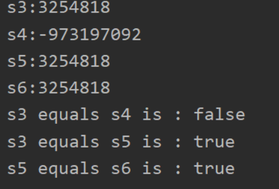

# Object 类

Java中的所有类都直接或间接的继承了**Object类** ，"Object"类的方法对于所有类都是可用的

---

## 一.Object类的主要方法

### 1. equals

**equals(Object O)** 方法用来比较**两个对象引用类型指向的对象实例** 如果指向的**对象实例地址相等，则返回True**

```java
package com.sdnu.test3;

/**
 * @ version: 1.8
 * @ author: Beyong
 * @ date: 2021/5/8 17:02
 * @ Description: TODO
 */
public class ExtendsTest {
    public static void main(String[] args){
        Object s1 = new Object();
        Object s2 = new Object();
        Object s3 = s1;
        System.out.println("s1 equals s2 is : " + s1.equals(s2));
        System.out.println("s1 equals s3 is : " + s1.equals(s3));
    }
}

//s1!=s2 因为这两个引用指向的对象实例地址不同
//s3==s2 因为这两个引用指向的对象实例地址相同

//s3是通过对象引用的方法创建的对象引用

```

在实际开发过程中**比较两个对象的地址是否相等并没有意义** ，因此我们经常会重写**equals方法** 

如果子类中重写了**equals()** ,那么我们就还需要重写**hashCode()** 

比如 **String**类就重写了equals()

```java
package com.sdnu.test3;

/**
 * @ version: 1.8
 * @ author: Beyong
 * @ date: 2021/5/8 17:43
 * @ Description: TODO
 */
public class ExtendsTest2 {
    public static void main(String[] args){
        String s3 = new String("java");
        String s4 = new String("python");
        String s5 = new String("java");
        String s6 = s5;
        System.out.println("s3 equals s4 is : " + s3.equals(s4));
        System.out.println("s3 equals s5 is : " + s3.equals(s5));
        System.out.println("s5 equals s6 is : " + s5.equals(s6));
    }
}

//String 重写之后的equals()比较的是字符串的内容，而不是地址
```

### 2.hashCode()

**hashCode()** 方法是Object类的一个重要方法，它用于返回对象的哈希码(根据对象的地址或其他唯一标识计算)。通常用作**快速查找技术（如哈希表和哈希集合）中数据的索引**。

hashCode() 方法在Java中的重要性体现在它与 equals() 方法的协同工作中，这两者共同定义了对象的身份相等性。

**hashCode()方法的三个特点**

- **一致性**

在Java应用的执行期间，只要对象的equals比较所用的信息没有被修改，那么对**同一个对象多次调用 hashCode() 必须始终如一地返回相同的整数**。在不同的Java应用执行中，此整数无需保持一致。

- **相等对象必须返回相同的hashCode**

如果两个对象通过**equals(Object o)** 方法比较是相等的，那么他们的hashCode也一定是相等的(这也是为什么重写equals方法的同时也要重写hashCode方法)

- **不相等的对象返回的hashCode值可能相等**

如果两个对象根据 equals(Object) 方法比较是不相等的，不要求它们的哈希码必须不同。然而，为不相等的对象生成不同的哈希码可以提高哈希表的性能。

```java
package com.sdnu.test3;

/**
 * @ version: 1.8
 * @ author: Beyong
 * @ date: 2021/5/8 17:43
 * @ Description: TODO
 */
public class ExtendsTest2 {
    public static void main(String[] args){
        String s3 = new String("java");
        String s4 = new String("python");
        String s5 = new String("java");
        String s6 = s5;
        System.out.println("s3:" + s3.hashCode());
        System.out.println("s4:" + s4.hashCode());
        System.out.println("s5:" + s5.hashCode());
        System.out.println("s6:" + s6.hashCode());
        System.out.println("s3 equals s4 is : " + s3.equals(s4));
        System.out.println("s3 equals s5 is : " + s3.equals(s5));
        System.out.println("s5 equals s6 is : " + s5.equals(s6));
    }
}
```


### 3.toString()

在Object类中，默认的**toString()** 会返回一个由**类名@+hashCode的十六进制表示**

>ClassName@1a2b3c4

这个输出通常不是特别有用，除非你想知道对象的内存地址相关的哈希码。

**重写toString()**

重写 **toString()** 方法可以让你返回更有意义的信息，通常应该包括类中重要字段的值。这对于日志记录、调试和展示对象状态非常有帮助。

示例：假设有一个简单的 Person 类，包含姓名和年龄，重写 toString() 方法以提供更有用的描述：

```java
public class Person {
    private String name;
    private int age;

    public Person(String name, int age) {
        this.name = name;
        this.age = age;
    }

    @Override
    public String toString() {
        return "Person[name=" + name + ", age=" + age + "]";
    }
}

Person person = new Person("John Doe", 30);
System.out.println(person);  // 输出：Person[name=John Doe, age=30]

```

