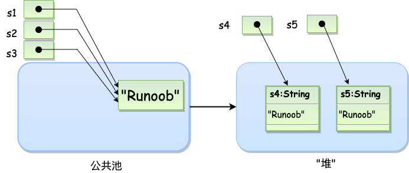
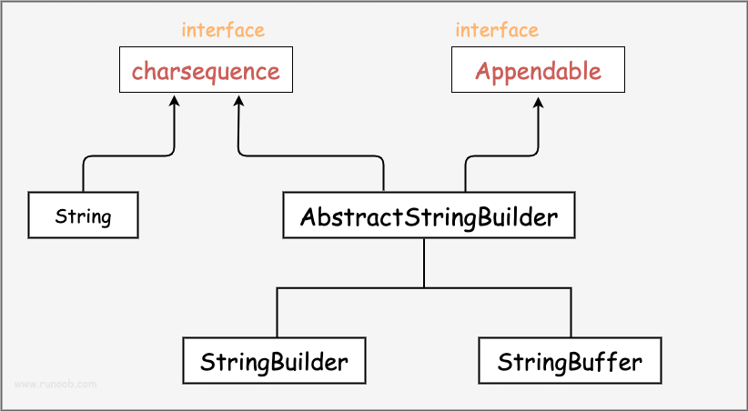
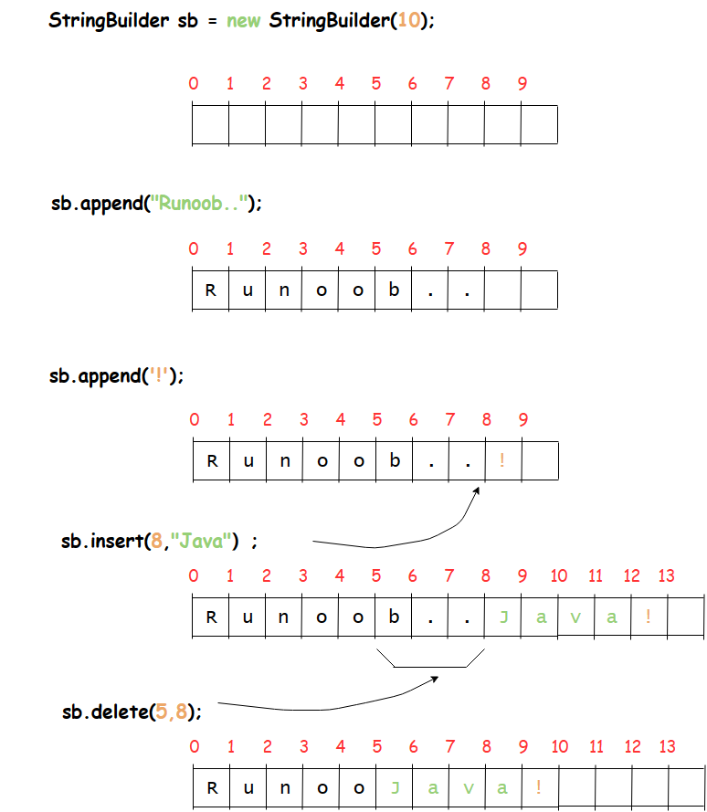

# String

Java中的String类是用于创建和操作字符串的。String对象一旦创建，它的值就不能改变（即字符串不可变）。由于字符串在Java程序中非常常见，所以String类也提供了大量的方法来进行各种操作。

**不可变性（Immutability）**

不可变性意味着String对象一旦创建，其值就无法更改。如果你对字符串进行任何改变，比如连接或替换字符，实际上会在内存中创建一个新的String对象。

---

## 一. 字符串的创建

String类的创建可以通过直接赋值或者new关键字来创建

```java
String s1="hello";
String s2=new String("hiu");
```

在代码中遇到字符串常量时，这里的值是 "Runoob"，编译器会使用该值创建一个 String 对象。

和其它对象一样，可以使用关键字和构造方法来创建 String 对象。

**String 创建的字符串存储在公共池中，而 new 创建的字符串对象在堆上**

```java
String s1 = "Runoob";              // String 直接创建
String s2 = "Runoob";              // String 直接创建
String s3 = s1;                    // 相同引用
String s4 = new String("Runoob");   // String 对象创建
String s5 = new String("Runoob");   // String 对象创建
```


### 什么是字符串池

在Java中，字符串池（String Pool），也称为字符串常量池（String Literal Pool），是Java堆内存的一部分，用于存储字符串字面量和显式调用 intern() 方法的字符串。字符串池帮助节省内存，因为它使得字符串实例可以被重用。

### 为什么需要字符串池？

字符串是Java中使用非常频繁的数据类型，**而字符串的不可变性（即一旦字符串被创建，其值就不可改变）使得可以安全地共享它们**。在很多情况下，程序中多处会用到相同的字符串。如果每次使用相同内容的字符串时都创建一个新的字符串实例，将会极大增加内存的消耗和垃圾收集的压力。字符串池的作用是避免这种情况的发生，**通过重用已存在的字符串减少内存的使用**。

### 如何工作？
当你创建通过**字符串字面量**赋值来创建一个新的字符串，比如 String s = "Hello";，JVM会检查字符串池中是否已经有一个内容为 "Hello" 的字符串：

- 如果存在，JVM就会返回这个已经存在的字符串的引用。
- 如果不存在，JVM就会在池中创建一个新的字符串 "Hello"，并返回这个新字符串的引用。

这种机制确保了所有的字符串字面量和通过 intern() 方法得到的字符串都是从字符串池中重用的，如果它们的值相同的话。

### 使用 new String()

如果你使用 new 关键字创建字符串，如 String s = new String("Hello");，这将始终在堆上创建一个新的字符串对象，**即使池中已有内容相同的字符串** 。然而，你可以使用 intern() 方法来确保字符串也被添加到字符串池中。

```java
String s = new String("Hello").intern();
```

当调用**intern() 方法** 时，如果池中已经包含一个等于此 String 对象的字符串（即有相同的 hashCode() 值和 equals() 为真），则返回池中的字符串。否则，将此 String 对象添加到池中，并返回此 String 对象的引用。

## 二. 比较两个字符串相等

在Java中，比较两个字符串是否相等可以通过两种主要方式进行：使用 equals() 方法和使用 == 操作符。选择哪种方式取决于你的具体需求，即你是想比较字符串的内容还是比较引用地址。

- **比较字符串内容使用equals()**
- **比较字符串引用地址使用'=='**

### 1. 使用 equals() 方法比较内容
equals() 方法用于比较两个字符串的内容是否相等。这是比较字符串时最常用的方法，因为它比较的是字符串中的字符，不关心两个字符串对象在内存中的位置。

```java
String str1 = "Hello";
String str2 = new String("Hello");

boolean result = str1.equals(str2);  // 返回 true
```
在这个例子中
- **str1是通过字符串字面值赋值创建的引用，指向字符串池中的字符串**
- **str2是通过new关键字创建的字符串，指向堆上的字符串实例**

即使 str2 是通过 new String() 创建的新对象（确保它是一个新的引用），equals() 方法仍然返回 true，因为 str1 和 str2 的内容相同。

### 2. 使用 == 操作符比较引用
== 操作符用于比较两个字符串对象的引用是否相同，即它们是否指向内存中的同一个对象。这种比较方式通常不用于检查字符串内容的相等，而是用来检查是否是同一个对象。

```java
String str3 = "Hello";
String str4 = "Hello";
String str5 = new String("Hello");

boolean result1 = str3 == str4;  // 通常返回 true，因为它们都指向字符串池中的同一个对象
boolean result2 = str3 == str5;  // 返回 false，因为 str5 指向一个通过 new 创建的新对象
```

在这个例子中
- **str3 和 str4 指向相同的内存地址（因为它们都是字面量，Java可能会从字符串池中重用这个字符串），因此 == 返回 true。**

- **str5 是通过 new 关键字创建的，保证了它在堆上有一个新的内存位置，所以即使内容相同，== 也返回 false。**

## 二. 格式化字符串

Java提供了两种主要方式来格式化字符串，一是通过System.out.printf()方法，二是使用String.format()方法。两者在语法上非常相似，都使用格式化字符串和一系列参数，只不过它们的输出目标不同。

**System.out.printf()**

System.out.printf()方法用于将格式化的字符串输出到控制台。这个方法不仅可以构造格式化字符串，还可以直接打印结果。

```java
System.out.printf("浮点类型的值为 " +
                  "%f, 整型类型的值为 " +
                  "%d, 字符串类型的值为 " +
                  "is %s", floatVar, intVar, stringVar);
```
在上述代码中，%f用于格式化浮点数，%d用于格式化整数，%s用于格式化字符串。变量floatVar、intVar和stringVar应该是对应的值，它们将被插入到格式化的字符串中对应的位置。

**String.format()**

String.format()方法与printf()非常相似，但它不会打印输出到控制台。相反，它会返回一个新的格式化后的字符串。

```java
String fs;
fs = String.format("浮点类型的值为 " +
                   "%f, 整型类型的值为 " +
                   "%d, 字符串类型的值为 " +
                   "is %s", floatVar, intVar, stringVar);

```


## 三. StringBuStringBuffer 和 StringBuilder 类

当对字符串进行修改的时候，需要使用 StringBuffer 和 StringBuilder 类。

和 String 类不同的是，StringBuffer 和 StringBuilder 类的对象能够被多次的修改，并且不产生新的未使用对象。



StringBuffer和StringBuilder类对字符串的操作都是**基于已经在堆上实例化的对象，而不是创建一个新的字符串**

```java
public class RunoobTest{
    public static void main(String args[]){
        StringBuilder sb = new StringBuilder(10);
        sb.append("Runoob..");
        System.out.println(sb);  
        sb.append("!");
        System.out.println(sb); 
        sb.insert(8, "Java");
        System.out.println(sb); 
        sb.delete(5,8);
        System.out.println(sb);  
    }
}
```



### StringBuffer
**特点**

- 可变性：与 String 类不同，StringBuffer 允许修改字符串而无需生成新的对象，这样可以提高性能，特别是在字符串经常变化的情况下。
- 线程安全：StringBuffer 中的方法大多是同步的，这意味着它是线程安全的。多个线程可以同时使用同一个 StringBuffer 对象而不会导致数据不一致的问题。

**方法：**

```java
append()：将数据添加到现有字符串的末尾。
insert()：在指定位置插入数据。
delete() 和 deleteCharAt()：删除字符串中的字符或子字符串。
reverse()：将字符串中的字符反转。
length() 和 capacity()：返回字符串的长度和缓冲区的容量。
setCharAt()：修改指定位置的字符。
```

### StringBuilder

StringBuilder 类在 Java 中用于创建可修改的字符串。与 StringBuffer 类似，StringBuilder 也允许进行字符串的动态修改，但它是非线程安全的。这使得 StringBuilder 在单线程环境下通常比 StringBuffer 更快，因为它避免了同步带来的性能开销。

**特点**
- 非线程安全：StringBuilder 不同步其方法，因此不是线程安全的。在没有多线程竞争的情况下，这可以提供更好的性能。
- 可变性：就像 StringBuffer，StringBuilder 允许修改字符串而无需每次修改时都创建新的对象。

**常用方法**
```java
append()：在当前 StringBuilder 对象的末尾添加字符串。
insert()：在指定位置插入字符串。
delete() 和 deleteCharAt()：从序列中删除字符或子字符串。
reverse()：将字符序列反转。
length() 和 capacity()：分别返回序列中字符的数量和分配的存储空间。
setCharAt()：设置指定位置的字符。
```

## 四. 常用方法

### 1.获取长度

用于获取有关对象的信息的方法称为访问器方法。

String 类的一个访问器方法是 length() 方法，它返回字符串对象包含的字符数。

下面的代码执行后，len 变量等于 14:

```java
public class StringDemo {
    public static void main(String args[]) {
        String site = "www.runoob.com";
        int len = site.length();
        System.out.println( "菜鸟教程网址长度 : " + len );
   }
}
```

### 2.连接字符串

String 类提供了连接两个字符串的方法：**string.concat()或者‘+’操作符**

```java
public class Str {
    public static void main(String[] args) {
        String str1 = "xmum";
        String str2 = "cst";
        String str3 = str1.concat(str2);  // 使用concat方法连接字符串
        String str4 = str1 + str2;        // 使用+操作符连接字符串

        System.out.println("str3: " + str3);  // 输出str3
        System.out.println("str4: " + str4);  // 输出str4
    }
}
/*
str3: xmumcst
str4: xmumcst
*/

```

**关键点：**

- 不可变性：String 对象一旦创建，其内容不可更改。**concat() 和 + 操作符实际上都会创建新的字符串对象**，而不是修改现有的字符串。

- 性能：虽然在现代JVM优化下，+ 操作符的性能已经非常接近于使用 StringBuilder，在大量或复杂的字符串操作中，显式使用 StringBuilder 仍可能提供更好的性能。

- 存储：无论是 concat() 还是 + 操作符，**创建的新字符串对象默认不存储在字符串池中**。这意味着即使内容相同，这些新对象也与字符串池中的字面量对象不是同一个引用。

#### 字符串储存的位置

- **字面值连接**：如果字符串连接的所有部分都是字面值，编译器会在编译时将它们合并，并将结果存储在常量池中。

```java
String str7 = "Hello" + " " + "World"; // 编译时优化为 "Hello World"
```

在这个例子中，编译器会将字符串连接优化为一个单一的字面值 "Hello World"，并将其存储在常量池中。

- **包含变量的连接**：如果字符串连接中包含变量，连接操作会在运行时进行，结果字符串对象存储在堆上。

```java
String str8 = "Hello";
String str9 = str8 + " World"; // 运行时在堆上创建新的字符串对象
```

在这个例子中，str9 指向的是堆上的新字符串对象 "Hello World"。


### 3.返回指定索引处的char值
返回指定索引处的 char 值。
```java
String str="hihihi";

char sub=str.charAt(0);//sub=='h'

```
