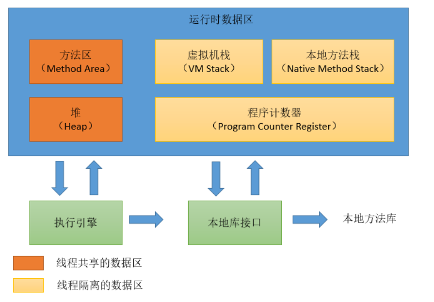
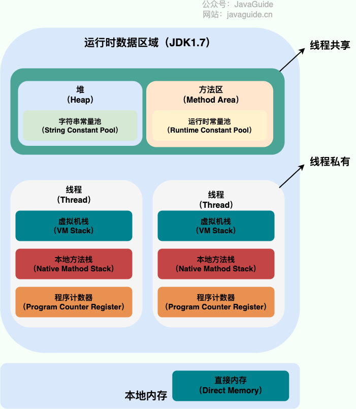
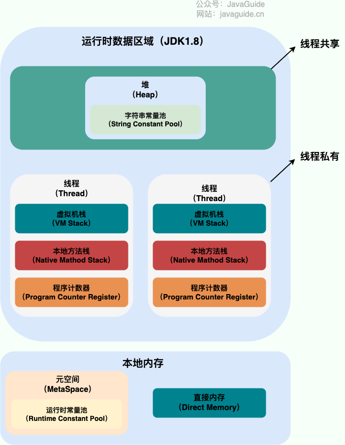
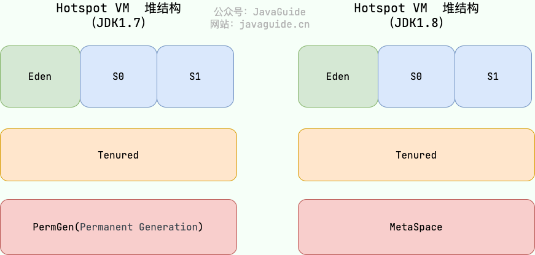

# Java虚拟机内存结构


Java Virtual Machine（JVM）的内存结构是运行Java程序的重要基础，它负责管理程序的内存分配和垃圾回收。Java程序在运行时，需要在内存中的分配空间。为了提高运算效率，就对数据进行了不同空间的划分，因为每一片区域都有特定的处理数据方式和内存管理方式。




---

## 一. 堆(Heap)

堆是JVM中最大的内存区域，用于**存储所有的对象实例和数组**。堆内存是所有线程共享的区域，垃圾回收器会自动回收不再使用的对象。

### 堆区与变量存储

#### **1.对象实例以及成员变量**

所有通过 new 关键字创建的对象实例及其成员变量（包括基本数据类型和引用类型）都存储在堆中。

```java
public class Person {
    private String name; // 成员变量存储在堆中
    private int age; // 成员变量存储在堆中

    public Person(String name, int age) {
        this.name = name;
        this.age = age;
    }
}

public class Main {
    public static void main(String[] args) {
        Person person = new Person("Alice", 30); // person 对象存储在堆中
    }
}
```

#### **2.数组**

数组也是对象，所以所有通过 new 关键字创建的数组存储在堆中，无论数组元素是基本数据类型还是引用类型。

**示例**
```java
public class Main {
    public static void main(String[] args) {
        int[] numbers = new int[5]; // 数组存储在堆中
        String[] names = new String[3]; // 数组存储在堆中
    }
}
```

#### **3.字符串常量池**
在JDK 7及以后，字符串常量池被移到了堆中。因此，字符串字面值和通过 String 类的 intern 方法显式放入常量池的字符串也存储在堆中。

**示例**

```java
public class Main {
    public static void main(String[] args) {
        String str1 = "hello"; // 字符串字面值存储在堆中的字符串常量池
        String str2 = new String("world"); // new 创建的字符串对象存储在堆中
        String str3 = str2.intern(); // intern() 方法返回的字符串存储在堆中的字符串常量池
    }
}
```
在这个例子中，str1 和 str3 都存储在堆中的字符串常量池，str2 是通过 new 创建的字符串对象，也存储在堆中。

### 堆区与垃圾回收
Java 堆是垃圾收集器管理的主要区域，因此也被称作 GC 堆（Garbage Collected Heap）。从垃圾回收的角度，由于现在收集器基本都采用分代垃圾收集算法，所以 Java 堆还可以细分为：新生代和老年代；再细致一点有：Eden、Survivor、Old 等空间。进一步划分的目的是更好地回收内存，或者更快地分配内存。

**在 JDK 7 版本及 JDK 7 版本之前，堆内存被通常分为下面三部分：**
- 新生代内存(Young Generation)
- 老生代(Old Generation)
- 永久代(Permanent Generation)

下图所示的 Eden 区、两个 Survivor 区 S0 和 S1 都属于新生代，中间一层属于老年代，最下面一层属于永久代。



**JDK 8 版本之后 PermGen(永久代) 已被 Metaspace(元空间) 取代，元空间使用的是本地内存。**

大部分情况，对象都会首先在 Eden 区域分配，在一次新生代垃圾回收后，如果对象还存活，则会进入 S0 或者 S1，并且对象的年龄还会加 1(Eden 区->Survivor 区后对象的初始年龄变为 1)，当它的年龄增加到一定程度（默认为 15 岁），就会被晋升到老年代中。对象晋升到老年代的年龄阈值，可以通过参数 -XX:MaxTenuringThreshold 来设置。
## 二. 栈(Stack)

**栈**是每个线程私有的内存区域，用于存储局部变量、方法调用的参数、方法返回值和方法调用的上下文信息（栈帧）。

**栈帧**
- **局部变量表**：存储方法的局部变量和参数。
- **操作数栈**：用于操作数的临时存储。
- **动态链接**：指向运行时常量池的方法引用。
- **方法返回地址**：记录方法调用后返回的位置。

### 栈区与变量存储

#### 1.局部变量

局部变量是在方法内部声明的变量。它们的生命周期仅限于方法的执行周期，当方法执行完毕，栈帧被销毁，局部变量也随之销毁。

```java
public class StackExample {
    public void myMethod() {
        int localVar = 10; // 局部变量存储在栈中
    }
}
```

#### 2.方法参数

方法参数也是局部变量的一种，在方法调用时传递给方法。这些参数在方法调用期间存储在栈中，并在方法执行结束时销毁。

```java
public class StackExample {
    public void myMethod(int param) { // 方法参数存储在栈中
        int localVar = param; // 局部变量存储在栈中
    }
}
```

#### 3.方法调用的返回地址

每次方法调用都会创建一个新的栈帧，栈帧中不仅包含局部变量和方法参数，还包含方法调用的返回地址，用于方法返回时跳转到调用方法的下一条指令。

```java
public class StackExample {
    public void methodA() {
        methodB(); // 方法调用的返回地址存储在栈中
    }

    public void methodB() {
        int localVar = 10; // 局部变量存储在栈中
    }
}
```
在这个例子中，当 methodA 调用 methodB 时，methodA 的栈帧中包含 methodB 方法调用的返回地址。当 methodB 执行完毕，程序会跳转回 methodA 的调用点继续执行。

**栈区的内存分配**
```mathematica
+-----------------------------+
|           栈（Stack）        |
|                             |
|  +-----------------------+  |
|  |  methodA's Stack Frame |  |
|  |  - 返回地址            |  |
|  |  - 局部变量            |  |
|  |  - 方法参数            |  |
|  +-----------------------+  |
|  |  methodB's Stack Frame |  |
|  |  - 返回地址            |  |
|  |  - 局部变量            |  |
|  |  - 方法参数            |  |
|  +-----------------------+  |
|  |  main's Stack Frame   |  |
|  |  - 返回地址            |  |
|  |  - 局部变量            |  |
|  |  - 方法参数            |  |
|  +-----------------------+  |
+-----------------------------+
```

## 三. 方法区(Method Area)

方法区是JVM内存的一部分，用于存储已加载的类信息、常量、静态变量、即时编译器编译后的代码等。

**主要内容：**
- **类信息**：类的字段、方法数据、方法字节码。
- **运行时常量池**：包含编译期生成的各种字面量和符号引用。
- **静态变量**：类的静态变量存储在这里。
- **字节码**：类的方法字节码存储在这里。

在JDK 8之前，方法区被称为永久代（PermGen）；在JDK 8及之后，被元空间（Metaspace）替代，元空间使用本地内存而非堆内存。

## 四. 本地方法栈（Native Method Stack）
本地方法栈用于存储本地方法调用的上下文信息。本地方法是使用非Java语言（如C、C++）编写的方法，主要用于与操作系统交互。

**主要特点：**

- 存储本地方法调用信息：包括本地方法的局部变量、参数、返回值等。
- 线程独占：每个线程都有自己的本地方法栈。

## 五. 程序计数器（Program Counter Register）
程序计数器是一个小的内存区域，用于存储当前线程所执行的字节码的地址，即指示当前线程下一条指令的执行位置。

**主要特点：**

- 线程独占：每个线程有一个独立的程序计数器。
- 字节码执行地址：记录当前线程执行的字节码指令的地址。
- 本地方法：在执行本地方法时，程序计数器的值是未定义的（Undefined）。
