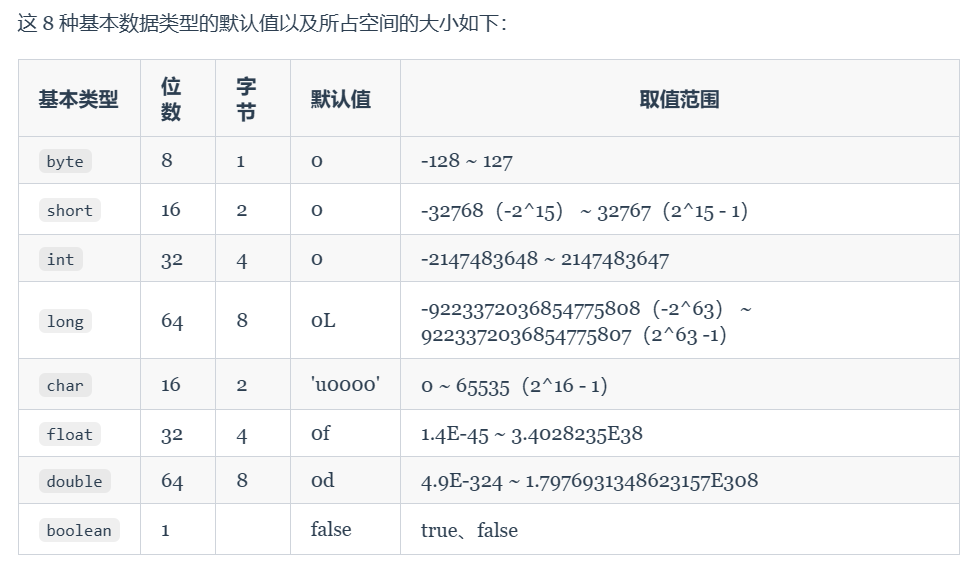
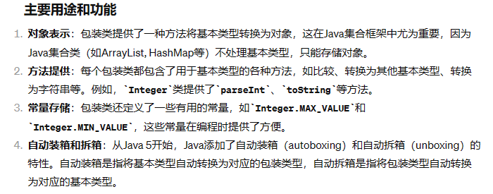

# 基本数据类型
---
**1. Java的八种基本数据类型**

- 六种数值类型
- 一种字符类型
- 一种布尔类型




**2. 包装类型是什么？**

在Java中，包装类型（Wrapper classes）是基本数据类型的对象表示形式。Java为每个原生数据类型提供了对应的包装类，使得基本类型可以作为对象处理。这是因为在很多情况下，如在需要使用对象而非基本类型的数据结构**例如集合类**中，基本类型需要以对象形式存在。

以下是Java中基本类型及其对应的包装类：

- byte - Byte
- short - Short
- int - Integer
- long - Long
- float - Float
- double - Double
- char - Character
- boolean - Boolean



```java
Integer myInt = 5;  // 自动装箱，编译器将基本类型转换为Integer对象
int myPrimitiveInt = myInt;  // 自动拆箱，编译器将Integer对象转换为int基本类型

List<Integer> integers = new ArrayList<>();
integers.add(10);  // 自动装箱
int first = integers.get(0);  // 自动拆箱

```

**3. 什么是自动拆箱和装箱？**

- **装箱**：将基本的数据类型包装为对应的包装类型
- **拆箱**：将包装类型转化为对应的基本数据类型

```java
Integer i=10;//装箱
int j=i;//拆箱
```

**4. 浮点数的精度缺失**

**示例**
```java
float a = 2.0f - 1.9f;
float b = 1.8f - 1.7f;
System.out.println(a);// 0.100000024
System.out.println(b);// 0.099999905
System.out.println(a == b);// false

```
