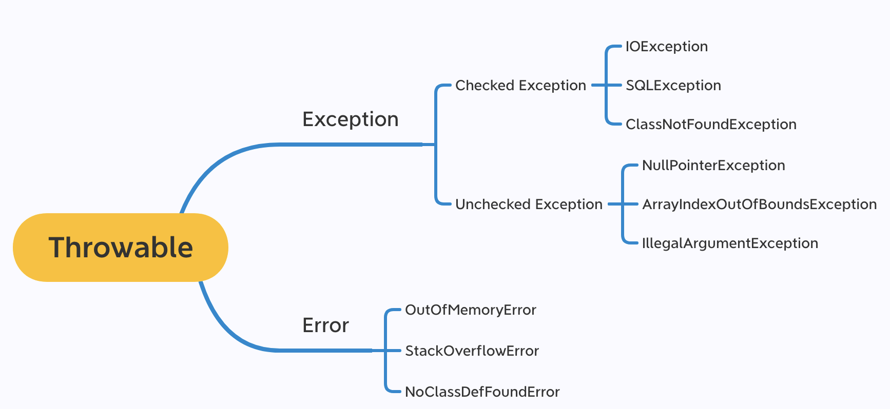
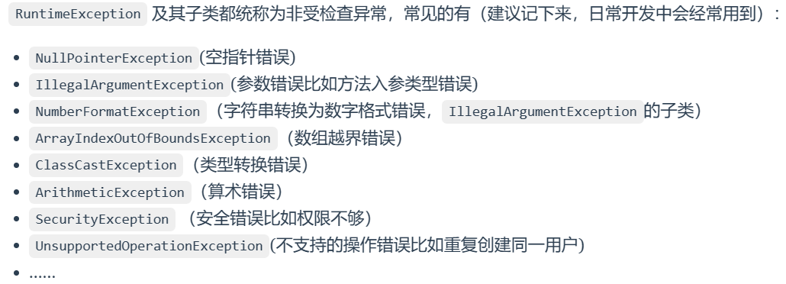
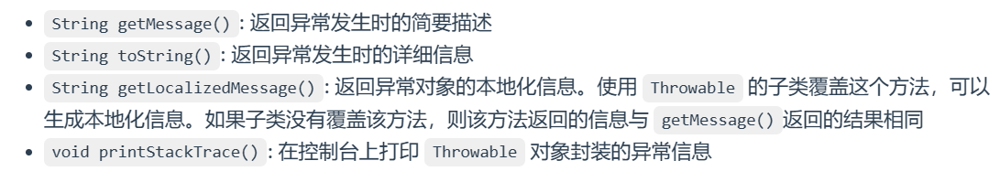
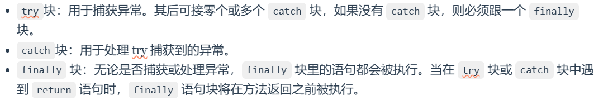

# 异常处理

异常处理使得程序能够捕获和处理错误，而不是在发生错误时崩溃。


---

## 一. 什么是Exception和Error？它们的区别是什么？

**Exception和Error** 都是继承于 **java.lang** 中的 **Throwable类**的子类

> - **Exceotion** :程序本身可以处理的异常，可以用**catch**来捕获。Exception 又可以分为 Checked Exception (受检查异常，必须处理) 和 Unchecked Exception (不受检查异常，可以不处理)。

> - **Error**: Error 属于程序无法处理的错误 ，我们**不建议通过catch捕获 。** 例如 Java 虚拟机运行错误（Virtual MachineError）、虚拟机内存不够错误(OutOfMemoryError)、类定义错误（NoClassDefFoundError）等 。这些异常发生时，Java 虚拟机（JVM）一般会选择线程终止。



## 二. CheckedException和UncheckedException的区别

**Checked Exception** 即 受检查异常 ，Java 代码在编译过程中，如果受检查异常没有被 catch或者throws 关键字处理的话，就没办法通过编译。

**Unchecked Exception** 即 不受检查异常 ，Java 代码在编译过程中 ，我们即使不处理不受检查异常也可以正常通过编译。



## 三. Throwable类的常用方法有哪些？



## 四. try-catch-finally的使用

Java 使用 try-catch-finally 块来处理异常。

1. **try 块**
try 块包含可能抛出异常的代码。

2. **catch 块**
catch 块用于捕获并处理 try 块中抛出的异常。可以有多个 catch 块来处理不同类型的异常。

3. **finally 块**
finally 块包含保证执行的代码，无论是否抛出异常。这通常用于清理资源，如关闭文件或网络连接。




**示例**
```java
public class ExceptionExample {
    public static void main(String[] args) {
        try {
            int[] numbers = {1, 2, 3};
            System.out.println(numbers[5]); // 可能抛出 ArrayIndexOutOfBoundsException
        } catch (ArrayIndexOutOfBoundsException e) {
            System.out.println("Array index is out of bounds!");
        } finally {
            System.out.println("This block is always executed.");
        }
    }
}


```

> 注意：不要在 finally 语句块中使用 return! 当 try 语句和 finally 语句中都有 return 语句时，try 语句块中的 return 语句会被忽略。这是因为 try 语句中的 return 返回值会先被暂存在一个本地变量中，当执行到 finally 语句中的 return 之后，这个本地变量的值就变为了 finally 语句中的 return 返回值。

## 五. finally中的代码一定会被执行吗？

不一定的！在某些情况下，finally 中的代码不会被执行。

就比如说 finally 之前虚拟机被终止运行的话，finally 中的代码就不会被执行。

```java
try {
    System.out.println("Try to do something");
    throw new RuntimeException("RuntimeException");
} catch (Exception e) {
    System.out.println("Catch Exception -> " + e.getMessage());
    // 终止当前正在运行的Java虚拟机
    System.exit(1);
} finally {
    System.out.println("Finally");
}

//Output: 
//Try to do something
//Catch Exception -> RuntimeException
```


## 五. try-with-resource的使用

**try-with-resources** 是 Java 7 引入的一种异常处理机制，用于自动管理资源。它简化了资源的关闭过程，确保在使用完资源后能够正确地释放它们，从而避免资源泄漏（如文件、数据库连接、网络连接等资源的泄漏）。这对提升代码的健壮性和可维护性非常重要。

**基本概念**
在 try-with-resources 语句中，所有实现了 java.lang.AutoCloseable 接口的资源（如stream、writer、reader等）都会在语句结束时自动关闭，无论是否发生异常。

**使用方法**
try-with-resources 语句的基本结构如下：

```java
try (ResourceType resource = new ResourceType()) {
    // 使用资源的代码
} catch (ExceptionType e) {
    // 处理异常的代码
} finally {
    // 可选的最终执行代码块
}
```
在 try 语句中声明的每个资源都必须实现 AutoCloseable 接口，该接口定义了 close() 方法。Java 会在 try 块执行完毕后自动调用这些资源的 close() 方法。

**示例**

**传统的资源管理方式（Java 7 之前）**
```java
import java.io.BufferedReader;
import java.io.FileReader;
import java.io.IOException;

public class TraditionalResourceManagement {
    public static void main(String[] args) {
        BufferedReader reader = null;
        try {
            reader = new BufferedReader(new FileReader("example.txt"));
            String line;
            while ((line = reader.readLine()) != null) {
                System.out.println(line);
            }
        } catch (IOException e) {
            e.printStackTrace();
        } finally {
            try {
                if (reader != null) {
                    reader.close();
                }
            } catch (IOException ex) {
                ex.printStackTrace();
            }
        }
    }
}
```

**使用 try-with-resources 的资源管理方式（Java 7 及之后）**

```java
import java.io.BufferedReader;
import java.io.FileReader;
import java.io.IOException;

public class TryWithResourcesExample {
    public static void main(String[] args) {
        try (BufferedReader reader = new BufferedReader(new FileReader("example.txt"))) {
            String line;
            while ((line = reader.readLine()) != null) {
                System.out.println(line);
            }
        } catch (IOException e) {
            e.printStackTrace();
        }
    }
}
```
