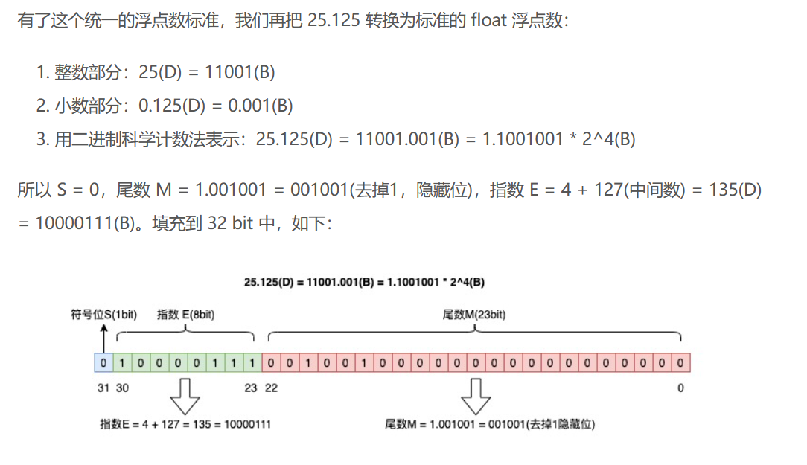

## 计算机存储整数的方法

计算机存储整数主要采用两种方式：无符号整数和有符号整数的存储。每种存储方式都基于二进制系统，但处理正负数的方式不同。

### 1. 无符号整数的存储

无符号整数只表示非负数。在无符号整数存储中，所有的位（bit）都用于表示数值的大小，没有位被用来表示符号。

#### 存储范围

- **8位无符号整数**：可以存储从0到255的数值。
- **32位无符号整数**：可以存储从0到4,294,967,295的数值。

### 2. 有符号整数的存储：补码

有符号整数可以表示正数、负数和零。计算机采用“补码”（Two's complement）格式来存储有符号整数。

#### 补码的定义和计算

补码的计算方式如下：
- **正数和零**：直接使用其标准的二进制表示。
- **负数**：
  1. 取其正数的二进制表示。
  2. 将所有位取反（0变为1，1变为0）。
  3. 最后结果加一。

### 3.通过数论来推导整数的储存规则

对于0-255的每一个数 **Xi** , **Xi** mod 256 得到的余数与 另一个数 **Xj** mod 256 得到的余数都不相同

对于0-255 数论上定义这是 mod 256 的一个最小非负完全剩余系 **{0,1,2....254,255}**

实际上计算机储存的**8 Bit**数据就是 2^8的一个**完全剩余系**

- 如果我们储存的整数是**无符号的**，那么我们的储存范围就是**0-255**，储存的是mod 256 的一个最小非负完全剩余系 **{0,1,2....254,255}**

- 如果我们储存的整数是**有符号的**，那么我们储存范围就是 **-128-127**，储存的是mod 256 的一个剩余系 **{-128,-127....126,127}**

**如何转化负数？**

- 以 **-128 -127 -126 -125** 为例

我们有同余方程 **-128=128 mod 256** 

**====>** Dec **(128)**=Bin **(1000 000)**

我们有同余方程 **-127=129 mod 256** 

**====>** Dec **(129)**=Bin **(1000 0001)**

我们有同余方程 **-126=130 mod 256** 

**====>** Dec **(130)**=Bin **(1000 0010)**

- 这里我们和 **127 126 125** 做对比

**====>** Dec **(127)**=Bin **(0111 1111)**

**====>** Dec **(126)**=Bin **(0111 1110)**

**====>** Dec **(125)**=Bin **(0111 1101)**

**这里我们注意到储存有符号整数的剩余系中，对于负数的储存都是转化为同余数之后在储存**

这帮发明计算机的大爹们就注意到**负数的首位都是1，正数的首位都是0**
于是这个首位就被定义为了**符号位**
#### 示例

- **-1的补码**：在8位系统中，因为 \(-1 \equiv 255 \mod 256\)，因此-1的补码就是255的二进制表示`11111111`。
- **-127的补码**：\(-127 \equiv 129 \mod 256\)，因此-127的补码是129的二进制表示`10000001`。

## 计算机储存浮点数规则

### 1. IEEE754浮点数标准

- **单精度float**：32位bit(四字节)储存, 符号S位占**1bit**, 指数E占**8bit**, 尾数M占**23bit**

- **双精度double**：64位bit(八字节)储存, 符号S位占**1bit**, 指数E占**11bit**, 尾数M占**52bit**

### 2. 指数 E 是什么？

指数 E 是个无符号整数，表示 float 时，一共占 8 bit，所以它的取值范围为 0 ~ 255。

但因为指数可以是负的，所以规定在存入 E 时在它原本的值加上一个中间数 **127(2^7-1)**，这样 E 的取值范围为 -127 ~ 128。

表示 double 时，一共占 11 bit，存入 E 时加上中间数 1023，这样取值范围为 -1023 ~ 1024。

### 3. 为什么指数要加127？

这里储存指数位的数学原理还是数论中的剩余系

**这里还是以 8 bit 为例子**

如果指数位E只是正数的话 **0000 0000** 就可以储存 **0 - 255** 

**比如：**

Dec **(127)**=Bin **( 0111 1111)**

**但是对于浮点数来说指数位也是存在负数的**

比如储存 Dec **(0.5)**=Bin **(0.1)** = Bin **(1x2^-1)**

E = -1

对于负整数的储存，我们采取补码的形式来解决(即对剩余系中的负数 **+256**进行映射)。

**补码中我们使用符号位来记录数值的正负。**

想一下我们补码的符号位是怎么来的

> 

> 

**在补码中我们采取对剩余系中负数+256进行映射**

将 **{-128,-127....127}** 映射到 **{0,1,2....254,255}**

这就导致了负数的首位都是1，而正数的首位都是0。

**但是在浮点数的储存中，我们已经有一个符号位来记录了。**

为了避免符号位的重复，我们选择对剩余系中的每一个数字都进行映射

在标准的float储存中，指数位是 8 Bit (0000 0000)

于是我们的映射就是对每一个数都 **+127** 进行同余映射

将 **{-127....128}** 映射到 **{0,1,2....254,255}**

**与补码映射的对比**

- **补码映射:对含负数的剩余系中的负数+256进行映射**

将 **{-128,-127....127}** 映射到 **{0,1,2....254,255}**

**0**   -----> **0**
**127** ----> **127**
**-128** ---> **128**

- **指数位映射:对含负数的剩余系中的每一个+127进行映射**

将 **{-127....128}** 映射到 **{0,1,2....254,255}**

**0**  -------->**128**
**-127** ------>**0**
**-10** ------>**117**

**这里映射选取的值取决于剩余系中的最小负数**

### 4. 指数位与尾数位的特殊值

- 指数 E 非全 0 且非全 1：规格化数字，按上面的规则正常计算
- 指数 E 全 0，尾数非 0：非规格化数，尾数隐藏位不再是 1，而是 0(M = 0.xxxxx)，这样可以表示 0 和很小的数
- 指数 E 全 1，尾数全 0：正无穷大/负无穷大（正负取决于 S 符号位）
- 指数 E 全 1，尾数非 0：NaN    (Not a Number)

这个特殊值的规定导致了float的 **E的实际取值范围不是-127-128，而是-126-127**。

因为-127映射之后是0，表示为0000 0000 **全0特殊值**
因为128映射之后是255，表示为1111 1111 **全1 特殊值**

### 5. 浮点数的储存范围

这里以float类型为例

上面我们得知float类型的指数E取值范围是[-126,127]，尾数的最大值为1.111....(即小数点后23位)

所以float类型的规格最大储存值是

**(1+(1−2^−23))×2^127 ≈3.4028235×10^38**

同理也可以得到规格最小储存值是

**(0.000...1)×2^-126 ≈2^-23x2^-126 =2^-149 ≈1.40129846×10^−45**

### 6.浮点数为什么会有精度损失

如果我们现在想用浮点数表示 0.2，它在转化为二进制的时候会发生尾数的截断

0.2 转换为二进制数的过程为，不断乘以 2，直到不存在小数为止，在这个计算过程中，得到的整数部分从上到下排列就是二进制的结果。

**尾数位的限制**
因为float类型只有23位尾数位，而double类型有52位尾数位，这意味着在达到这些位数后，剩余的位数将被截断。这个截断就是精度损失的来源。即使是使用double类型，虽然精度更高，但如果数字的二进制表示超过52位，仍然会有精度损失。

在float中最多会转化 23 bit 二进制小数
在double中最多会转化 52 bit 二进制小数

**因此，当你在编程中使用浮点数时，可能会注意到例如0.2 + 0.1不精确等于0.3，而是一个非常接近0.3但略有不同的数。这种现象是由于二进制表示中的截断和舍入误差造成的。**