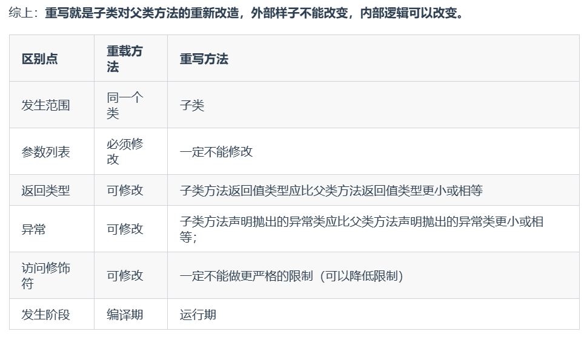

# 方法

**1. 什么是方法**

Java中的方法是执行特定任务的代码块，是组织代码的一种方式（在C/C++中叫函数）


**2. 什么是方法的返回值?**
方法的返回值指执行特定任务的代码块执行后得到的结果

**3. 方法有哪几种类型？**

**按照参数与返回类型分类**
- 无参无返回值
- 有参无返回值
- 无参有返回值
- 有参有返回值

**按照是否需要实例化一个对象来访问**
- 实例方法：需要创建一个该类的对象来使用方法，无法直接通过类名直接使用
- 静态方法：不需要创建类的对象，可以直接通过类名来使用

**4. 访问限定符**
- public：可以被其他任何类访问
- private：只能被定义他的类使用，子类也不可以访问
- protected：可以被同一个包下的类 **(cpp的友元类)** 或子类访问
- 默认(无修饰符)：可以被同一个包下的类访问

**5. 静态方法是什么？**

静态方法是属于类而不属于类的实例化对象的方法，这意味着我不需要创建类的实例就可以直接通过类名来使用这个方法。

静态方法只能访问类的静态成员，并且不能直接访问类的非静态成员。因此静态方法不能调用this关键字，因为this引用调用方法的对象。

**6. 为什么静态方法不能访问非静态成员**

没有实例化对象的时候静态方法就已经存在了，而非静态方法还不存在

- 静态方法是属于类而不是属于对象的，JVM在类加载的时候就会自动给静态方法分配内存。

- 非静态方法是属于实例对象的，只有在创建新的对象之后才能通过实例化的对象来调用非静态方法。

```java

public class test {
    public static void main(String[] args){
        ticket01.test();//调用静态方法
        t1=new ticket01();
        t1.run()//通过实例化的对象来调用非静态方法
    }
}
/*这里的ticket01是一个类
run()方法就是一个非静态方法，只有实例化的对象能使用这个方法
test()方法就是一个静态方法，直接通过类名就可以调用
*/
class ticket01 extends Thread{
    private static int sum=100;
    
    @Override
    public void run(){
        while(true){
            if(sum<=0){
                break;
            }
            try {
                Thread.sleep(50);
            } catch (Exception e) {
                e.printStackTrace();
            }
            System.out.println(Thread.currentThread().getName()+"卖了一张票"+(--sum));
        }
    }

    public stastic void test(){
        System.out.println("hihihi");
    }
}
```

**7.方法重载与重写的区别**

- 重载方法是同一个方法对于不同的传入参数做出不同的处理
- 重写方法是子类继承自父类的方法，输入的参数相同，但要做出有别于父类方法的相应。

**重载(Overloading)**

发生在同一个类中（或者父类和子类之间），**方法名必须相同**，参数类型不同、个数不同、顺序不同，**方法返回值**和访问修饰符可以不同。

```java
StringBuilder sb = new StringBuilder();
StringBuilder sb2 = new StringBuilder("HelloWorld");
```
编译器必须挑选出具体执行哪个方法，它通过用各个方法给出的参数类型与特定方法调用所使用的值类型进行匹配来挑选出相应的方法。 如果编译器找不到匹配的参数， 就会产生编译时错误， 因为根本不存在匹配， 或者没有一个比其他的更好(这个过程被称为重载解析(overloading resolution))。Java 允许重载任何方法， 而不只是构造器方法。

**重写(Overriding)**

重写发生在运行期，是子类对父类的允许访问的方法的实现过程进行重新编写。

- 传入的参数相同，方法的相应不同
- 返回值类型可以比父类更小或相等
- 访问修饰限定符的范围可以比父类大
- 如果父类有 **private /final /stastic** 关键字修饰那么子类就不能重写父类的方法



**8. 可变长参数**

从Java5开始，Java开始支持可变长参数，即允许在调用方法的时候传入不定长度的参数。
实际上这个可变长参数会被编译为一个数组

```java
//这里的String... args就是可变长参数
//可变长参数只能是方法的最后一个参数
public static void method1(String arg1,String... args) {
   //......
}
```

当遇到方法重载(即传入参数的数量不同的重载方法)，会优先匹配固定参数数量的方法

```java
public class VariableLengthArgument {

    public static void printVariable(String... args) {
        for (String s : args) {
            System.out.println(s);
        }
    }

    public static void printVariable(String arg1, String arg2) {
        System.out.println(arg1 + arg2);
    }

    public static void main(String[] args) {
        printVariable("a", "b");
        printVariable("a", "b", "c", "d");
    }
}

```