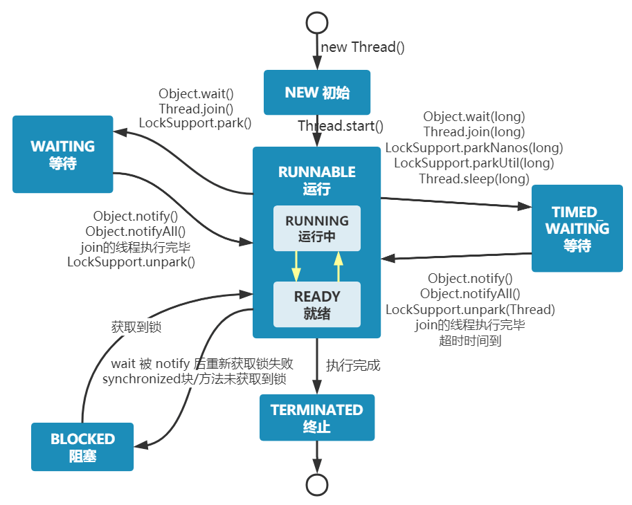

# 并发编程

## 基本概念

**一. 什么是进程**

进程是程序的一次执行过程，是系统运行程序的基本单位。
进程是动态的，系统运行程序的过程就是一个进程的创建，运行到销毁的过程

在java中启动一次main函数其实就是启动了一个JVM进程，而main函数所在的线程就是这个JVM进程中的一个线程，也被称为程序的主线程

**二. 什么是线程**

线程是比进程更小的一个执行过程。在一个进程的启动过程中可以启动多个子线程

一个java程序的运行其实就是一个JVM进程启动了多个子线程


**三. 什么是并发**

并发指的是多个任务被同一个CPU在同一个时间段内处理，但每一个瞬间时刻只有一个任务被这个CPU处理

**四. 什么是并行**

并行指的是多个CPU在同一个时刻处理多个任务,每一个瞬间都有着多个任务在被处理

**五. 并发与并行的区别**

- 并发：两个及两个以上的作业在同一 时间段 内执行。<br>
- 并行：两个及两个以上的作业在同一 时刻 执行。<br>

**最关键的点**
是否是多个任务是否同时执行
## **Java与并发编程**

### **一.创建线程的方法**

#### **1.使用Thread类来创建线程**


````java
// 继承Thread类来实现多线程
class MyThread extends Thread {
    public void run() {
        System.out.println("Thread running");
    }
}

// 实现Runnable接口来实现多线程
class MyRunnable implements Runnable {
    public void run() {
        System.out.println("Runnable running");
    }
}

public class ConcurrencyTest {
    public static void main(String[] args) {
        MyThread t1 = new MyThread();
        t1.start();

        Thread t2 = new Thread(new MyRunnable());
        t2.start();
    }
}

````

#### **2. 实现Runnable接口来实现多线程**

因为java中只允许单继承(即一个类只能extends 一个父类)，所以对于已经继承父类的类可以进行实现Runnable接口来实现

因为实现Runnable类的方法实现的多线程没有start（）方法，所以我们是通过创建一个新的Thread类并传递实现runnable类的方法来创建新的线程。

```java
// 实现Runnable接口来实现多线程
class MyRunnable implements Runnable {
    public void run() {
        System.out.println("Runnable running");
    }
}

public class ConcurrencyTest {
    public static void main(String[] args) {
        MyRunnable r1=new MyRunnable();

        //通过向Thread的构造器传入实现了Runnable接口的类实例来创建线程
        Thread t2 = new Thread(new MyRunnable());
        t2.start();

        //通过向Thread的构造器传入实例
        Thread t3=new Thread(r1);
        t3.start();

        //通过匿名内部类的方法实现Runnable接口创建线程
        Thread t4=new Thread(new Runnable(){
            @Override
            public void run(){
                System.out.println("Runnable running");
            }
        });

        //通过匿名内部类的方法实现Thread
        Thread t5=new Thread(){
            public void run(){
                System.out.println("Runnable running");
            }
        };
    }
}
```

**实现Runnable接口方法和extend Thread方法的区别**
- 从java的设计来看，从Thread继承和实现Runnable接口没有本质区别，因为Thread类本身就实现了Runnable接口
- 实现Runnable接口的方式更适合多个线程共享一个资源的情况，避免了单继承的限制

#### 3. 实现Callable接口

**"Callable"** 是Java并发库中的一个接口，与**Runnable**接口类似需要通过**重写run()方法**来创建线程。**Callable接口**需要重写**call()**方法来创建线程

**注意Thread类的构造器只可以传入实现了Runnable接口的对象,因此通常是通过方法类ExecutorService来使用实现Callable接口的对象**


>**使用 Callable 创建线程的一般步骤如下：**
**1.实现 Callable 接口**：实现 Callable 接口并定义 call() 方法。
**2.使用 ExecutorService 提交任务**：使用 ExecutorService 提交 Callable 任务。
**3.获取任务结果**：通过 Future 对象获取任务结果。

**示例代码**
```java
public class test{
    public static void main(String[] args){
        ExecutorService eS=ExecutorService.newFixedThreadPool(2);
        Future<String> future=eS.submit(new Callable<String>() {
            @Override
            public String call() throws Exception{
                Thread.sleep(5000);//模拟线程休眠
                return "work done";
            }
        });
        try{
            String res=future.get();
            System.out.println("Result from Callable: " + res);
        }catch(Exception e){
            e.printStackTrace();
        }
        eS.shutdown();
    }
    
}
```

### **二.如何启动线程**

**1. start()方法**

start()方法用于启动一个新的线程。当你调用一个线程的start()方法时，Java虚拟机调用该线程的run()方法在新启动的线程中执行。这意味着，调用start()会导致操作系统底层创建一个新的线程，然后在这个新线程中并行地执行run()方法。使用start()可以使得多个线程并发执行，从而提高程序的效率。
````java
class MyThread extends Thread {
    public void run() {
        System.out.println("Running in a new thread");
    }
}

public class ThreadExample {
    public static void main(String[] args) {
        MyThread t = new MyThread();
        t.start();  // 新线程中执行run()方法
        System.out.println("Running in main thread");
    }
}
````
**2. run()方法**

run()方法只是一个普通的方法调用，如果直接从主线程或任何线程调用run()，它将作为一个普通方法在当前线程中执行，而不会创建新的线程。这样做不会实现多线程的并发执行，而是在同一个线程中顺序执行。
````java
class MyThread extends Thread {
    public void run() {
        System.out.println("Running in the same thread");
    }
}

public class ThreadExample {
    public static void main(String[] args) {
        MyThread t = new MyThread();
        t.run();  // 在当前线程（这里是主线程）中执行run()方法
        System.out.println("Running in main thread");
    }
}
````


### **三.Java中线程类的状态**

**Java中的Thread.State是一个枚举类**，它定义了线程的六种状态
```java
public enum Thread.State {
  
/**
     * Thread state for a thread which has not yet started.
     */
    NEW,

    /**
     * Thread state for 

    RUNNABLE,

    /**
     * Thread state for a thread blocked waiting for a monitor lock. A thread in the blocked state is waiting for a monitor lock to enter a synchronized block/method or reenter a synchronized block/method after calling Object.wait.
     */
    BLOCKED,

    /**
     * Thread state for a waiting thread. A thread is in the waiting state due to calling one of the following methods:
     * <ul>
     * <li>{@link Object#wait() Object.wait} with no timeout</li>
     * <li>{@link #join() Thread.join} with no timeout</li>
     * <li>{@link LockSupport#park() LockSupport.park}</li>
     * </ul>
     */
    WAITING,

    /**
     * Thread state for a waiting thread with a specified w
@link Thread#sleep Thread.sleep}</li>
     * <li>{@link Object#wait(long) Object.wait} with timeout</li>
     * <li>{@link #join(long) Thread.join} with timeout</li>
     * <li>{@link LockSupport#parkNanos LockSupport.parkNanos}</li>
     * <li>{@link LockSupport#parkUntil LockSupport.parkUntil}</li>
     * </ul>
     */
    TIMED_WAITING,

    /**
     * Thread state for a ter

    TERMINATED;
}
```



**1.NEW**

当一个线程对象被创建但尚未调用 start() 方法时，线程处于 NEW 状态。

```java
Thread thread = new Thread(() -> System.out.println("Thread is running"));
System.out.println(thread.getState()); // 输出 NEW
```

**2. RUNNABLE**

当调用 start() 方法后，线程处于 RUNNABLE 状态。线程可能正在运行，也可能等待 CPU 时间片。

```java
Thread thread = new Thread(() -> {
    while (true) {
        // 无限循环，保持线程在 RUNNABLE 状态
    }
});
thread.start();
System.out.println(thread.getState()); // 输出 RUNNABLE
```

**3.BLOCKED**

当线程试图进入一个被其他线程持有的同步块(锁被其他线程持有)时，它进入 BLOCKED 状态。

```java
public class BlockedExample {
    public static void main(String[] args) throws InterruptedException {
        final Object lock = new Object();

        Thread t1 = new Thread(() -> {
            synchronized (lock) {
                try {
                    Thread.sleep(5000);
                } catch (InterruptedException e) {
                    e.printStackTrace();
                }
            }
        });

        Thread t2 = new Thread(() -> {
            synchronized (lock) {
                System.out.println("Thread 2 acquired the lock");
            }
        });

        t1.start();
        Thread.sleep(1000); // 确保t1先获取到锁
        t2.start();

        Thread.sleep(1000); // 确保t2进入BLOCKED状态
        System.out.println(t2.getState()); // 输出 BLOCKED
    }
}
```

**4.WAITING**

当线程无限期等待另一个线程唤醒时，它进入 WAITING 状态。

```java
public class WaitingExample {
    public static void main(String[] args) throws InterruptedException {
        final Object lock = new Object();

        Thread t1 = new Thread(() -> {
            synchronized (lock) {
                try {
                    lock.wait();
                } catch (InterruptedException e) {
                    e.printStackTrace();
                }
            }
        });

        t1.start();
        Thread.sleep(1000); // 确保t1调用wait()
        System.out.println(t1.getState()); // 输出 WAITING
    }
}
```
**5. TIMED_WAITING**

当线程等待另一个线程唤醒或者等待指定时间时，它进入 TIMED_WAITING 状态。

```java
public class TimedWaitingExample {
    public static void main(String[] args) throws InterruptedException {
        Thread t1 = new Thread(() -> {
            try {
                Thread.sleep(5000);
            } catch (InterruptedException e) {
                e.printStackTrace();
            }
        });

        t1.start();
        Thread.sleep(1000); // 确保t1调用sleep()
        System.out.println(t1.getState()); // 输出 TIMED_WAITING
    }
}
```

**6. TERMINATED**

当线程完成执行或者由于异常退出时，它进入 TERMINATED 状态

```java
public class TerminatedExample {
    public static void main(String[] args) throws InterruptedException {
        Thread t1 = new Thread(() -> {
            System.out.println("Thread is running");
        });

        t1.start();
        t1.join(); // 等待线程t1结束
        System.out.println(t1.getState()); // 输出 TERMINATED
    }
}
```
### 四. 特殊的进程

在操作系统中，除了普通进程外，还有一些特殊类型的进程。这些特殊的进程通常用于特定的系统任务和操作。

#### 1.系统进程（System Processes）

系统进程是由操作系统内核创建和管理的进程，通常在操作系统启动时创建。它们负责系统级任务，如内存管理、进程调度、文件系统操作等。

示例：在 Unix 系统中，init 进程（PID 1）是第一个进程，负责启动其他系统进程。

#### 2.守护进程

#### 3.僵尸进程

#### 4.孤儿进程

#### 5.实时进程

#### 6.交互进程

#### 7.虚拟机进程


### 五. 锁对象

#### **1. 什么是锁对象？**

**锁就是一个对象**

**一个对象只能和一个线程搞对象**，一个线程想要执行这个sychronized修饰的代码块里面的方法就要**得到这个对象**

- 是一个用于实现同步的对象。
- 任何 Java 对象都可以作为锁对象。
- 当一个线程持有锁对象时，其他尝试获取相同锁对象的线程将被阻塞，直到锁被释放。

**锁对象的作用**

在同步代码块中使用锁对象时，锁对象起到了一个标志的作用。只有一个线程能够持有锁对象，这个线程可以进入并执行同步代码块，而其他线程必须等待，直到锁对象被释放。

### 五.原子性

原子性（Atomicity）是并发编程中的一个关键概念，指的是一个操作或者一系列操作在执行的过程中不会被中断，要么全部执行完毕，要么完全不执行。原子性确保了操作的不可分割性和完整性，即在多线程环境下，原子操作是不可中断的，即使有其他线程在执行，也不会影响到这个操作的执行结果。

#### 1. 原子性的特点

**不可分割性**
原子操作在执行时，不会被其他操作打断。对于多线程环境来说，这意味着其他线程不能看到原子操作的中间状态。

**一致性**
原子操作的执行结果是完整的，要么完全成功，要么完全不执行。如果一个原子操作执行了一半出现问题，它会回滚到操作之前的状态，不会留下不一致的中间状态。

#### 2. 原子性的例子

在 Java 中，一些简单的操作是原子的，例如：

- 读取和写入 boolean、byte、short、char、int、long、float、double 和引用变量（reference variable）。
- 读取和写入 volatile 变量。

然而，像 i++ 这样的操作并不是原子的。虽然它看起来是一个简单的自增操作，但实际上它是由三部分组成的：

- 读取当前值。
- 增加值。
- 写回新值。

在多线程环境下，这三步操作可能会被其他线程打断，导致并发问题。

#### 3. 保证原子态的方法

**上锁**
使用 synchronized 关键字可以确保一个方法或代码块在某一时刻只被一个线程执行，从而保证操作的原子性。

```java
public class Counter {
    private int count = 0;

    public synchronized void increment() {
        count++;
    }

    public synchronized int getCount() {
        return count;
    }
}
```

**使用原子类**
Java 提供了一些原子类，如 AtomicInteger、AtomicLong 等，它们通过 CAS（Compare-And-Swap）机制来保证操作的原子性。

```java
import java.util.concurrent.atomic.AtomicInteger;

public class AtomicCounter {
    private AtomicInteger count = new AtomicInteger(0);

    public void increment() {
        count.incrementAndGet();
    }

    public int getCount() {
        return count.get();
    }
}
```
### 六. 线程同步问题

在 Java 中，线程同步是指控制多个线程访问共享资源的顺序，以避免竞态条件（Race Conditions）和确保数据一致性。由于 Java 中的线程是并发执行的，如果多个线程同时访问和修改共享资源，可能会导致数据不一致或其他意外行为。为了保证线程安全，可以使用线程同步机制。

#### 1. synchronized关键字

synchronized 是 Java 提供的最基本的同步机制，可以用来修饰方法或代码块。它确保同一时间只有一个线程可以执行被 synchronized 修饰的代码。

**synchronized 是一种基于悲观锁（Pessimistic Locking）机制实现的同步工具。** 在多线程编程中，悲观锁的核心思想是对共享资源的访问持悲观态度，假设总会发生并发冲突，因此每次对共享资源的访问都会加锁，从而阻止其他线程同时访问该资源。

**修饰实例方法**

当 synchronized 用于修饰实例方法时，锁住的是当前实例对象（this），即同一时刻只能有一个线程执行该实例的 synchronized 实例方法。

```java
public class Counter {
    private int count = 0;

    public synchronized void increment() {
        count++;
    }

    public synchronized int getCount() {
        return count;
    }
}
```

**修饰静态方法**

当 synchronized 用于修饰静态方法时，锁住的是该类的 Class 对象（ClassName.class），即同一时刻只能有一个线程执行该类的 synchronized 静态方法。

```java

public class ts{
    public static void main(String[] args){
        Thread[] threads=new Thread[5];//创建有五个线程的数组
        int incrementsPerThread = 1000;//每个线程增加1000
        for(int i=0;i<5;i++){
            threads[i]=new Thread(new Runnable(){
                public void run(){
                    for(int i=0;i<incrementsPerThread;i++){
                        Counter.increase();
                    }
                }
            });
            threads[i].start();
        }
        for(int i=0;i<5;i++){
            try{
                threads[i].join();
            }catch(InterruptedException e){
                e.printStackTrace();
            }

        }
         System.out.println("Final count: " + Counter.getcount());

        int expectedCount = 5 * incrementsPerThread;
        System.out.println("Expected count: " + expectedCount);
    }
}
class Counter{
    private static int count=0;
    public static synchronized void increase(){
        count++;
    }
    public static synchronized int getcount(){
        return count;
    }
}

```
**同步代码块**

同步代码块可以锁住任意方法，给方法上锁**锁住的是this对象**

```java
public class Counter {
    private int count = 0;
    private final Object lock = new Object(); // 锁对象

    public void increment() {
        synchronized (lock) { // 同步代码块
            count++;
        }
    }

    public int getCount() {
        synchronized (lock) { // 同步代码块
            return count;
        }
    }
}
```


#### 2. 使用 volatile 关键字

volatile 关键字是 Java 提供的一种轻量级同步机制，用于保证多个线程访问共享变量时的可见性。它通过限制编译器和处理器的优化来确保变量的可见性，但它并不能保证原子性。