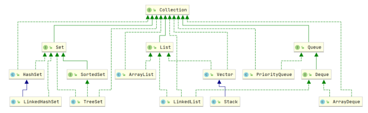
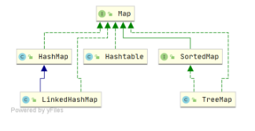

# Java集合

Java集合，也叫做容器，本质上就是**数据结构的实现**，与C++中的STL库类似。

Java中的集合类是由两个接口派生而来的一个是**Collection接口**，另一个是**Map接口**

---

## 一. Collection接口

继承Collection接口实现的集合类都是**用于储存值的单列集合**


<div align="center">
  Fig1.Collection接口派生集合类
</div>


所有单列集合类的根接口。它代表了一组对象，这些对象也称为元素。java.util.Collection 接口有以下几个主要的子接口：

**List：** 一个有序集合（也称为序列）。该接口的用户可以精确控制列表中每个元素的插入位置。用户可以通过整数索引（在列表中的位置）访问元素，并搜索列表中的元素。
**Set：** 一个不包含重复元素的集合。更确切地讲，集合不包含满足e1.equals(e2)的元素对e1和e2，并且最多包含一个null元素。
**Queue：** 一种用于在处理之前保持元素的集合。除了基本的Collection操作外，队列还提供其他插入、提取和检查操作。


**下面是Collection接口内部的方法**
```java
boolean add(E e) //- 确保此集合包含指定的元素（可选操作）。

boolean addAll(Collection<? extends E> c)// - 将指定集合中的所有元素添加到此集合（可选操作）。

void clear() //- 移除此集合中的所有元素（可选操作）。

boolean contains(Object o) //- 如果此集合包含指定的元素，则返回 true。

boolean containsAll(Collection<?> c) //- 如果此集合包含指定集合中的所有元素，则返回 true。

boolean equals(Object o) //- 比较此集合与指定对象是否相等。

int hashCode() //- 返回此集合的哈希码值。

boolean isEmpty() //- 如果此集合不包含元素，则返回 true。

Iterator<E> iterator() //- 返回在此集合中的元素上进行迭代的迭代器。

boolean remove(Object o) //- 如果存在，则从此集合中移除指定元素的单个实例（如果存在）（可选操作）。

boolean removeAll(Collection<?> c) //- 移除此集合中那些也包含在指定集合中的所有元素（可选操作）。

boolean retainAll(Collection<?> c) //- 仅保留此集合中那些也包含在指定集合的元素（可选操作）。

int size() //- 返回此集合中的元素数。

Object[] toArray() //- 返回一个包含此集合所有元素的数组。

<T> T[] toArray(T[] a) //- 返回一个包含此集合所有元素的数组；返回数组的运行时类型是指定数组的类型。
```

### 1.List

List类的集合特点就是**元素有序性和可重复性** 

#### 1.1 [ArrayList](ArrayList.md)
#### 1.2 [LinkedList](LinkedList.md)
#### 1.3 [Vector](Vector.md)

### 2.Set
Set接口下的集合特点是**元素不可重复性**

Set 是 Java 集合框架中的一个接口，表示一个不包含重复元素的集合。Set 的主要特性是其唯一性，集合中的每个元素都是唯一的。常见的 Set 实现类包括 **HashSet、LinkedHashSet 和 TreeSet**。

**Set 接口的主要特性**

- **唯一性**：Set 中不能包含重复的元素。如果试图将一个重复的元素加入 Set 中，则添加操作将失败。
- **无序或有序**：具体的 Set 实现类可以选择是否维护元素的顺序。例如，HashSet 是无序的，而 LinkedHashSet 保持插入顺序，TreeSet 按自然顺序或指定的比较器排序。

#### 2.1 [HashSet](./HashSet.md)
#### 2.2 SortedSet
#### 2.3 TreeSet

### 3.Queue
#### 3.1 Deque
#### 3.2 PriorityQueue


## 二. Map接口

继承Map接口实现的集合类都是**用于储存键值对的双列集合**


<div align="center">
  Fig2.Map接口派生集合类
</div>

**主要方法**
```java
import java.util.HashMap;
import java.util.Map;
import java.util.Set;
import java.util.Collection;

public class MapExample {
    public static void main(String[] args) {
        // 创建一个 HashMap 实例
        Map<String, Integer> map = new HashMap<>();

        // put(K key, V value) - 添加键值对
        map.put("Alice", 30);
        map.put("Bob", 25);
        map.put("Charlie", 35);

        // get(Object key) - 获取指定键对应的值
        System.out.println("Alice's age: " + map.get("Alice"));

        // remove(Object key) - 移除指定键的键值对
        map.remove("Bob");

        // containsKey(Object key) - 检查是否包含指定的键
        boolean hasAlice = map.containsKey("Alice");
        System.out.println("Contains Alice: " + hasAlice);

        // containsValue(Object value) - 检查是否包含指定的值
        boolean hasAge35 = map.containsValue(35);
        System.out.println("Contains age 35: " + hasAge35);

        // size() - 获取键值对的数量
        int size = map.size();
        System.out.println("Size of the map: " + size);

        // isEmpty() - 检查 Map 是否为空
        boolean isEmpty = map.isEmpty();
        System.out.println("Is the map empty? " + isEmpty);

        // keySet() - 获取所有键的集合
        Set<String> keys = map.keySet();
        System.out.println("Keys in the map: " + keys);

        // values() - 获取所有值的集合
        Collection<Integer> values = map.values();
        System.out.println("Values in the map: " + values);

        // entrySet() - 获取所有键值对的集合
        Set<Map.Entry<String, Integer>> entries = map.entrySet();
        System.out.println("Entries in the map: ");
        for (Map.Entry<String, Integer> entry : entries) {
            System.out.println(entry.getKey() + " : " + entry.getValue());
        }

        // clear() - 清空 Map
        map.clear();
        System.out.println("Is the map empty after clear? " + map.isEmpty());
    }
}
```
### 1. [HashMap](./HashMap.md)
### 2. LinkedHashMap
### 3. HashTable
### 4. SortedMap
### 5. TreeMap