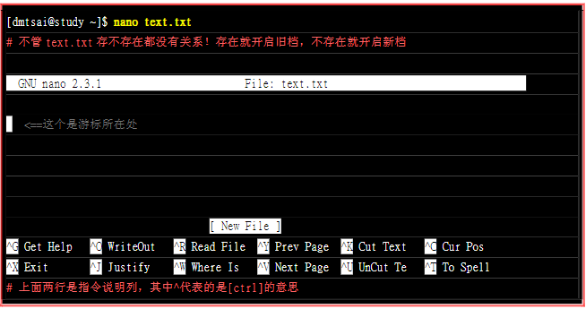

# 常用指令
---


## **1.显示日期**

- **date**
显示今天的日期全部

- **date +%H:%M**
显示当前时分秒


- **date +%Y/%m/%d**
显示当前年月日


- **cal**
显示日历


## **2.使用计算器**

- **bc**
通过bc来使用内置的计算器完成简单的计算
**scale**用来设置保留的小数点位数


## **3.常见的热键**

- **Tab**
**xx [tab][tab]** :用于自动补全所有以xx开头的指令

**xx -xx [tab][tab]** :会列出目录下的所有文件


- **Ctrl+c**
用于终止命令


- **Ctrl+d**
用于退出(相当于quit)


- **--help**
读取某个指令的基本使用方法


- **man page**
获得更为详细的使用方法


## **4.简单的文本编辑器nano**
通过输入nano就可以进入nano编辑器



## **5.关机指令**

-**sync**
这个指令用于将数据写入硬盘


-**shutdown**
用于关机


## **6. 处理目录的指令**

### **ls**：列出目录以及文件名

**选项与参数：**

-a ：全部的文件，连同隐藏文件( 开头为 . 的文件) 一起列出来(常用)
-d ：仅列出目录本身，而不是列出目录内的文件数据(常用)
-l ：长数据串列出，包含文件的属性与权限等等数据；(常用)


### **cd**:用来变换工作目录的命令

```
 cd [相对路径或绝对路径]

 #使用 mkdir 命令创建 runoob 目录
[root@www ~]# mkdir runoob

#使用绝对路径切换到 runoob 目录
[root@www ~]# cd /root/runoob/

#使用相对路径切换到 runoob 目录
[root@www ~]# cd ./runoob/

# 表示回到自己的家目录，亦即是 /root 这个目录
[root@www runoob]# cd ~

# 表示去到目前的上一级目录，亦即是 /root 的上一级目录的意思；
[root@www ~]# cd ..

```


### **mkdir**：用来创建目录的命令
```
mkdir [-mp] 目录名称
-m: 用来配置文件的权限
-p: 用来递归创建所有需要的目录
```


**这里看见我们创建的目录都是默认的权限属性**
上面的权限部分，如果没有加上 -m 来强制配置属性，系统会使用默认属性。

。


### **pwd**：用于显示目前所在的目录

pwd 是 Print Working Directory 的缩写，也就是显示目前所在目录的命令。

```
[root@www ~]# pwd [-P]

[root@www ~]# pwd
/root   <== 显示出目录啦～

[root@www ~]# cd /var/mail   <==注意，/var/mail是一个链接档
[root@www mail]# pwd
/var/mail         <==列出目前的工作目录
[root@www mail]# pwd -P
/var/spool/mail   <==怎么回事？有没有加 -P 差很多～
[root@www mail]# ls -ld /var/mail
lrwxrwxrwx 1 root root 10 Sep  4 17:54 /var/mail -> spool/mail
# 看到这里应该知道为啥了吧？因为 /var/mail 是链接档，链接到 /var/spool/mail 
# 所以，加上 pwd -P 的选项后，会不以链接档的数据显示，而是显示正确的完整路径啊
```


### **rmdir**:用于删除空的目录
这个指令只能用于删除没有内容的空目录，如果目录下还有内容则无法删除

```
 rmdir [-p] 目录名称

 -p :从该级目录开始删除多级空目录
```

### **rm** ：用于删除文件(即使不是空目录)

```
rm 目录名称
```
### **cp** :用于复制文件或目录

```
[root@www ~]# cp [-adfilprsu] 来源档(source) 目标档(destination)
[root@www ~]# cp [options] source1 source2 source3 .... directory
```


