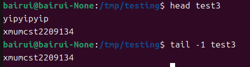

# 文件权限与目录配置
---
## 一. 使用者与群组

**1.文件拥有者**

Linux系统是多使用者的系统，所以时常会有很多人同时使用一部主机来工作。

为了保护每一个人的文件隐私，就有了文件拥有者的设定。

> 例如当你将你的 e-mail 情书转存成文件之后，放在你自己的家目录，你总不希望被其他人看见自己的情书吧？这个时候，你就把该文件设定成『只有文件拥有者，就是我，才能看与修改这个文件的内容』， 那么
即使其他人知道你有这个相当『有趣』的文件，不过由于你有设定适当的权限， 所以其他人自然也就无法
知道该文件的内容啰！


**2. 群组概念**

每个群组有多个组员，Linux系统可以通过权限限制，限制**非本群组的组员访问**

每个账户都可以访问多个群组, 比如设定YIP账号是CST206A和CST206B 的老师，YIP就可以同时观察两组的状态。YIP和这两个群组的所有人都是同一部主机的使用者

**3. 其他人的概念**

对于CST206A的成员来说，CST206B的成员就是其他人


root用户是一个特殊的存在，可以随意访问任意群组


## 二. Linux文件属性

### 1. Linux权限属性

在Linux系统中，文件权限对系统的安全性至关重要。权限决定了用户对文件或目录可以进行哪些操作。Linux中的文件权限分为三组：

**所有者（Owner）权限：**   文件的创建者或指定的所有者具有的权限。
**组（Group）权限：** 文件所属的用户组内成员的权限。
**其他用户（Others）权限：** 系统中非所有者且不在文件所属组内的其他用户的权限。

**权限类型主要分为三种：**

**读（Read - r）**：允许读取文件内容或列出目录内容。
**写（Write - w）**：允许修改文件内容或向目录添加/删除文件。
**执行（Execute - x）**：允许运行文件作为程序，或进入目录及在其内部进行搜索。

每个文件和目录的权限都用一串**由10位组成的字符**表示，下面详细解释每一位的含义：

**第一位 - 文件类型：**
-：普通文件。
d：目录。
l：链接。
c：字符设备文件，如键盘、鼠标等。
b：块设备文件，如硬盘、闪存驱动器等。
**第二至第四位 - 所有者权限：**
r：所有者具有读取文件或列出目录内容的权限。
w：所有者具有修改文件或向目录添加/删除文件的权限。
x：所有者具有执行文件或进入目录的权限。
**第五至第七位 - 组权限：**
r：组内用户具有读取权限。
w：组内用户具有写入权限。
x：组内用户具有执行权限。
**第八至第十位 - 其他用户权限：**
r：其他用户具有读取权限。
w：其他用户具有写入权限。
x：其他用户具有执行权限。


**以 drwxrwxr -x 为例子：**

-   **d**表示这个是一个目录

**从第二位开始分别三个字符为一组**
-   **rwx**表示所有者有读写和执行的权限
-   **rwx**表示组内用户有读写和执行的权限
-   **r-x**表示其他用户有读取和执行的权限，但没有写入的权限

### 2.链接数属性

在Unix和类Unix系统中，链接数是指向文件系统中某个节点（可以是文件或目录）的硬链接的数量。

紧跟权限属性后面的数字就是**Linux文件的链接数属性**

**对于文件**

每个文件都至少有**一个硬链接**，就是这个文件在系统中的名字。当你在系统中创建了一个新文件时，实际上是创建了**一个指向数据文件的硬链接**。

- 当为文件创建一个新的硬链接时，链接数增加。
- 当删除一个硬链接时，链接数减少。
- 当链接数减少到零时，系统会释放该文件的数据，因为没有更多的链接指向它。

**对于目录**

每个目录都至少有**两个硬链接**

- 其中一个是目录本身的名字 **(指向本身的硬链接)**
- 另一个是指向父链接的硬链接
- 对于目录的链接数，还包括：该目录中每个直接子目录的 .. 条目（指向当前目录的硬链接），因为 .. 是子目录指向父目录的链接。

因此，**如果一个目录有三个直接子目录**，则该**目录的链接数至少是五**：自身的链接 ‘.’，指向父目录中的链接，以及每个子目录中的 ‘..’ 链接

**以这个文件夹为例**


**链接数为2**，一个链接指向目录名，一个链接指向父链接

### 3. 所有者和群组属性

紧跟在链接数属性后面的就是文件的所有者用户名和群组属性

以上面的图为例，这个文件夹的所有者就是**bairui**，所属群组是**bairui**

### 4. 大小日期和名称

还是以上面的截图为例，这里的文件大小就是**4096**字节

紧跟在大小后面的就是修改日期和文件名称**4月 19 11：34** **test.txt**

### 5. 文件权限的重要性

与Windows系统不同，Linux系统多了很多属性（特别是群组）

多加的这些属性是为了保证数据的安全性

- **系统保护**

>在Linux系统中，关于系统服务的文件通常只有Root才能读写或者执行，例如/etc/shadow这个管理账号的文件记录了系统中所有账号的数据。为了防止账号数据的泄露，只有Root账号才能访问，所以这个文件的权限属性就被设定为[----------]即其他账户都没有访问权限，而root账户不管文件权限是什么都可以访问。

- **软件开发或数据共享**

>如果你有一个软件开发团队，在你的团队中，你希望每个人都可以使用某一些目录下的文件， 而非
你的团队的其他人则不予以开放呢？以上面的例子来说，testgroup 的团队共有三个人，分别是 test1, test2,
test3，那么我就可以将团队所需的文件权限订为[ -rwxrws--- ]来提供给 testgroup 的工作团队使用啰！

- **未将权限设定妥当的危害**

>再举个例子来说，如果你的目录权限没有作好的话，可能造成其他人都可以在你的系统上面乱搞啰！ 例如本来只有 root 才能做的开关机、ADSL 的拨接程序、新增或删除用户等等的指令，若被你改成任何人都可以执行的话， 那么如果使用者不小心给你重新启动啦！重新拨接啦！等等的！那么你的系统不就会常常莫名其妙的挂掉啰！ 而且万一你的用户的密码被其他不明人士取得的话，只要他登入你的系统就可以轻而易举的执行一些 root 的工作！

## 三. 如何改变文件属性与权限

### 1.改变所属群组 .chgrp

改变文件所属群组

```
chgrp [选项] 群组名 文件名

chgrp users myfile.txt //将myfile.txt的群组改成user

```
### 2.改变文件拥有者 .chown

改变文件拥有者

```
chown [选项] 用户名:群组名 文件名

chgrp bairui:users myfile.txt

```

### 3.改变文件的权限 .chmod

改变文件的读写执行权限

权限模式可以是数字表示法，如 755，也可以是符号表示法，如 u+rwx,g+rx,o+rx。

**数字表示法：** 
每个权限组对应一个数字，r（4）、w（2）和x（1）。这些数字加起来代表了权限组合。
**符号表示法：** 
使用 u（用户，即所有者）、g（群组）、o（其他用户）和 a（所有用户）来指定权限的更改范围，然后使用 +（添加权限）、-（删除权限）和 =（设置确切权限）来更改权限。

每种身份(owner/group/others)各自的三个权限(r/w/x)分数是需要累加的，例如当权限为： [-rwxrwx---] 分数
则是：
owner = rwx = 4+2+1 = 7
group = rwx = 4+2+1 = 7
others= --- = 0+0+0 = 0

```
chmod [选项] 权限模式 文件名

chmod 755 myfile.txt
chmod u=rwx,g=rx,o=rx myfile.txt

7=4+2+1
5=4+1
5=4+1

owner=rwx
group=rx
others=rx
```

## 四. 读写文件

### **1.ls**

用于查看当前目录下的全部文件与文件夹

```
ls [-al..参数] [想要访问的文件夹]

ls -l test
```

### **2.cd**

用于转到某个文件夹

```
cd [文件名]

cd test
```

### **3.cp,rm,mv**

分别用于复制，删除，移动文件

```
cp [源文件] [目标位置]

rm [参数-r可以用于递归删除] [文件名]

rmdir [删除全部-r] [文件夹名]//用于删除空文件夹

mv [源文件] [目标位置]

```

### **4.touch**

touch用于新建文件

```
touch [-acdmt] 文件

touch testtouch //新建文件testtouch

touch -d "2 dayss ago" bashhrc //新建文件并将日期调整为两天前

touch -t 201406150202 bashhrc //将bash文件的日期改为2014/06/15


```


## 五. 文件内容的检阅


**1.cat**:从第一行开始显示文件的内容

**选项与参数：**

- A ：相当於 -vET 的整合选项，可列出一些特殊字符而不是空白而已；
- b ：列出行号，仅针对非空白行做行号显示，空白行不标行号！
- E ：将结尾的断行字节 $ 显示出来；
- n ：列印出行号，连同空白行也会有行号，与 -b 的选项不同；
- T ：将 [tab] 按键以 ^I 显示出来；
- v ：列出一些看不出来的特殊字符

```
cat [-AbEnTv]


```


**2.tac**:从最后一行开始显示文件的内容
```
[root@www ~]# tac /etc/issue

Kernel \r on an \m
CentOS release 6.4 (Final)
```


**3.nl**:显示的时候，同时输出行号

```
nl [-bnw] 文件

```
**选项与参数：**

- b ：指定行号指定的方式，主要有两种：
- b a ：表示不论是否为空行，也同样列出行号(类似 cat -n)；
- b t ：如果有空行，空的那一行不要列出行号(默认值)；
- n ：列出行号表示的方法，主要有三种：
- n ln ：行号在荧幕的最左方显示；
- n  rn ：行号在自己栏位的最右方显示，且不加 0 ；
- n rz ：行号在自己栏位的最右方显示，且加 0 ；
- w ：行号栏位的占用的位数。


**4.more**:一页一页的显示
```
[root@www ~]# more /etc/man_db.config 
#
# Generated automatically from man.conf.in by the
# configure script.
#
# man.conf from man-1.6d
....(中间省略)....
--More--(28%)  <== 重点在这一行喔！你的光标也会在这里等待你的命令
```
在 more 这个程序的运行过程中，你有几个按键可以按的：

- 空白键 (space)：代表向下翻一页；
- Enter         ：代表向下翻『一行』；
- /字串         ：代表在这个显示的内容当中，向下搜寻『字串』这个关键 字；
- :f            ：立刻显示出档名以及目前显示的行数；
- q             ：代表立刻离开 more ，不再显示该文件内容。
- b 或 [ctrl]-b ：代表往回翻页，不过这动作只对文件有用，对管线无用。

**5.less**:与more相同，但是可以向前翻页

```
[root@www ~]# less /etc/man.config
#
# Generated automatically from man.conf.in by the
# configure script.
#
# man.conf from man-1.6d
....(中间省略)....
:   <== 这里可以等待你输入命令！
```
ess运行时可以输入的命令有：

- 空白键    ：向下翻动一页；
- [pagedown]：向下翻动一页；
- [pageup]  ：向上翻动一页；
- /字串     ：向下搜寻『字串』的功能；
- ?字串     ：向上搜寻『字串』的功能；
- n         ：重复前一个搜寻 (与 / 或 ? 有关！)
- N         ：反向的重复前一个搜寻 (与 / 或 ? 有关！)
- q         ：离开 less 这个程序；

**6.head**:只看头几行

```
head [-n number] 文件 
```
**参数意义**
- n ：后面接数字，代表显示几行的意思，默认的情况中，显示前面 10 行！若要显示前 20 行，就得要这样：

```
[root@www ~]# head -n 20 /etc/man.config
```

**7.tail**:只看末尾几行

```
tail [-n number] 文件 
```
**参数意义**
- n ：后面接数字，代表显示几行的意思，默认的情况中，显示最后 10 行！若要显示后 20 行，就得要这样：

```
[root@www ~]# tail -n 20 /etc/man.config
```


**8.od**:查看非纯文本文档


## 六. 文件权限的设置

**1.权限类型**

在笔记前面有记录，Linux文件权限分为owner权限，group user权限，others权限

- r 读取权限 4
- w 写入权限 2
- x 执行权限 1

比如说**755表示这个文件owner具有rwx权限，group user和others有读取和执行权限**

**2.文件预设权限 umask**

**umask (user file-creation mode mask)** 

这个命令是用来预设文件建立时候的权限的，


这里看见系统预设的权限是002

umask的分数指的是[该默认值需要减掉的权限！]

比如002 ，对于owner和group user 是不需要减掉权限，others的权限需要-2(即没有写入的权限)

- 建立文件时：(-rw-rw-rw-)-(002)= (-rw-rw-r--)
- 建立目录时：(drw-rw-rw-)-(002)= (drw-rw-r--)


**umask的用处**

当群组工作的时候，如果umask设定为022，那么组内工作者就没有文件的写入权限

因此要通过umask来重新设定预定权限

**3.文件类型观察**

```
file 文件名称
```

file指令用来查看文件的类型
