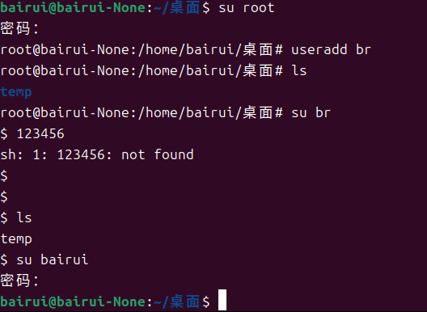
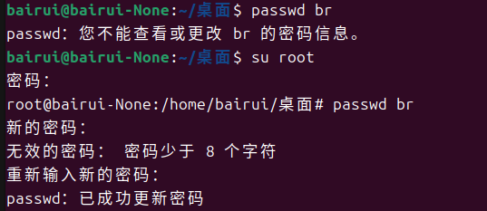

# 用户和用户组管理

用户账户的管理工作主要涉及到用户账号的添加删除和修改

添加用户账号就是在系统中创建一个新账号，然后为新账号分配用户号、用户组、主目录和登录Shell等资源。刚添加的账号是被锁定的，无法使用。

---
# 用户管理
## 1.添加用户

```
useradd [-cdgGsu] 用户名

-c comment 指定一段注释性描述。
-d 目录 指定用户主目录，如果此目录不存在，则同时使用-m选项，可以创建主目录。
-g 用户组 指定用户所属的用户组。
-G 用户组，用户组 指定用户所属的附加组。
-s Shell文件 指定用户的登录Shell。
-u 用户号 指定用户的用户号，如果同时有-o选项，则可以重复使用其他用户的标识号。

useradd -d /home/sam -m sam //创建了一个新的用户sam，并为这个用户创建一个主目录

useradd -g group –G adm,root gem//创建了一个新的用户gem，gem同时属于adm root group组，group是gem的主组

```




## 2.删除用户

```
userdel [] 用户名

-r 把用户的主目录同时删除
```


## 3.修改账户

```
usermod [-cdmgGsuo] 用户名

-c comment 指定一段注释性描述。
-d 目录 指定用户主目录，如果此目录不存在，则同时使用-m选项，可以创建主目录。
-g 用户组 指定用户所属的用户组。
-G 用户组，用户组 指定用户所属的附加组。
-s Shell文件 指定用户的登录Shell。
-u 用户号 指定用户的用户号，如果同时有-o选项，则可以重复使用其他用户的标识号。

```

## 4.用户口令的管理

用户管理的一项重要内容是用户口令的管理。用户账号刚创建时没有口令，但是被系统锁定，无法使用，必须为其指定口令后才可以使用，即使是指定空口令。

指定和修改用户口令的Shell命令是passwd。**超级用户root**可以为自己和其他用户指定口令，普通用户只能用它修改自己的口令。命令的格式为：
```
passwd [-ludf] 用户名

-l 锁定口令，即禁用账号。
-u 口令解锁。
-d 使账号无口令。
-f 强迫用户下次登录时修改口令。

```



# 用户组管理

## 1.添加用户组

```
groupadd [] 组名

- g GID 指定新用户组的组标识号（GID）。
- o 一般与-g选项同时使用，表示新用户组的GID可以与系统已有用户组的GID相同。

```

## 2.删除用户组

```
groupdel 用户组

# groupdel group1
```

用于删除某个用户组

## 3.修改用户组的属性

```
groupmod [-gon] 用户组

- g GID 为用户组指定新的组标识号。
- o 与-g选项同时使用，用户组的新GID可以与系统已有用户组的GID相同。
- n新用户组 将用户组的名字改为新名字

# groupmod -g 102 group2 //给group2标识号为102
# groupmod -g 102 -n group3 group2 //给group2组名改成group3，标识号改为102

```
## 4.切换用户组

```
newgrp 组名 //切换到新的用户组

```