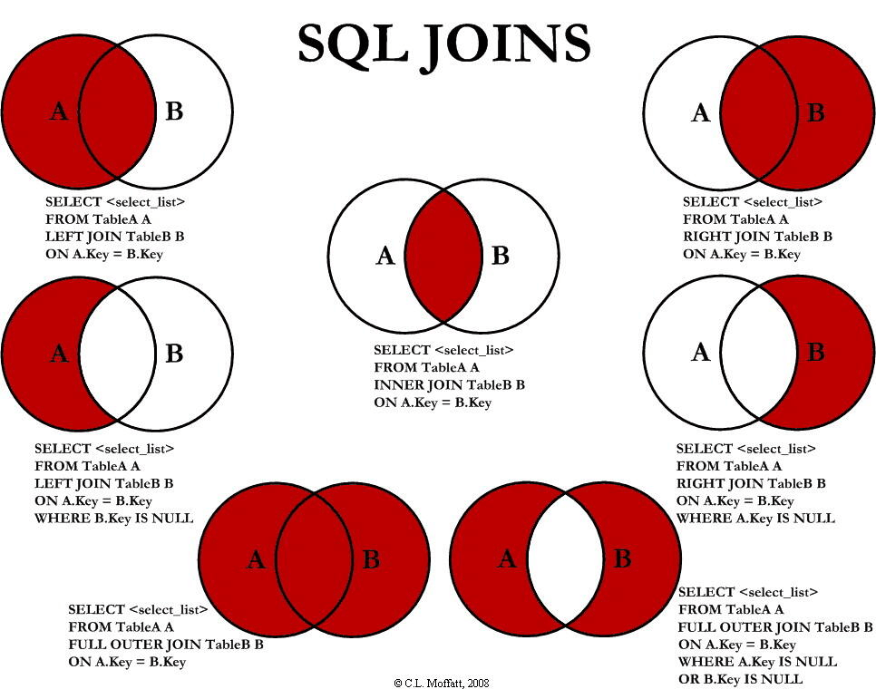
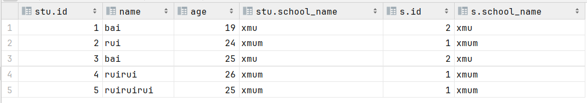
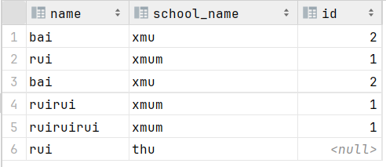
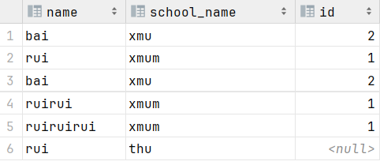
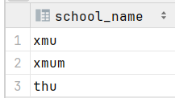

# Mysql基础

MySQL 是关系型数据库管理系统的一种实现，它实现了关系型数据库的基本概念和功能。MySQL 使用表格来表示数据，并通过 SQL 进行数据管理。


---

## 1. Sql语句的分类

### **DDL(Data Defination Language)**

数据定义语言，用来定义数据库对象 **(数据库，表，字段)**

**示例**
```mysql
-- 创建表
CREATE TABLE Employees (
    EmployeeID INT PRIMARY KEY,
    FirstName VARCHAR(50),
    LastName VARCHAR(50),
    BirthDate DATE,
    Position VARCHAR(50)
);

-- 修改表
ALTER TABLE Employees ADD Email VARCHAR(100);

-- 删除表
DROP TABLE Employees;

-- 清空表
TRUNCATE TABLE Employees;
```

### **DML(Data Manipulation Language)**

数据操作语言，用来对数据库表中的数据进行**增(INSERT),改(UPDATE),删(DELETE)**

**示例**
```mysql
-- 插入数据
INSERT INTO Employees (EmployeeID, FirstName, LastName, BirthDate, Position)
VALUES (1, 'John', 'Doe', '1980-01-01', 'Manager');

-- 更新数据
UPDATE Employees SET Position = 'Senior Manager' WHERE EmployeeID = 1;

-- 删除数据
DELETE FROM Employees WHERE EmployeeID = 1;
```

### DQL(Data Query Language)

数据查询语言，用来查询数据库中的**记录**

**示例**
```mysql
SELECT column1, column2 FROM table_name WHERE condition;
```

### DCL(Data Control Language)

数据控制语言，用来创建数据库用户，控制数据库的访问权限

**示例**
```mysql
-- 授予权限
GRANT SELECT, INSERT ON Employees TO user1;

-- 撤销权限
REVOKE INSERT ON Employees FROM user1;
```

## 2. DDL操作详解
**控制字段**
### 2.1 CREATE
**创建数据库**
```mysql
CREATE DATABASE my_database;
```
**创建表**
```mysql
CREATE TABLE users (
    id INT AUTO_INCREMENT PRIMARY KEY,
    name VARCHAR(100) NOT NULL,
    email VARCHAR(100) UNIQUE NOT NULL,
    created_at TIMESTAMP DEFAULT CURRENT_TIMESTAMP
);
```
### 2.2 ALTER
**添加字段**
```sql
alter table test add column age int;
```
**修改字段的数据类型**
```sql
alter table test modify column name varchar(50);
```
**重命名列**
```sql
alter table test change column age Age int;
```
**重命名表**
```sql
alter table test rename to student;
```
**删除列**
```sql
alter table test drop column age;
```

### 2.3 DROP

**删除数据库**
```sql
drop database db01;
```
**删除表**
```sql
drop table student;
```

## 3. DML操作详解
**控制记录**
### 3.1 Insert

**插入记录**
```sql
insert into student (id,name) values (1,'bairui');
```

**插入多条数据**
```sql
insert into student (id,name) values
(2,'bai'),
(3,'rui')
```
### 3.2 Update

**更新单条记录**
```sql
update student set name='br' where id =1;
```

**更新多条记录**
```sql
update student set name='br' where age=12;//将12岁的都改成br
```

### 3.3 Delete

**删除某条数据**

```sql
delete from student where id =1;
```

**删除所有数据**

```sql
delete from user;
```


## 4. DQL操作详解

**Sql查询语句的运行顺序**
在 SQL 中，查询的执行顺序与我们书写的顺序不同。SQL 引擎通常按照以下步骤执行查询：
```
FROM 子句：确定参与查询的表或视图，并进行必要的连接。
JOIN 操作：执行连接操作，生成一个中间结果集。
WHERE 子句：应用过滤条件，筛选出符合条件的行。
GROUP BY 子句：按指定的列分组。
HAVING 子句：对分组后的结果进行过滤（如果存在）。
SELECT 子句：选择需要返回的列，并计算聚合函数。
ORDER BY 子句：排序结果集（如果存在）。
LIMIT 子句：限制返回的行数（如果存在）。
DQL语句通过**select**在表中查询对应条件的字段
通过限制条件来控制查询记录
```

**SELECT 语句的基本语法**

```sql
SELECT [DISTINCT] column1, column2, ...
FROM table_name
[WHERE condition]
[GROUP BY column1, column2, ...]
[HAVING condition]
[ORDER BY column1 [ASC|DESC], column2 [ASC|DESC], ...]
[LIMIT number];
```

### 4.1 基本查询
**查询表中所有字段，并给出相应的记录**
```sql
select * from student;
```
**查询表中某些字段，并给出相应的记录**
```sql
select age from student;
```


### 4.2 条件查询

#### 4.2.1 单表操作

**根据条件筛出某些记录-Where**
```sql
select * from student where age>20;
```

**消除字段中的重复记录-distinct**
```sql
select distinct age from student;
```

**将字段的记录按排序-order by**
```sql
select distinct name,age from student order by age asc;//正序
select distinct name,age from student order by age desc;//逆序
```

**分组-group by**

通常要和聚合函数一起组合使用

```sql
select age,count(*) from student group by age;
```

**筛选分组后的记录-Having**

```sql
select age,count(*) 
from student 
group by age
having count(*)>1;
```

**限制返回的记录数**

```sql
select age,count(*) 
from student 
group by age
limit 2;
```
#### 4.2.2 多表操作
SQL join 用于把来自两个或多个表的行结合起来。

下图展示了 LEFT JOIN、RIGHT JOIN、INNER JOIN、OUTER JOIN 相关的 7 种用法。


**Join**
最普通的多表连接，根据条件返回两张表中有连接的记录
```sql
select stu.name,stu.school_name
from student stu
join school s
on stu.school_name=s.school_name;

select *
from student stu
inner join school s //inner join 与join的结果相同
on stu.school_name=s.school_name;
```



**left join**
返回左表中的所有记录，即使右表中没有相应的记录(会返回null)
```sql
select stu.name,stu.school_name
from student stu
left join school s
on stu.school_name=s.school_name;
```


**right join**
返回左表中的所有记录，即使右表中没有相应的记录(会返回null)
```sql
select stu.name,stu.school_name
from school s
right join student stu
on stu.school_name=s.school_name;
```


**union**
将多次查询的结果聚在一起并去重
```sql
select school_name
from student
union
select school_name
from school;
```



### 4.3 聚合函数

**count()**
用于各组表中计算记录的数量
```sql
select school_name,count(*) as sum 
from student 
group by school_name;
```
**sum()**
用于计算各组表中数值字段的记录和
```sql
select school_name,sum(age) as sum_age
from student
group by school_name;
```

**avg()**
用于计算各组表中数值字段的记录平均值
```sql
select school_name,avg(age) as sum_age
from student
group by school_name;
```

**min()**
用于计算各组表中数值字段的记录最小值
```sql
select school_name,min(age) as sum_age
from student
group by school_name;
```
**max()**
用于计算各组表中数值字段的记录最大值
```sql
select school_name,max(age) as sum_age
from student
group by school_name;
```

### 4.4 子查询

**子查询（Subquery）** 是嵌套在另一个 SQL 查询中的查询。子查询可以出现在 SELECT、FROM、WHERE、HAVING 和 JOIN 子句中，用于执行更复杂的查询操作。子查询允许你在一个查询中使用另一个查询的结果，从而实现更强大的数据检索和操作。

**子查询会优先进行**

