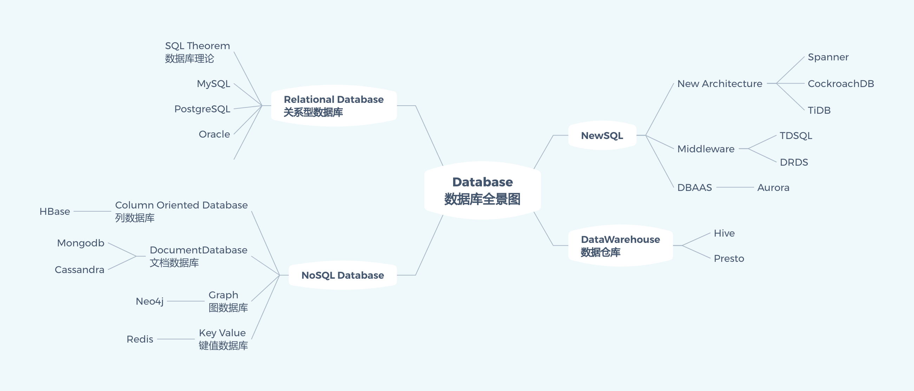

# 数据库的基本概念

> **数据库、操作系统和编译器** 并称为三大系统，可以说是整个计算机软件的基石。其中**数据库更靠近应用层，是很多业务的支撑。** 这一领域经过了几十年的发展，不断的有新的进展。任何数据库管理系统的主要工作都是可靠地存储数据并使数据可供用户使用，即当你把数据交给数据库时，它应当把数据存储起来；而后当你向数据库要数据时，它应当把数据返回给你。我们常常使用数据库作为主要数据源，帮助我们在应用程序的不同部分之间共享数据库。每次创建新应用程序时，我们都没有使用存储和检索信息的方法，而是发明了一种新的组织数据的方法，而是使用数据库。这样，我们可以专注于应用程序逻辑而不是基础架构。

---

## 一. 什么是数据库? 数据库的作用是什么

**数据库（Database）：** 一个数据库是一个有组织的、存储数据的集合，通常以电子方式存储在计算机系统中。

**数据库管理系统（DBMS）：** DBMS(Data Base Manage System)是用于创建和管理数据库的软件。常见的 DBMS 包括 MySQL、PostgreSQL、SQLite、Oracle、SQL Server 等。

**数据库系统(DBS):** 数据库系统(Data Base System，简称 DBS)通常由软件、数据库和数据管理员(DBA)组成。

**数据库管理员(DBA):**  数据库管理员(Database Administrator, 简称 DBA)负责全面管理和控制数据库系统。

**SQL(Structured Query Language):** 操作关系型数据库的编程语言，定义了一套操作关系型数据库的统一标准

**数据库最根本的功能是能把数据存下来**

保存数据的方法很多，最简单的方法是直接在内存中建一个数据结构，保存用户发来的数据。比如用一个数组，每当收到一条数据就向数组中追加一条记录。这个方案十分简单，能满足最基本，并且性能肯定会很好，但是除此之外却是漏洞百出，其中最大的问题是数据完全在内存中，一旦停机或者是服务重启，数据就会永久丢失。

## 二. 数据库的类型有哪些？

### 1.关系型数据库（RDBMS）
数据以表的形式组织，表之间通过关系进行连接。SQL（Structured Query Language）是用于管理关系型数据库的标准语言。

**关系型数据库（Relational Database，简称 RDBMS）** 是一种基于关系模型的数据管理系统。关系模型由 IBM 的 E.F. Codd 于 1970 年提出，它使用表格来表示数据及其之间的关系。使用表格来组织数据，并通过 **SQL（Structured Query Language）进行数据管理**。关系型数据库的基本单位是表（Table），表由行（记录）和列（字段）组成。

#### 关系型数据库的基本概念

##### **表(table)**
表是关系型数据库的基本存储结构。每个表包含若干行和列。
- **行（记录）**：表中的每一行表示一条记录。
- **列（字段）**：表中的每一列表示记录中的一个属性或特征。

##### 主键(Primary Key)
- 主键是表中的一个或多个字段，其值唯一标识表中的每一行。
- 主键的值不能重复，也不能为 NULL。

##### 外键(Foreign Key)
- 外键是一个或多个字段，其值引用另一表的主键。
- 外键用于在表之间建立关系，确保数据的一致性和完整性。

##### 索引(Index)
- 索引是对表中一列或多列的值进行排序的一种结构，用于加速数据检索。
- 常见的索引类型包括 B-tree 索引和哈希索引。
##### 视图(view)
- 视图是基于一个或多个表的查询结果，它提供了一种虚拟表的表示。
- 视图不存储数据，只存储查询定义。
##### 模式(Schema)
- 模式是数据库对象（如表、视图、索引等）的集合，用于组织和管理数据库结构。

#### 关系型数据库的优点

**数据完整性**：通过主键和外键约束，确保数据的一致性和完整性。
**数据安全性**：通过用户权限和角色管理，确保数据的安全性。
**数据独立性**：应用程序与数据的物理存储方式独立，数据的修改不影响应用程序。
**支持复杂查询**：通过 SQL，可以进行复杂的数据查询和操作。

### 2.非关系型数据库（NoSQL）
适用于存储非结构化数据，具有灵活的结构。常见的类型包括文档数据库、键值数据库、列族数据库和图数据库。

**示例：** MongoDB（文档数据库）、Redis（键值数据库）、Cassandra（列族数据库）、Neo4j（图数据库）。