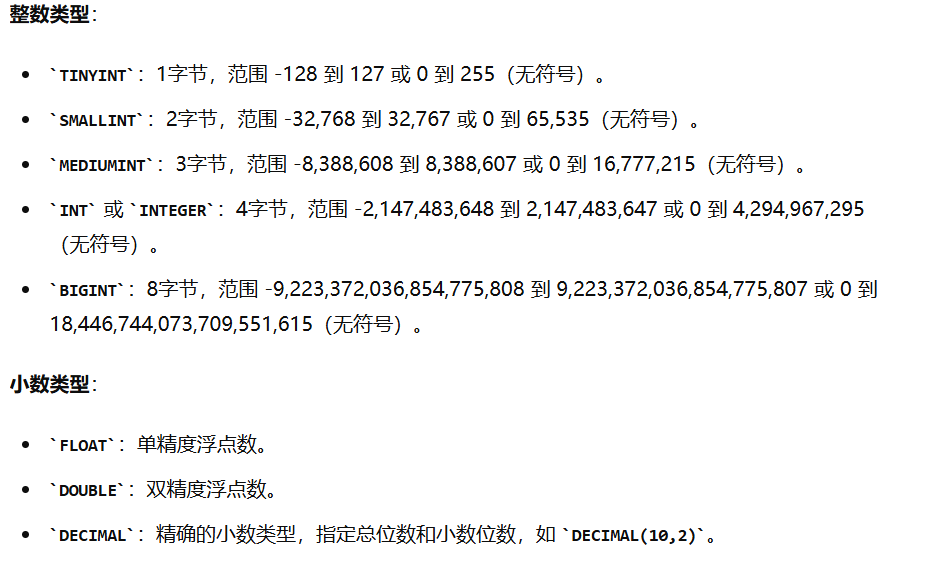
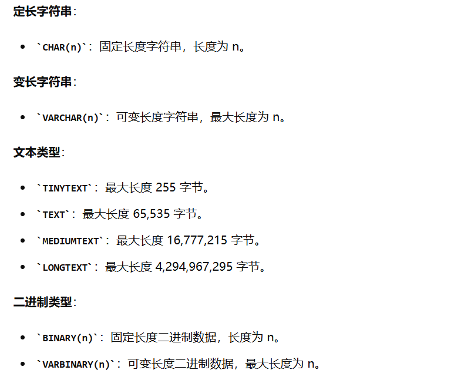
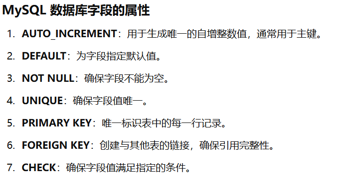

# 字段

MySQL 数据库的字段（或称列）用于定义表中的数据类型和属性。


---


## 1. 数据类型
### 1.1 数值类型

### 1.2 字符串类型

### 1.3 日期类型

### 1.4 枚举和集合类型

```sql
CREATE TABLE example (
    id INT AUTO_INCREMENT PRIMARY KEY,
    status ENUM('active', 'inactive', 'suspended'),
    options SET('option1', 'option2', 'option3')
);
```

## 2. 属性



```sql
CREATE TABLE employees (
    id INT AUTO_INCREMENT PRIMARY KEY,            -- 主键，自增
    name VARCHAR(100) NOT NULL,                   -- 非空字符串
    email VARCHAR(100) UNIQUE,                    -- 唯一字符串
    birthdate DATE,                               -- 日期
    hire_date TIMESTAMP DEFAULT CURRENT_TIMESTAMP,-- 默认当前时间戳
    salary DECIMAL(10, 2) CHECK (salary > 0),     -- 带检查约束的十进制数
    status ENUM('active', 'inactive', 'suspended')-- 枚举类型
);
```

```sql
CREATE TABLE orders (
    order_id INT AUTO_INCREMENT PRIMARY KEY,
    order_date DATE NOT NULL,
    customer_id INT,
    amount DECIMAL(10, 2) NOT NULL CHECK (amount > 0),
    status ENUM('pending', 'shipped', 'delivered') NOT NULL,
    FOREIGN KEY (customer_id) REFERENCES customers(customer_id)
);
```