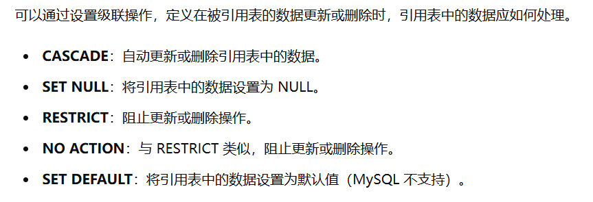

# 约束

在数据库中，**约束（Constraints）用于限制数据表中的数据**，以确保数据的完整性、正确性和一致性。通过设置约束，可以防止无效数据的输入和维护数据库的质量。以下是常见的几种约束及其详细解释：

---

**示例**

```sql
CREATE TABLE employees (
    id INT PRIMARY KEY,                      -- 主键约束
    name VARCHAR(100) NOT NULL,              -- 非空约束
    email VARCHAR(100) UNIQUE,               -- 唯一约束
    salary DECIMAL(10, 2) DEFAULT 3000.00,   -- 默认约束
    age INT CHECK (age >= 18),               -- 检查约束
    department_id INT,
    FOREIGN KEY (department_id) REFERENCES departments(id)  -- 外键约束
);
```

## 1. 主键约束
主键约束确保表**被约束字段**中的**每一条记录** 都有一个唯一的标识符，并且该标识符不能为空

**主键约束的特性**
- **唯一性**
- **非空**
- **约束单个字段或多个字段(复合主键)**

### 1.1 创建主键
#### 1.1.1 单一主键
创建表的时候给**某一个字段添加单列主键**
```sql
CREATE TABLE employees (
    id INT PRIMARY KEY//主键约束
    name VARCHAR(100),
    salary DECIMAL(10, 2)
);
```
在已有表上添加单列主键：
```sql
ALTER TABLE employees
ADD PRIMARY KEY (id);
```

#### 1.1.2 复合主键
复合主键是由多个列组合起来的主键，用于唯一标识表中的每一行记录。

创建表时定义复合主键：
```sql
CREATE TABLE employee_projects (
    employee_id INT,
    project_id INT,
    PRIMARY KEY (employee_id, project_id)//给两个字段都加上主键约束
);
```
在已有表上添加复合主键
```sql
ALTER TABLE employee_projects
ADD PRIMARY KEY (employee_id, project_id);
```

### 1.2 修改主键
要修改主键，通常需要先删除现有的主键，然后添加新的主键。
只是**删除主键约束，不是删除字段**
```sql
ALTER TABLE employees
DROP PRIMARY KEY,
ADD PRIMARY KEY (name, salary);
```
### 1.3 删除主键
```sql
ALTER TABLE employees
DROP PRIMARY KEY;
```
## 2. 外键约束
**外键约束（Foreign Key Constraint）** 用于在两个表之间建立和维护关系，确保一个表中的数据与另一个表中的数据保持一致。外键约束有助于维护数据的完整性和一致性，防止数据孤立或失效。

**外键约束的特点**
- **参照完整性**：外键约束确保**约束的字段**必须是**被唯一约束的字段(通常是主键约束)**，维护表之间的参照完整性。
- **多对一关系**：外键通常表示表之间的多对一关系，例如多个员工属于一个部门。
- **级联操作**：可以通过设置级联操作，当被引用表中的数据更新或删除时，自动更新或删除引用表中的数据。

### 2.1 创建外键约束
在创建表的时候添加外键约束
```sql
CREATE TABLE customers (
    customer_id INT PRIMARY KEY,
    customer_name VARCHAR(100)
);

CREATE TABLE orders (
    order_id INT PRIMARY KEY,
    order_date DATE,
    customer_id INT,
    FOREIGN KEY (customer_id) REFERENCES customers(customer_id)//添加外键约束，参考字段是customers表的id
    ON DELETE CASCADE
    ON UPDATE CASCADE
);
```
给已有表添加外键约束
```sql
ALTER TABLE employees
ADD CONSTRAINT fk_department
FOREIGN KEY (department_id)
REFERENCES departments(id);
```

### 2.2 级联操作


**示例**
```sql
CREATE TABLE employees (
    id INT PRIMARY KEY,
    name VARCHAR(100),
    department_id INT,
    FOREIGN KEY (department_id) REFERENCES departments(id)
    ON DELETE CASCADE //删除departments表中的记录同时删除employ中的记录
    ON UPDATE CASCADE//同时更新
);
```
### 2.3 删除外键约束
### 2.4 修改外键约束

## 3. 唯一约束
## 4. 非空约束
## 5. 检查约束
## 6. 默认约束
## 7. 复合约束