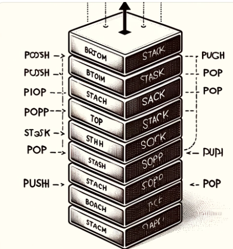
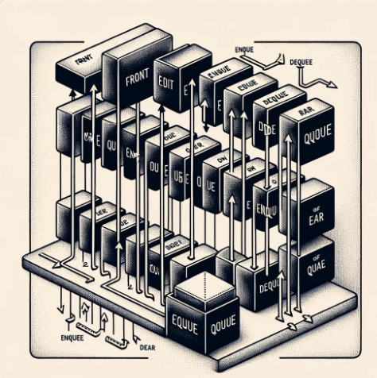
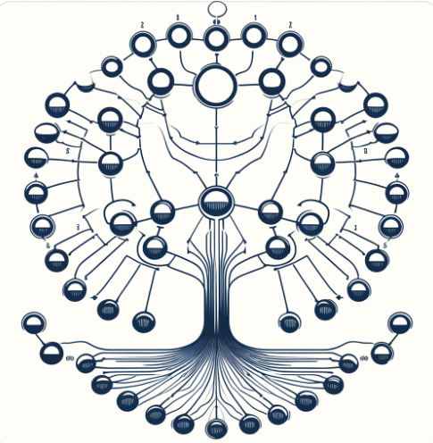

# Data-Structure
数据结构是计算机存储、组织数据的方式，它使得数据的访问更加有效。这包括了顺序结构和链状结构
## 顺序结构

顺序结构是数据按照线性顺序排列的结构，主要包括：

- **数组**：一种固定大小的，能够持有预定义数量类型数据项的集合。
- **链表**：由节点组成的集合，每个节点都包含数据部分和指向下一个节点的指针。根据链接节点的方式不同，链表可以进一步分为：
  - **单链表**：
    - 每个节点只包含一个指向下一个节点的指针。
    - 操作简单，但只能单向遍历。
  - **双链表**：
    - 每个节点包含两个指针，一个指向下一个节点，另一个指向前一个节点。
    - 支持双向遍历，增加和删除操作相对复杂。
- **栈**：一种后进先出（LIFO）的数据结构，只能在一端（栈顶）进行添加和删除操作。
  
  
  **特殊类型包括：**
  - **单调栈**：
    - 用于解决一类特定的问题，它按照某种顺序（递增或递减）来维护栈内元素的单调性。
    - 常用于解决数组中元素的最大值、最小值、或者是某个元素向左或向右第一个比它大（或小）的元素的问题。

- **队列**：一种先进先出（FIFO）的数据结构，新元素的添加在队尾进行，元素的移除在队头进行. 

  **特殊类型包括：**
  - **单调队列**：
    - 与单调栈类似，单调队列维护队列中元素的单调性（递增或递减）。
    - 常用于解决滑动窗口类问题，比如求滑动窗口的最大值或最小值。

## 树状结构

链状结构中的元素通过链接点串联起来，包括树和图，它们在物理存储上不必相邻。

## 树

树是表示具有层次关系的数据的分层数据模型，包括：

### 二叉树

- 每个节点最多有两个子节点：一个是左子节点，另一个是右子节点。
- 特点包括有根节点、叶节点、子树、节点的深度和树的高度。

### 二叉搜索树 (BST)

- 一个节点的左子树只包含小于当前节点的数，右子树只包含大于当前节点的数。
- BST在最坏情况下可能会退化为一个链表。

### AVL树

AVL树是一种自平衡的二叉搜索树，得名于其发明者 G. M. Adelson-Velskii 和 E. M. Landis。AVL树的每个节点都维护了一个平衡因子，该因子是其左子树高度与右子树高度的差值。这个平衡因子的维护确保了树在进行插入和删除操作之后，仍然保持相对平衡，从而保证了操作的高效性。

#### 平衡因子

- 平衡因子的可能值为 -1、0 或 1。
  - **-1**：表示该节点的右子树比左子树高一层。
  - **0**：表示该节点的左右子树高度相同。
  - **1**：表示该节点的左子树比右子树高一层。

#### 自平衡操作

当进行插入或删除操作后，AVL树通过以下旋转操作来恢复其平衡状态：

- **右旋转**：适用于左子树比右子树高的情况（LL不平衡）。
- **左旋转**：适用于右子树比左子树高的情况（RR不平衡）。
- **左右旋转**：先对子节点进行左旋转，然后对当前节点进行右旋转，适用于左子树的右子树比左子树高的情况（LR不平衡）。
- **右左旋转**：先对子节点进行右旋转，然后对当前节点进行左旋转，适用于右子树的左子树比右子树高的情况（RL不平衡）。

#### 特点

- **高度平衡**：AVL树的高度大约是log(n)，其中n是树中节点的数量，这保证了查找、插入和删除操作的高效性。
- **旋转操作**：通过旋转操作来保持树的平衡，虽然这增加了插入和删除操作的复杂度，但保证了查找操作的效率。

### 红黑树

红黑树是一种特殊的二叉搜索树，它在每个节点上增加了一个存储位来表示节点的颜色，可以是红色或黑色。通过对任何路径上的颜色进行约束，红黑树确保没有一条路径会比其他路径长出两倍，因此接近平衡。

#### 红黑树的性质

1. **节点颜色**：每个节点要么是红色，要么是黑色。
2. **根节点**：根节点总是黑色的。
3. **叶节点(NIL节点)**：所有叶节点（即空节点）都是黑色的。
4. **红色节点规则**：如果一个节点是红色的，则它的两个子节点都是黑色的（即红色节点不能连续）。
5. **从任一节点到其每个叶子的所有简单路径都包含相同数目的黑色节点**。

#### 调整操作

为了维护红黑树的性质，在插入和删除节点时可能会违反上述性质，因此需要通过以下操作来恢复红黑树的性质：

- **旋转**：
  - **左旋转**：对节点进行左旋转，即使其右子节点成为该节点的父节点和新的子树根节点。
  - **右旋转**：对节点进行右旋转，即使其左子节点成为该节点的父节点和新的子树根节点。
- **重新着色**：改变节点的颜色，以满足红黑树的性质。

通过这些调整操作，红黑树在插入和删除操作后仍然能够保持平衡。

#### 特点

- **自平衡**：虽然红黑树不是完全平衡的二叉树，但它能保证最长的路径不会超过最短的路径的两倍，因此查找效率非常高。
- **高效的操作**：在红黑树上进行插入、删除和查找操作的时间复杂度都是O(log n)，其中n是树中节点的数量。
- **广泛应用**：由于其高效的操作性能，红黑树被广泛用于实现许多高效的数据结构，如Java的TreeMap和TreeSet，C++的std::map和std::set。

## 图
图是一种数据结构，用于表示实体之间的关系。它由节点（顶点）和连接节点的边组成。图可以用来模拟路网、社交网络、数据组织框架等。

### 基本概念

- **节点（顶点）**：图中的一个元素，可以代表一个实体或对象。
- **边（Edge）**：连接两个节点的线，表示节点之间的关系。边可以是有向的（箭头指向一个方向）或无向的（没有箭头）。
- **路径**：由边依次连接的一系列节点。
- **循环**：起点和终点相同的路径。
- **连通图**：图中任意两个节点间都存在路径的图。
- **子图**：由图中的一部分节点及这些节点间的边构成的图。

### 类型

#### 无向图

- 边没有方向，表示节点间的关系是双向的。

#### 有向图（Digraph）

- 边有方向，表示节点间的关系是单向的。

#### 加权图

- 每条边赋予了一个权重或成本，用于表示从一个节点到另一个节点的代价。

#### 连通图和非连通图

- **连通图**：在无向图中，任意两个节点间都存在路径。
- **强连通图**：在有向图中，任意两个节点间都存在双向路径。

### 特殊图

- **树**：一种无环连通图，每两个节点间仅存在一条路径。
- **完全图**：每对节点之间都存在一条边的图。
- **二分图**：节点可以分成两组，图中的每条边连接的都是不同组的节点。

### 应用

图的应用范围非常广泛，包括

- 图由节点（也称为顶点）和连接这些节点的边组成。
- 图可以是无向的（边没有方向）或有向的（边有方向）。
- 图用于表示物体之间的多对多关系，广泛应用于网络路由、社交网络等领域。

## 堆 (Heap)

堆是一种基于完全二叉树的数据结构，它主要用于实现优先队列。堆可以分为最大堆和最小堆。

### 特点

- **完全二叉树**：堆是一个完全二叉树，除了最后一层外，每一层都是完全填满的，且最后一层的节点都尽可能地向左填充。
- **堆属性**：
  - **最大堆**：每个节点的值都大于或等于其子节点的值。
  - **最小堆**：每个节点的值都小于或等于其子节点的值。

### 操作

- **插入（Insertion）**：向堆中添加新元素时，新元素被放在树的末端，然后通过一系列上浮操作，恢复堆的属性。
- **删除最大（或最小）元素（Deletion）**：在最大堆中删除最大元素，通常是根节点。删除后，将最后一个元素移至根节点位置，然后通过一系列下沉操作，恢复堆的属性。
- **构建堆（Heapify）**：将一个无序数组转换成一个堆。这个过程通过从最后一个非叶子节点开始，对每个节点执行下沉操作来实现。

### 应用

- **优先队列**：堆是实现优先队列的理想选择，允许快速访问（O(1)时间复杂度）最大元素或最小元素，以及在对数时间内插入和删除元素（O(log n)时间复杂度）。
- **堆排序**：堆可以用来进行堆排序，一种有效的排序算法，利用最大堆或最小堆的性质来实现。
- **图算法**：在许多图算法中，如Dijkstra的最短路径算法和Prim的最小生成树算法，使用优先队列来优化性能。

### 堆的表示

堆通常通过数组来表示。对于数组中的任意元素，位于`i`位置的元素：
- 其左子节点在位置`2*i + 1`。
- 其右子节点在位置`2*i + 2`。
- 其父节点在位置`(i - 1) / 2`。

这种表示方法利用了完全二叉树的性质，简化了节点间关系的计算。

堆结构的高效性使其在数据处理和算法优化中发挥着重要作用，尤其是在需要快速访问或移除最大（或最小）元素的场景下。

## 字典结构

