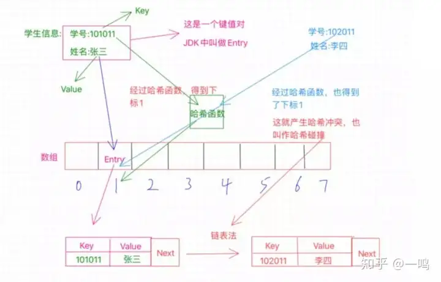
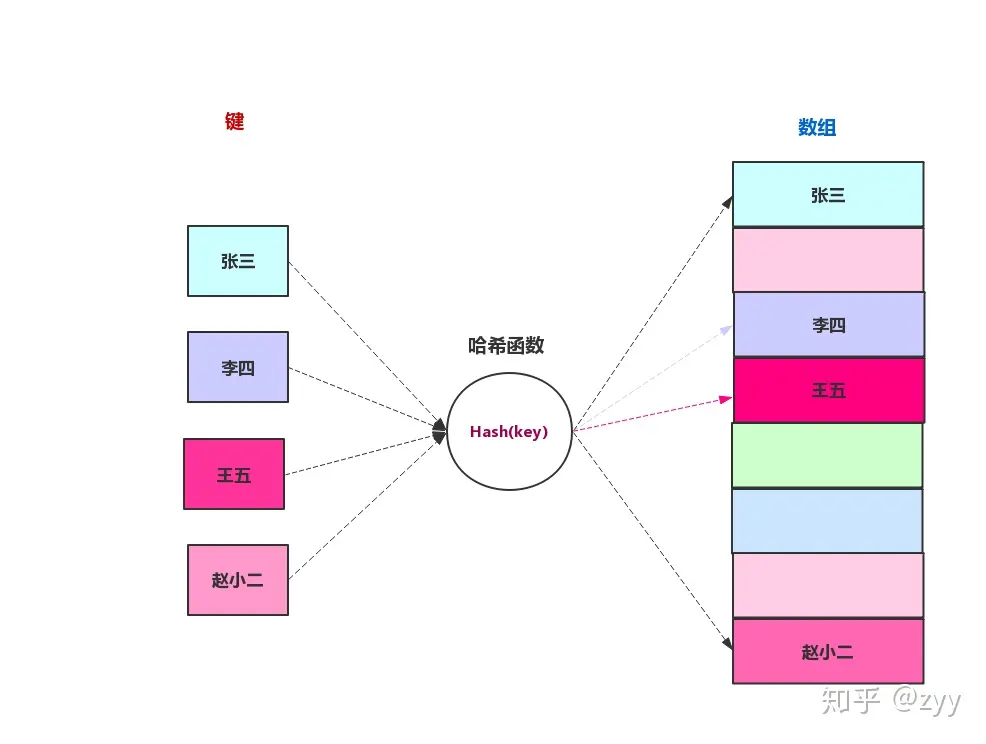
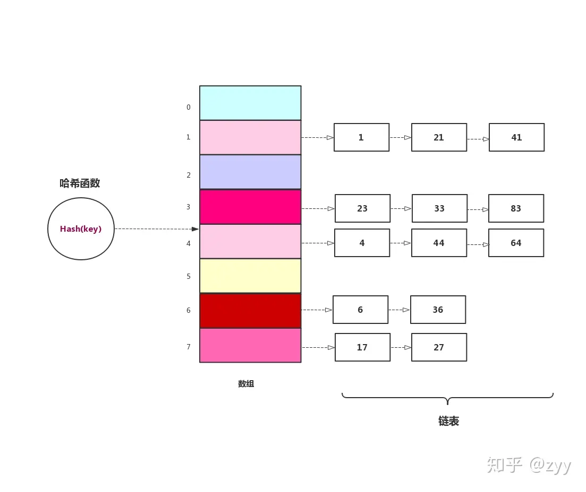
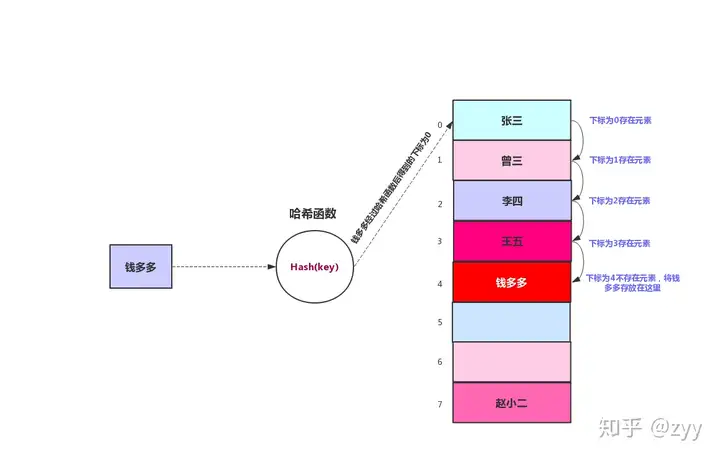
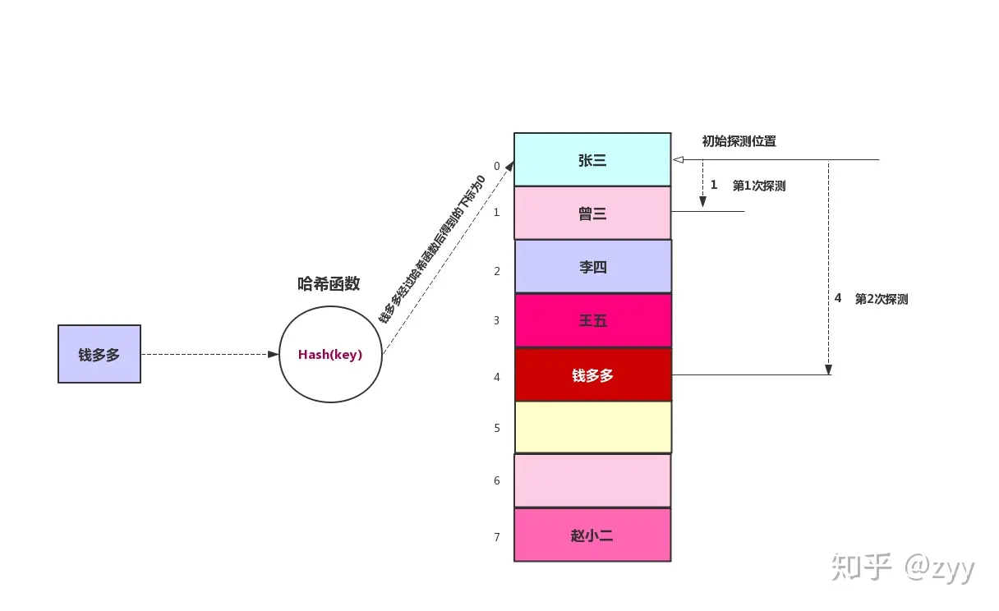

# 哈希表

哈希表是一种用于存储键值对的数据结构。其核心思想是通过一个哈希函数将键映射到数组中的一个位置（索引），从而实现快速的插入、删除和查找操作。


> 哈希表也叫散列表，哈希表是一种数据结构，它提供了快速的插入操作和查找操作，无论哈希表总中有多少条数据，插入和查找的时间复杂度都是为O(1)，因为哈希表的查找速度非常快，所以在很多程序中都有使用哈希表，例如拼音检查器。


---

## 哈希表原理

哈希表是**基于数组的一种数据结构**，利用转化的思想用**哈希函数**将**键**映射为数组的一个索引，数组这个位置的内存就用来存储这个**键**对应的**值**。

**键(key)**就可以访问对应的**值(value)**, 访问的时间复杂度为 **O(1)**

\[HashTable[key] \to  value \]



## 什么是哈希函数

**哈希函数**是用来将非整数类型的**键(key)** 映射为 整数类型的数组索引的函数

\[ f(key) =index\]

**哈希表** 的存储和访问元素的时候都是通过**哈希函数**映射出的索引来访问数组的

\[Arr[f(key)]=value\]
**一个好的哈希函数需要满足以下条件：**

- **确定性**：相同的输入必须产生相同的输出。
- **均匀性**：输入应尽可能均匀分布到哈希表的每个位置。
- **高效性**：哈希函数计算应尽可能快速。

## 哈希函数例子

**哈希函数的写法有很多，比如「HashMap」中的哈希函数**

```java
 static final int hash(Object key) {
        int h;
        return (key == null) ? 0 : (h = key.hashCode()) ^ (h >>> 16);
    }
```

Java 中的 HashMap 使用的是对象的 hashCode 方法生成的哈希值，再经过进一步处理来计算数组的索引位置。

### 1.hashCode方法
每个 Java 对象都有一个 hashCode 方法，该方法返回一个整数，表示该对象的哈希值。这个值由对象类的具体实现决定。例如，String 类的 hashCode 方法计算字符串的哈希值如下：

```java
@Override
public int hashCode() {
    int h = 0;
    int length = value.length;
    for (int i = 0; i < length; i++) {
        h = 31 * h + value[i];
    }
    return h;
}
```

### 2.扰动函数(hash function)

在 HashMap 中，为了更好地分散哈希值，避免冲突，HashMap 进一步处理 hashCode 返回的值。具体来说，HashMap 使用了一个扰动函数（hash function），对原始哈希值进行扰动处理。这个扰动函数通过一个位运算来实现：

```java
static final int hash(Object key) {
    int h;
    return (key == null) ? 0 : (h = key.hashCode()) ^ (h >>> 16);
}
```
这里，hash 方法将原始哈希值 h 和 h 向右位移 16 位的结果进行异或操作。这么做是为了将哈希值的高位信息混合到低位，从而使得哈希值分布更均匀。

### 3.计算索引

```java
static int indexFor(int h, int length) {
    return h & (length - 1);
}
```
其中 length 是数组的长度，h 是经过处理的哈希值。length 通常是 2 的幂，因此 length - 1 的二进制形式为低位全 1 的数。将哈希值 h 与 length - 1 进行按位与操作，能够高效地计算出数组的索引。

**这三步统一起来就是一个哈希函数，将一个String类型映射到整数索引**

\[String \to HashFunction() \to index\]


## 什么是哈希冲突

**哈希冲突（Hash Collision）** 是指在使用哈希表（如 HashMap）时，不同的键通过哈希函数计算后得到相同的哈希值，从而被映射到哈希表的同一个位置。哈希冲突是哈希表需要处理的一个重要问题，因为它会影响哈希表的性能和正确性。

哈希冲突发生的主要原因是哈希函数将大量的输入（可能是无限的）映射到有限的哈希表大小上。即使哈希函数设计得非常好，由于**鸽巢原理（Pigeonhole Principle）**，当**键的数量超过哈希表的槽（buckets）数量**时，必然会发生冲突。

\[key_1 \to HashFunction() \to index_1\]
\[key_2 \to HashFunction() \to index_2\]
\[index_1 == index_2 \gets 哈希冲突\]

## 怎么解决哈希冲突

### 1. 链地址法

链地址法是最常用的方法之一。在链地址法中，每个槽存储**一个链表（或其他链式数据结构Java的HashMap采用链表+红黑树）**，所有被映射到同一个槽的键值对都被存储在这个链表中。当发生哈希冲突时，新来的键值对被添加到链表的末尾。


>「链表法」解决哈希冲突代码比较简单，但是代码比较多，因为需要维护一个链表的操作，我们这里采用有序链表，有序链表不能加快成功的查找，但是可以减少不成功的查找时间，因为只要有一项比查找值大，就说明没有我们需要查找的值，删除时间跟查找时间一样，有序链表能够缩短删除时间。但是有序链表增加了插入时间，我们需要在有序链表中找到正确的插入位置。

**示例**
```java
// 链地址法的示例
class HashMapNode<K, V> {
    K key;
    V value;
    HashMapNode<K, V> next;

    public HashMapNode(K key, V value) {
        this.key = key;
        this.value = value;
        this.next = null;
    }
}

class MyHashMap<K, V> {
    private ArrayList<HashMapNode<K, V>> bucketArray;
    private int numBuckets;
    private int size;

    public MyHashMap() {
        bucketArray = new ArrayList<>();
        numBuckets = 10;
        size = 0;

        // 初始化所有的 buckets
        for (int i = 0; i < numBuckets; i++) {
            bucketArray.add(null);
        }
    }

    private int getBucketIndex(K key) {
        int hashCode = key.hashCode();
        int index = hashCode % numBuckets;
        return index;
    }

    public void put(K key, V value) {
        int bucketIndex = getBucketIndex(key);
        HashMapNode<K, V> head = bucketArray.get(bucketIndex);

        // 检查 key 是否已经存在
        while (head != null) {
            if (head.key.equals(key)) {
                head.value = value;
                return;
            }
            head = head.next;
        }

        // 将新节点插入到链表的头部
        size++;
        head = bucketArray.get(bucketIndex);
        HashMapNode<K, V> newNode = new HashMapNode<>(key, value);
        newNode.next = head;
        bucketArray.set(bucketIndex, newNode);
    }

    public V get(K key) {
        int bucketIndex = getBucketIndex(key);
        HashMapNode<K, V> head = bucketArray.get(bucketIndex);

        // 遍历链表查找 key
        while (head != null) {
            if (head.key.equals(key)) {
                return head.value;
            }
            head = head.next;
        }

        // 如果没有找到 key
        return null;
    }
}
```

### 2. 开放地址法

开放地址法在发生哈希冲突时，不使用链表，而是在哈希表中查找其他空的槽。常见的开放地址法有**线性探测（Linear Probing）、二次探测（Quadratic Probing）和双重散列（Double Hashing）**。

#### 线性探测(Linear Probing)

线性探测是最简单的一种开放地址法。当发生冲突时，按顺序查找下一个空槽，直到找到为止。

**线性探测的步骤：**
- **初始哈希位置计算**
\[hash(key) = (key.hashCode() \& 0x7fffffff) \% capacity \]
- **如果初始位置已被占用，尝试位置**
\[hash(key)=(hash(key) + 1) \% capacity\]

- **如果还是被占用，继续尝试位置**
\[hash(key)=(hash(key) + 2) \% capacity\]

- 依此类推，直到找到空闲位置或遍历整个哈希表。

**线性探测的优缺点：**
- **优点**：实现简单，顺序查找空闲位置。
- **缺点**：可能产生聚集（clustering），即冲突的元素集中在一起，影响性能。



#### 二次探测(Quadratic Probing)

线性探测的方法可能会导致多个索引发生聚集。

二次探测通过二次函数计算探测位置，避免了线性探测的聚集问题。它使用平方函数计算下一个位置，从而分散冲突元素的位置。

**二次探测的步骤：**
- **初始哈希位置计算**
\[hash(key) = (key.hashCode() \& 0x7fffffff) \% capacity \]
- **如果初始位置已被占用，尝试位置**
\[hash(key)=(hash(key) + 1^2) \% capacity\]

- **如果还是被占用，继续尝试位置**
\[hash(key)=(hash(key) + 2^2) \% capacity\]

- 依此类推，直到找到空闲位置或遍历整个哈希表。



#### 双重散列(Double Hashing)

**双重散列的步骤**
- **初始哈希位置计算**
\[hash(key) = (key.hashCode() \& 0x7fffffff) \% capacity \]
- **如果初始位置已被占用，尝试位置**
\[hash(key)=(hash(key) + 1^{hash_2(key)}) \% capacity\]

- **如果还是被占用，继续尝试位置**
\[hash(key)=(hash(key) + 2^{hash_2(key)}) \% capacity\]

- 依此类推，直到找到空闲位置或遍历整个哈希表。

**示例**
```java
class DoubleHashingHashMap<K, V> {
    private K[] keys;
    private V[] values;
    private int capacity;
    private int size;

    public DoubleHashingHashMap(int capacity) {
        this.capacity = capacity;
        keys = (K[]) new Object[capacity];
        values = (V[]) new Object[capacity];
        size = 0;
    }

    private int hash1(K key) {
        return (key.hashCode() & 0x7fffffff) % capacity;
    }

    private int hash2(K key) {
        return 1 + (key.hashCode() % (capacity - 1));
    }

    public void put(K key, V value) {
        int hash1 = hash1(key);
        int hash2 = hash2(key);
        int i = 0;
        int index;

        while (keys[(index = (hash1 + i * hash2) % capacity)] != null) {
            if (keys[index].equals(key)) {
                values[index] = value;
                return;
            }
            i++;
        }

        keys[index] = key;
        values[index] = value;
        size++;
    }

    public V get(K key) {
        int hash1 = hash1(key);
        int hash2 = hash2(key);
        int i = 0;
        int index;

        while (keys[(index = (hash1 + i * hash2) % capacity)] != null) {
            if (keys[index].equals(key)) {
                return values[index];
            }
            i++;
        }

        return null;
    }
}
```