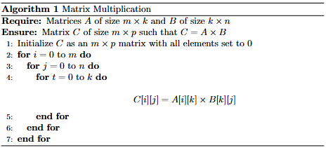
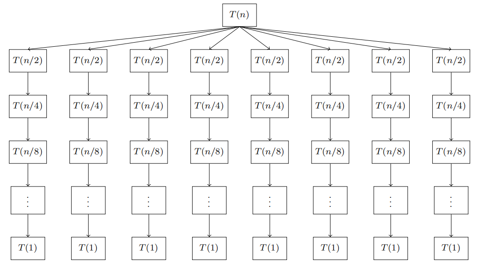
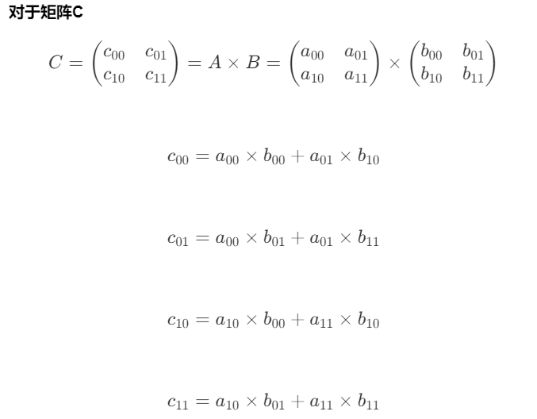

# 矩阵

## 1.矩阵的概念

### 矩阵表示

矩阵是一个二维数组，具有 \( m \) 行和 \( n \) 列。它的元素可以通过两个索引 \( i \) 和 \( j \) 来访问，表示第 \( i \) 行第 \( j \) 列的元素。

例如，一个 \( 3 \times 3 \) 的矩阵 \( A \) 可以表示为：

\[
A = \begin{pmatrix}
a_{11} & a_{12} & a_{13} \\
a_{21} & a_{22} & a_{23} \\
a_{31} & a_{32} & a_{33}
\end{pmatrix}
\]

### 剩余系映射

剩余系是模运算的结果集。例如，对于模 \( n \) 的运算，剩余系包括 \( 0 \) 到 \( n-1 \) 之间的所有整数。

如果我们将矩阵的元素映射到一个剩余系中，可以表示为：

\[ a_{ij} \equiv f(i, j) \pmod{n} \]

这里的 \( f(i, j) \) 是一个函数，将行 \( i \) 和列 \( j \) 映射到一个整数。

### 具体示例

假设我们有一个 \( 3 \times 3 \) 的矩阵，其中每个元素都是通过行和列的索引映射到模 \( 3 \) 的剩余系。

\[
B_{mat} = \begin{pmatrix}
0 & 1 & 2 \\
1 & 2 & 0 \\
2 & 0 & 1
\end{pmatrix}=\begin{pmatrix}
a_{00} & a_{01} & a_{02} \\
a_{10} & a_{11} & a_{12} \\
a_{20} & a_{21} & a_{22} 
\end{pmatrix}
\]

在这个矩阵中，每个元素 \( a_{ij} \)有角标
\[(i,j)\] 
与角标之和
\[k = i + j\]

一个有序集合
\[
A=\{0,1,2,1,2,0,2,0,1\}
\]

将有序集合\(A\)中的每一个元素都映射到\(B_{mat}\)中


\[
\begin{aligned}
A_{k} &= a_{(k\div3 )( k \% 3)}
\end{aligned}
\]

例如：

\[
\begin{aligned}
A_{0}  &= a_{00}\\
A_{1}  &= a_{01}\\
A_{2}  &= a_{02}\\
A_{3}  &= a_{10}\\
\end{aligned}
\]

### 抽象到一般情况

首先我们有一个有着\(N个元素\)集合\[
A=\{A_{0},A_{1},A_{2},A_{3}.....\}
\]
把这个集合映射到 \( rows \times cols \) 的矩阵，其中\(N=rows\times cols\)

每个元素都是通过行和列的索引映射到模 \( cols \) 的剩余系。

\[
B_{mat} =\begin{pmatrix}
a_{00} & a_{01} & a_{02} \\
a_{10} & a_{11} & a_{12} \\
a_{20} & a_{21} & a_{22} 
\end{pmatrix}
\]


在这个矩阵中，每个元素 \( a_{ij} \)有角标
\[(i,j)\] 
与角标之和
\[k = i + j\]

将有序集合\(A\)中的每一个元素都映射到\(B_{mat}\)中
\[
\begin{aligned}
A_{k} &= a_{(k\div cols )( k \% cols)}
\end{aligned}
\]

找到 **在哪一个剩余系**
\[k \div cols \]

找到 **在这个剩余系中的位置**
\[k \% cols \]


### 代码示例

```java
public class Test {
    public static void main(String[] args) {
        int[] vector = new int[]{0, 1, 2, 1, 2, 0, 2, 0, 1, 2, 3, 4};
        
        // 新建一个4x3的矩阵
        int rows = 4;
        int cols = 3;
        int[][] matrix = new int[rows][cols];
        
        for (int i = 0; i < vector.length; i++) {
            matrix[i / cols][i % cols] = vector[i];
        }
        
        // 打印这个4x3矩阵
        System.out.println("Original 4x3 Matrix:");
        for (int i = 0; i < matrix.length; i++) {
            for (int j = 0; j < matrix[i].length; j++) {
                System.out.print(matrix[i][j] + " ");
            }
            System.out.println();
        }

        // 将4x3矩阵转化为3x4矩阵
        int newRows = 3;
        int newCols = 4;
        int[][] nmatrix = new int[newRows][newCols];
        
        for (int i = 0; i < vector.length; i++) {
            nmatrix[i / newCols][i % newCols] = matrix[i / cols][i % cols];
        }

        // 打印这个3x4矩阵
        System.out.println("Transformed 3x4 Matrix:");
        for (int i = 0; i < nmatrix.length; i++) {
            for (int j = 0; j < nmatrix[i].length; j++) {
                System.out.print(nmatrix[i][j] + " ");
            }
            System.out.println();
        }
    }
}

```


## 2. 矩阵的叉乘

### 2.1 基本的矩阵叉乘
**我们有两个矩阵A和B**
\[A=m \times k\]
\[B=k \times n\]
\[
A =\begin{pmatrix}
a_{00} & a_{01} & a_{02} \\
a_{10} & a_{11} & a_{12} \\
a_{20} & a_{21} & a_{22} 
\end{pmatrix}
\]

\[
B =\begin{pmatrix}
b_{00} & b_{01} & b_{02} \\
b_{10} & b_{11} & b_{12} \\
b_{20} & b_{21} & b_{22} 
\end{pmatrix}
\]

**矩阵的乘积C=AXB**
\[C=m \times n\]

**矩阵C的每个元素都由公式所得**
\[C[i][j]=\sum_{t=1}^{k}A[i][t] \times B[t][j]\]

**矩阵C一共有m X n个元素，因此需要计算 m X n 次**



**算法复杂度计算**
\[\begin{align*}T(n)&=T(n-1)+k\\&=T(n-2)+k+k\\&=\underbrace{k+k+k+\cdots+k}_{m \times n}\\&=m \times n\times k=O(n^3)\end{align*}\]

### 2.2 基于分治思想的叉乘计算

**假设A,B,C都是 n X n 大小的矩阵**

\[
A =\begin{pmatrix}
a_{00} & a_{01} \\
a_{10} & a_{11}  \\
\end{pmatrix}
\]
\[
B =\begin{pmatrix}
b_{00} & b_{01} \\
b_{10} & b_{11}  \\
\end{pmatrix}
\]
\[
C =\begin{pmatrix}
c_{00} & c_{01} \\
c_{10} & c_{11}  \\
\end{pmatrix}
\]

**A,B,C都可以分割为四个子矩阵**

**以A矩阵为例**

\[a_{ij}=\frac{n}{2} \times \frac{n}{2}\]
\[
A =\begin{pmatrix}
a_{00} & a_{01} \\
a_{10} & a_{11}  \\
\end{pmatrix}
\]

**对于矩阵C**

\[
C =\begin{pmatrix}
c_{00} & c_{01} \\
c_{10} & c_{11}  \\
\end{pmatrix}=A \times B= \begin{pmatrix}
a_{00} & a_{01} \\
a_{10} & a_{11}  \\
\end{pmatrix}
\times
\begin{pmatrix}
b_{00} & b_{01} \\
b_{10} & b_{11}  \\
\end{pmatrix}
\]
\[c_{00}=a_{00}\times b_{00}+a_{01}\times b_{10}\]
\[c_{01}=a_{00}\times b_{01}+a_{01}\times b_{11}\]
\[c_{10}=a_{10}\times b_{00}+a_{11}\times b_{10}\]
\[c_{11}=a_{10}\times b_{01}+a_{11}\times b_{11}\]

**矩阵C的每一个子矩阵都是由A和B的子矩阵叉乘而来，进而得到问题的递推关系式**

\[T(n)=\begin{cases}8 \times T(\frac{n}{2})+\Theta(n^2)&,n \ge 2\\ \Theta(1)&, n=1\end{cases}\]

**展开递归关系式**

\[\begin{align*}T(n)&=8\times T(\frac{n}{2}) +\Theta(n^2)\\T(\frac{n}{2})&=8\times T(\frac{n}{2^2})+\Theta(\frac{n^2}{2^2})\end{align*}\]


**识别模式**
\[T(\frac{n}{2^k})=8\times T(\frac{n}{2^{k+1}})+\Theta(\frac{n^2}{2^{k+1}})\]

**当递归终止时**
\[\frac{n}{2^k}=1\to k=\log n\]

**带入计算**
\[\begin{align*}T(n)&=n^2+2n^2+2^2n^2+\cdots+2^{log n}\times n^2\\&=n^2\times(1+2+2^2+\cdots+2^{log n})\\&=n^2 \times \frac{1-2^{log n}}{1-2}\\&=n^2\times(2^{logn}-1)\\&=n^2\times 2^{\log n}-n^2\\&=n^2\times n^{\log_{2}{2}}-n^2\\&=n^3-n^2\end{align*}\]

**得到结论**
\[T(n)=\Theta(n^3)\]

**虽然时间复杂度是相同的，但是可以看出分治算法的矩阵乘法要比普通的算法快**

### 2.3 Strassen算法

**Strassen算法同样是分治思想的算法，只是对将递归的规模进行了优化**

**基于分治思想的叉乘计算的递归树**


**这里可以看见树的每层都有8个节点，递归深度是logn**


***如果进一步减小递归树的节点数量就可以将时间复杂度降低***


**观察递归树节点数量的来源**


**观察到每一次调用乘积都会增加一个节点，只要能减少调用乘积的次数就可以减少节点的数量**

为了减少乘法次数，Strassen算法引入了七个辅助矩阵 \( M \)：
\[ M_1 = (A_{11} + A_{22})(B_{11} + B_{22}) \]
\[ M_2 = (A_{21} + A_{22})B_{11} \]
\[ M_3 = A_{11}(B_{12} - B_{22}) \]
\[ M_4 = A_{22}(B_{21} - B_{11}) \]
\[ M_5 = (A_{11} + A_{12})B_{22} \]
\[ M_6 = (A_{21} - A_{11})(B_{11} + B_{12}) \]
\[ M_7 = (A_{12} - A_{22})(B_{21} + B_{22}) \]
。

### 组合结果矩阵
利用这七个辅助矩阵，结果矩阵 \( C \) 的各个子矩阵可以表示为：
\[ C_{11} = M_1 + M_4 - M_5 + M_7 \]
\[ C_{12} = M_3 + M_5 \]
\[ C_{21} = M_2 + M_4 \]
\[ C_{22} = M_1 - M_2 + M_3 + M_6 \]

- [X] [推导过程](../算法/Strassen推导.pdf)