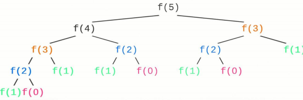
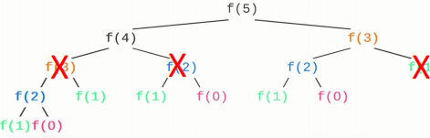
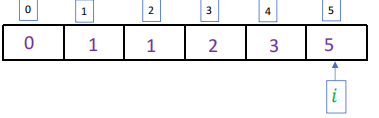

# Dynamic Programming


**动态规划（Dynamic Programming, DP）** 是一种算法设计技巧，通常用来解决具有重叠子问题和最优子结构性质的问题。它通过将问题分解为更小的子问题，逐步解决这些子问题并将结果存储起来，以避免重复计算，从而提高效率。

---

## 1. 特点

### 1.1 重叠子问题

在许多递归问题中，计算过程中会多次遇到相同的子问题。如果我们每次遇到这些子问题时都重新计算，会导致大量的重复计算和效率低下。重叠子问题的思想是通过将子问题的结果存储起来，避免重复计算，从而提高效率。

**举例**

*斐波那契数列*

**递归关系式**

\[T(n)=T(n-1)+T(n-2)\]

**计算T(3)**

\[
\begin{aligned}
T(3) &= T(2) + T(1) \\
     &= T(1) + T(0) + T(1)
\end{aligned}
\]

**这里我们可以看见T(1)被多次计算**

*这个多次计算的T(1)便被称为重复子问题*

**如果我们用递归来解决这个问题**

```cpp
int fin(int n){
    if(n==1)return 1;
    if(n==0)return 0;
    return fin(n-1)+fin(n-2);
}
```
**画出递归树**



我们可以看到有多次递归调用都是重复的，即出现了重复子问题。


### 1.2 记忆化存储

**继续探究斐波那契问题**

我们之前发现使用递归解决问题时出现了多次递归调用是重复的



我们可以将这些重复子问题的结果储存起来,这样下一次需要解决这个子问题的时候，只需要访问之前的结果就可以了。

<p align="center">

</p>

**模拟实现**

```cpp
int fin(int n){
    std::vector<int>Fin(n+1);
    Fin[0]=0;
    Fin[1]=1;
    for(int i=2;i<=n;i++){
        Fin[i]=Fin[i-1]+Fin[i-2];
    }
    return Fin[n];
}
```

**可以看出来我们是从最小子问题来逐渐递推至最后的答案，这也被称为自底而上的算法**

### 1.4 状态转移方程

**我们来看斐波那契数列的递推关系式**

\[
T(n)=T(n-1)+T(n-2)    
\]


**这里我们可以看出，如果我们想得到第n项的答案，我们就要知道第n-1项和第n-2项的答案**

\[
T(n) \gets 这个第n项的答案，就定义为一个状态
\]

状态转移方程表示的就是**某一个状态和其他状态之间的关系**

\[
T(n)=T(n-1)+T(n-2) \]

**这个方程就表示第n个状态是由第n-1个状态和第n-2个状态决定**

### 1.5 最优子结构

**还是看斐波那契数列**

我们如果要求出第n个状态的状态值，那么我们一定是使用第n-1个状态和第n-2个状态的值来计算的。

由于我们的状态转移方程是确定的，这里求出的一定是最优解。

**给出定义**

*如果一个问题的最优解包含了其子问题的最优解，则称这个问题具有最优子结构性质。*


---

## 2. 用动态规划来设计算法的步骤

### 2.1 理解问题并确定子问题

首先，理解斐波那契数列的问题。斐波那契数列定义如下：

\[ F(n) = F(n-1) + F(n-2) \]

其初始条件为：

\[ F(0) = 0 \]  
\[ F(1) = 1 \]

这个问题可以分解为子问题，即计算第 \( n \) 项的值依赖于第 \( n-1 \) 项和第 \( n-2 \) 项的值。

### 2.2 定义状态

定义状态 \( dp[i] \) 表示斐波那契数列第 \( i \) 项的值。

\[
dp[i] \gets 斐波那契数列第  i  项的值
\]

### 2.3 确定状态转移方程

状态转移方程基于斐波那契数列的递归定义，可以写作：

\[ dp[i] = dp[i-1] + dp[i-2] \]

### 2.4 确定初始状态和边界

根据斐波那契数列的初始条件，初始化状态：

\[ dp[0] = 0 \]  
\[ dp[1] = 1 \]

### 2.5 利用状态转移方程计算状态值

使用状态转移方程从初始状态开始逐步计算到目标状态值。

```cpp
#include <vector>

int fib(int n) {
    if (n <= 1) return n;
    std::vector<int> dp(n + 1);
    dp[0] = 0;
    dp[1] = 1;
    for (int i = 2; i <= n; ++i) {
        dp[i] = dp[i - 1] + dp[i - 2];
    }
    return dp[n];
}
```
