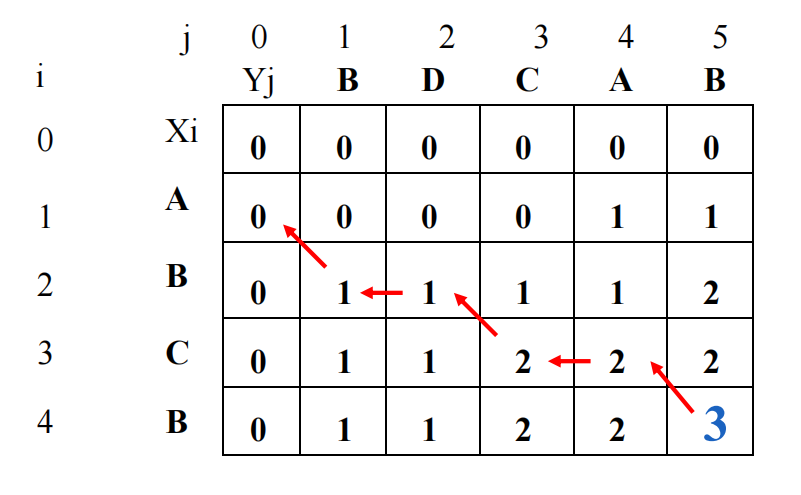
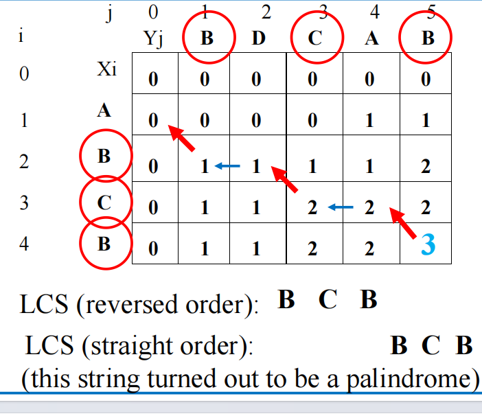

# dp之LCS问题

**最长公共子序列（Longest Common Subsequence, LCS）问题** 是寻找两个字符串中最长的子序列，使得这个子序列在两个字符串中出现的相对顺序保持一致，但不要求连续。

[力扣原题链接](https://leetcode.cn/problems/qJnOS7/description/)
---


## 1.定义

**给定两个字符串 *S1和S2***
$$
S1=a_1a_2a_3...a_n \to 长度为n的字符串
$$
$$
S2=b_1b_2b_3...b_m \to 长度为m的字符串
$$

**子序列(Subsequence)**

一个字符串的 子序列 是指这样一个新的字符串：它是由原字符串在 **不改变字符的相对顺序** 的情况下删除某些字符（也可以不删除任何字符）后组成的新字符串。

**对于 S1 来说**

$$
S_{sub}=a_i...a_j \gets  i<j,  S_{sub} \in S1
$$

**比如说**

$$
S_1=abcdfgh
$$

$$
S_2=abdfhr
$$

$$
S_1 \cap S_2 = abdfh
$$

## 2. 动态规划解法

**Step1 分析子问题**

对于每个子问题都要求出到当前两个子字符串的最长公共子序列。

**Step2 状态定义**

令 `dp[i][j]` 表示 `text1` 的前 `i` 个字符与 `text2` 的前 `j` 个字符的最长公共子序列长度。

**Step3 递推求解**

1. 初始化状态：
   - 当 `i == 0` 或 `j == 0` 时，`dp[i][j] = 0`，因为任意一个空字符串与另一个字符串的最长公共子序列长度为 0。

2. 状态转移方程：

$$
dp[i][j] = \left\{
\begin{array}{ll}
dp[i-1][j-1] + 1 & \text{if } \text{text1[i] = text2[j]} \\
\max(dp[i-1][j], dp[i][j-1]) & \text{if } \text{text1[i] $\neq$ text2[j]}
\end{array}
\right.
$$

**示例图**



**动态规划代码实现**

```cpp
class Solution {
public:
    int longestCommonSubsequence(string text1, string text2) {
        int m = text1.size();
        int n = text2.size();
        vector<vector<int>> dp(m + 1, vector<int>(n + 1, 0));

        for (int i = 1; i <= m; ++i) {
            for (int j = 1; j <= n; ++j) {
                if (text1[i - 1] == text2[j - 1]) {
                    dp[i][j] = dp[i - 1][j - 1] + 1;
                } else {
                    dp[i][j] = max(dp[i - 1][j], dp[i][j - 1]);
                }
            }
        }

        return dp[m][n];
    }
};
```

**递归代码实现**
递归调用的开销会很大，力扣这个题会超时
```cpp
class Solution{
    int longestCommonSubsequence(string text1, string text2) {
        return rec(text1,text2,text1.size()-1,text2.size()-1);
    }
    int rec(const&string str1,const&string str2,int m,int n){
        if(m==0||n==0)return 0;
        if(str1[m]==str[n]){
            return 1+rec(str1,str2,m-1,n-1);
        }else{
            return max(rec(str1,str2,m-1,n),rec(str1,str2,m,n-1));
        }
    }
}
```
