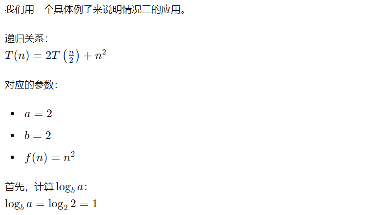

# 3.主定理(Master Theorem)

**主定理 (Master Theorem)** 提供了一种简便的方法来求解递归算法的时间复杂度。

**对于递归关系式：**
\[
T(n) = a \times T\left(\frac{n}{b}\right) + f(n)
\]

**其中：**
- \( a \geq 1 \) 和 \( b > 1 \)，\(a\) 和 \(b\) 都是常数。
- \( c = \log_b a \) 是用来表示 \( n^{\log_b a} \) 的指数，即递归部分函数的增长速度的基准。

**根据主定理的解：**
\[
T(n) = 
\begin{cases}
O(n^c), & \text{if } f(n) = O(n^{c-\epsilon}), \text{ for some } \epsilon > 0 \\
O(n^c \log n), & \text{if } f(n) = \Theta(n^c) \\
O(f(n)), & \text{if } f(n) = \Omega(n^{c+\epsilon}), \text{ for some } \epsilon > 0, \text{ and if } af\left(\frac{n}{b}\right) \leq cf(n) \text{ for some } c < 1
\end{cases}
\]

>**主定理**基础思想是递归树分析。递归树展示了递归调用的层次结构，每一层代表递归调用的不同层次。树的根节点表示初始问题，子节点表示递归子问题，直到叶节点表示基准情况。
主定理通过分析递归树的每一层的成本（非递归部分 𝑓(𝑛) 以及树的总高度来确定时间复杂度。

## 例子

