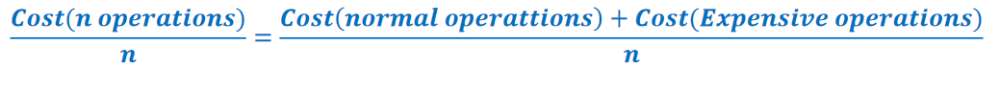
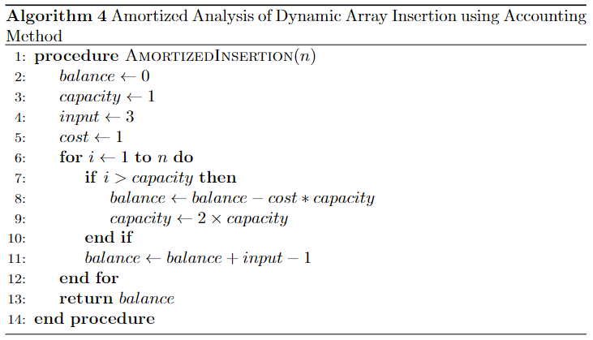
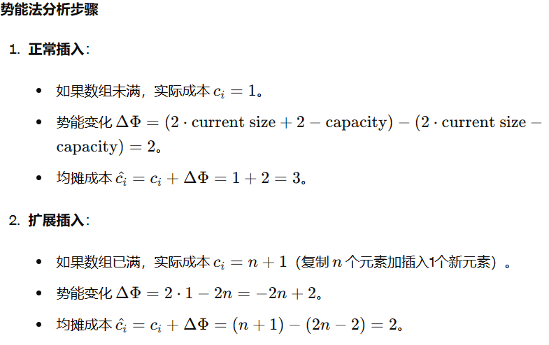

# 均摊分析

**均摊分析（Amortized Analysis）是一种评估算法在一系列操作中平均性能的方法。** 与最坏情况分析不同，均摊分析考虑所有操作的总成本，并将其均摊到每个操作上。这种方法特别适用于那些个别操作可能很慢，但大多数操作却很快的算法和数据结构。

**以动态扩容数组的插入操作为例**

动态扩容的数组是Java中ArrayList和CPP中Vector的底层实现原理。

- 如果插入元素后数组大小足够则不扩容
- 如果插入元素后数组大小不够则将数组容量扩大到2倍(或1.5倍)
- **扩容**：通过先新创建一个大小为原来二倍的新数组，再将原来数组的元素按照顺序拷贝到新数组中

如果我们使用简单分析方法，单次插入操作的最坏情况时间复杂度是 𝑂(𝑛)。通过均摊分析，我们可以更准确地计算平均每次插入操作的时间复杂度。

**均摊分析的三种方法**

#### 聚合分析(Aggregate Analysis)

聚合分析是最简单的一种均摊分析方法。它直接计算一系列操作的总成本，然后将总成本平均分摊到每个操作上。

- **不考虑扩容的情况下每次插入的成本都是O(1)**
- **考虑扩容的情况下每次插入的成本则是O(n)**

**算法流程**

#### 记账方法(Accounting Method)

**记账法是一种将每次操作的成本分摊到一系列操作中的方法。** 通过对每次操作进行“记账”，我们可以确保即使某些操作成本较高，但整体上每次操作的平均成本是合理的。

**使用记账法分析动态数组插入操作**
我们将通过记账法来分析插入操作的均摊时间复杂度。记账法的基本思路是为每次操作分配一个虚拟费用，这个费用可能高于或低于实际成本。我们会为每次插入操作分配一个统一的费用，以支付扩展操作的高成本。

##### 具体步骤

- **分配费用**
    为每次插入操作分配固定费用，假设为3个单位。

- **处理正常插入**
    如果数组未满，插入操作的实际成本是1个单位，剩下的2个单位存入“余额”。
- **处理扩展插入**
    如果数组已满，还要为每次复制操作支付1个单位。

假设我们有一个动态数组，初始容量为1，插入4个元素。

**第1次插入：**

- 分配费用3
- 数组未满，需要插入1个单位，实际成本1
- 存入余额2
- 余额剩余2
- 初始容量0，最大容量1
- 插入后剩余容量0

**第2次插入：**

- 分配费用3
- 数组已满，需要复制1个单位并插入一个单位，实际成本2
- 存入余额1
- 余额剩余3
- 初始容量1，最大容量1
- 扩容后最大容量2
- 插入后剩余容量0

**第3次插入：**

- 分配费用3
- 数组已满，需要复制2个单位并插入一个单位，实际成本3
- 存入余额0
- 余额剩余3
- 初始容量2，最大容量2
- 扩容后最大容量4
- 插入后剩余容量1

**第4次插入：**

- 分配费用3
- 数组未满，需要插入一个单位，实际成本1
- 存入余额2
- 余额剩余5
- 初始容量3，最大容量4
- 不需要扩容
- 插入后剩余容量0

**第5次插入：**

- 分配费用3
- 数组已满，需要复制4个单位并插入一个单位，实际成本5
- 存入余额-2
- 余额剩余3
- 初始容量4，最大容量4
- 扩容后最大容量8
- 插入后剩余容量3

**第6次插入：**

- 分配费用3
- 数组未满，需要插入一个单位，实际成本1
- 存入余额2
- 余额剩余5
- 初始容量5，最大容量8
- 不需要扩容
- 插入后剩余容量2

**通过上述步骤，我们可以看到每次插入的均摊费用为3就可以保证了每次都可以插入。**
均摊分析证明了在动态数组中，**插入操作的均摊时间复杂度为 𝑂(1),与数据规模无关**

**算法流程**

#### 势能法(Potential Method)

**势能法是均摊分析的一种技术，它通过引入一个势能函数（Potential Function）来分析算法或数据结构在一系列操作中的均摊时间复杂度。** 势能函数表示数据结构在某个状态下的“能量”或“势能”。势能法通过分析势能的变化来计算每次操作的均摊成本。

##### 概念

**1.势能函数 Φ**

- **势能函数 Φ(𝐷)** 定义为数据结构 𝐷在某个状态下的势能。

势能函数的选择依赖于具体的问题，并且需要满足两个条件：

- 势能函数的初始值为0。
- 在任何状态下，势能函数的值非负。

**2.实际成本与均摊成本**

**使用势能法分析动态数组插入操作**

##### 具体步骤

**定义势能函数**

为了使用势能法，我们定义势能函数 Φ(D) 为动态数组当前使用的空间与总容量之差，即：

**假设我们有一个动态数组，初始容量为1，需要插入4个元素。**

**第1次插入：**

- size=1,capacity=1,cost=1
- Φ(D)=2 x size-capacity=1
- Φ(1)-Φ(0)=1
- cost_act=cost+Φ(1)-Φ(0)=2

**第2次插入：**

- size=2,capacity=2,cost=2
- Φ(D)=2 x size-capacity=2
- Φ(2)-Φ(1)=1
- cost_act=cost+Φ(2)-Φ(1)=3

**第3次插入：**

- size=3,capacity=4,cost=3
- Φ(D)=2 x size-capacity=2
- Φ(3)-Φ(2)=0
- cost_act=cost+Φ(3)-Φ(2)=3

**第4次插入：**

- size=4,capacity=4,cost=1
- Φ(D)=2 x size-capacity=4
- Φ(4)-Φ(3)=2
- cost_act=cost+Φ(4)-Φ(3)=3

**以此类推，实际消耗始终为3，平均时间复杂度常数级别,与数据规模无关**

**算法流程**

---