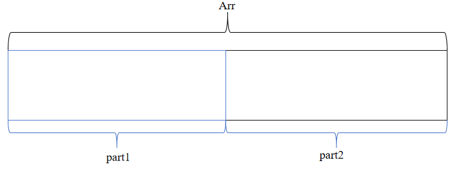
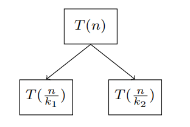

# 快排的时间复杂度证明

**对于一个数组**

\[Arr[n]\gets\underbrace{Arr[0],Arr[1],Arr[2],\cdots,Arr[n-1]}_{n}\]

**快速排序每一次调用都选取一个基准位置pivot用来将母问题分割为两部分**

\[Arr[pivot] \to 分割数组\]
\[Arr[k]<Arr[pivot] \to Arr[k]\in Arr_{part1}\]
\[Arr[k]<Arr[pivot] \to Arr[k]\in Arr_{part2}\]

**每次分治都将数组分割为两部分,直到数组大小为1进行数组合并**

**设每部分的长度为len,设定**
\[\begin{align*}len_i=\text{Size of part i}\end{align*}\]
\[len_1+len_2=len_0\]

**每次分治都将问题缩小为原来的1/k倍**
\[k_i=\frac{len_i}{len_0}\]

**得到递归关系式**

\[\begin{align*}T(n)=\begin{cases}T(\frac{n}{k_1})+T(\frac{n}{k_2})+n&,n\ge2\\n&,n=1\end{cases}\end{align*}\]
**画出递归树**

**最差情况的时候这棵递归树退化为单链表**

\[T(n)=T(n-1)+n\]

**展开递推式**

\[\begin{align*}T(n)&=T(n-1)+n\\&=T(n-2)+n+n\\&=\cdots\\&=\underbrace{n+n+n+n+\cdots+n}_{n}\\&=n^2\end{align*}\]

**平均情况下每次分割的比例大致相等**

\[\text{左子树的深度} \to log_{k_1}n\]
\[\text{右子树的深度} \to log_{k_2}n\]

**由于每次左右分割比例不同会导致左右子树不平衡，可能出现两种情况**
\[nlog_{k_1}n \leq T(n) \leq nlog_{k_2}n\]
\[nlog_{k_2}n \leq T(n) \leq nlog_{k_1}n\]

**可以看出上下界都是nlogn**
\[\to T(n)=\Theta(nlogn)\]