# 算法复杂度

---
## 一. 常用符号

### 1. O(n)

**大O符号用于表示算法的最坏情况复杂度。** 它描述了算法在输入规模无限增大时所需的最大运算次数。

**定义**

如果存在正整数 \(c\) 和 \(N\)，对于所有的 \(n \geq N\)，有 \(f(n) \leq c \cdot g(n)\)，则 \(f(n) = O(g(n))\)。

#### 示例

```java
// 线性搜索的时间复杂度为 O(n)
int linearSearch(int[] arr, int key) {
    for (int i = 0; i < arr.length; i++) {
        if (arr[i] == key) {
            return i;
        }
    }
    return -1;
}
```

### 2. Ω(n) -Omega符号

**Omega符号用于表示算法的最佳情况复杂度。** 它描述了算法在输入规模无限增大时所需的最小运算次数。

#### 定义
如果存在正整数 \(c\) 和 \(N\)，对于所有的 \(n \geq N\)，有 \(f(n) \geq c \cdot g(n)\)，则表示 \(f(n) = \Omega(g(n))\)。

#### 示例
```java
// 假设数组已排序，则二分查找的时间复杂度为 Ω(log n)
int binarySearch(int[] arr, int key) {
    int low = 0;
    int high = arr.length - 1;
    while (low <= high) {
        int mid = (low + high) / 2;
        if (arr[mid] < key) {
            low = mid + 1;
        } else if (arr[mid] > key) {
            high = mid - 1;
        } else {
            return mid;  // 找到key
        }
    }
    return -1;  // 未找到key
}
```

### 3. Θ(n) - Theta符号

**Theta符号用于表示算法的平均或期望复杂度。** 它描述了算法复杂度的上下界都符合同一个函数。

#### 定义
如果存在正整数 \(c_1\), \(c_2\) 和 \(N\)，对于所有的 \(n \geq N\)，有 \(c_2 \cdot g(n) \geq f(n) \geq c_1 \cdot g(n)\)，则表示 \(f(n) = \Theta(g(n))\)。

#### 示例
```java
// 插入排序的时间复杂度在最佳情况下为 Ω(n)，最坏情况下为 O(n^2)，平均情况下为 Θ(n^2)
int[] insertionSort(int[] arr) {
    for (int i = 1; i < arr.length; i++) {
        int key = arr[i];
        int j = i - 1;
        while (j >= 0 && arr[j] > key) {
            arr[j + 1] = arr[j];
            j = j - 1;
        }
        arr[j + 1] = key;
    }
    return arr;
}
```

---

## 二. 常用数学符号与近似函数


### 常见数学符号

| 符号 | 名称     | 符号表示  | 定义                   | 用途                |
|------|----------|-----------|------------------------|--------------------|
| ⌊x⌋  | 下取整   | \[⌊x⌋\] | 最大的不大于 x 的整数  | 取整操作            |
| ⌈x⌉  | 上取整   | \[⌈x⌉\] | 最小的不小于 x 的整数  | 取整操作            |
| lnN  | 自然对数 | \[lnN\]   | 对数以 e 为底          | 数学计算            |
| \[2^{lgN}\] | 幂与对数的关系 | \[2^{lg N}\] | \(N\)（当底为 2 时） | 计算机科学中常用    |
| ⌊lgN⌋ | 对数的下取整 | \[\lfloor \lg N \rfloor\] | 不大于 \(\lg N\) 的最大整数 | 位运算中的位数计算  |
| \[H_N\] | 调和级数 | \[H_N\]     | \(\sum_{i=1}^{N} \frac{1}{i}\) | 分析算法中的级数和  |
| N!  | 阶乘     | \[N!\]      | \(1 \times 2 \times 3 \times \ldots \times N\) | 组合数学中的计算    |

### 算法分析中常用的近似表示

| 近似名称     | 表达式                 | 定义                                    | 应用场景          |
|--------------|------------------------|-----------------------------------------|------------------|
| 调和级数近似 | \(H_N \approx \ln N\) | \(\sum_{i=1}^{N} \frac{1}{i} \approx \ln N\) | 算法时间复杂度分析 |
| 等差级数近似 | \(1+2+3+\ldots+N \approx \frac{N^2}{2}\) | \(\sum_{i=1}^{N} i = \frac{N(N+1)}{2} \approx \frac{N^2}{2}\) | 数列求和          |
| 等比级数近似 | \(1+2+4+\ldots+2^{N-1} \approx 2^N\) | \(\sum_{i=0}^{N-1} 2^i = 2^N - 1 \approx 2^N\) | 运算过程分析      |
| 对数级数近似 | \(\ln N! \approx \sum_{i=1}^{N} \ln i\) | 斯特灵近似：\(\ln N! \approx N \ln N - N\) | 排列组合问题      |
| 二项式系数   | \(\binom{N}{k} \approx \frac{N^k}{k!}\) | 斯特灵近似的应用                          | 组合数计算        |
| 指数级数     | \(e^x \approx \frac{1}{(1-x)}\) for small \(x\) | 泰勒级数的应用                            | 近似计算          |

---
## 三. 时间复杂度与空间复杂度

### 时间复杂度 (Time Complexity)

时间复杂度是衡量一个算法执行所需时间的指标。它描述了算法执行时间随输入数据的大小增加而增加的速率。时间复杂度通常用大O符号表示，例如 `O(n)`, `O(log n)`, `O(n^2)` 等。

#### 常见的时间复杂度级别

- **常数时间 `O(1)`**：执行时间不依赖于输入数据的大小。
- **对数时间 `O(log n)`**：例如二分查找，时间复杂度与输入数据的对数成正比。
- **线性时间 `O(n)`**：例如数组遍历，时间复杂度与输入数据大小成正比。
- **线性对数时间 `O(n log n)`**：例如快速排序和归并排序。
- **二次时间 `O(n^2)`**：例如冒泡排序，执行时间随输入数据的平方增长。
- **立方时间 `O(n^3)`**：常见于涉及三层嵌套循环的算法。
- **指数时间 `O(2^n)`**：例如许多递归算法，执行时间随输入数据的指数增长。

### 空间复杂度 (Space Complexity)

空间复杂度是衡量一个算法在执行过程中所需的存储空间量。它帮助我们了解算法对存储资源的消耗。

#### 常见的空间复杂度级别

- **常数空间 `O(1)`**：如使用固定数量和大小的变量。
- **线性空间 `O(n)`**：如动态分配的数组。
- **二次空间 `O(n^2)`**：在处理矩阵或二维数组的算法中常见。

### 时间与空间复杂度的权衡

在实际应用中，通常需要在时间复杂度和空间复杂度之间进行权衡。有时，为了加快算法的执行速度，我们可能需要牺牲更多的存储空间（例如，通过使用缓存）。理解这种权衡对于设计高效且实用的算法至关重要。

---

## 四. 非递归算法的复杂度计算

### 1. 指示随机变量的概率分析

**指示随机变量的概率分析(Probabilistic analysis with indicator random variables)** 是计算机科学和统计学领域中用于在随机条件下分析算法行为的一种方法。这种方法使用指示随机变量来简化计数和概率计算的复杂性，为涉及随机过程的场景提供了一种直接计算期望值的方式。


#### 什么是指示随机变量？
指示随机变量是一种特殊类型的随机变量，当满足某个条件时取值为1，否则取值为0。
**数学上定义如下：**

\[
    X=\begin{cases} 
1 & \text{如果条件为真}, \\
0 & \text{如果条件为假}.
\end{cases}
\]

这些变量特别适用于捕捉样本空间中事件的发生，并且极大地简化了复杂随机过程的分析。

#### 在算法分析上的应用

在算法分析的背景下，使用指示随机变量的概率分析包括：

**1.定义事件：** 指定指示随机变量将为1的事件或条件。例如，"数组位置持有操作系列后的最大值的事件"。

**2.分配指示变量：** 对于条件可能发生的每个实例，都分配一个指示随机变量。例如，在排序中，可能对每对元素使用一个指示变量来指示在特定步骤中是否需要交换它们。

**3.计算期望值：** 这些指示变量之和的期望值给出了事件发生的预期次数。经常使用期望的线性性质（即随机变量之和的期望值等于它们各自期望值的总和，无论它们是否独立）：

\[
    E (\sum_{i=1}^n X_{i}) = \sum_{i=1}^n E(X_i )
\]

**算法流程**

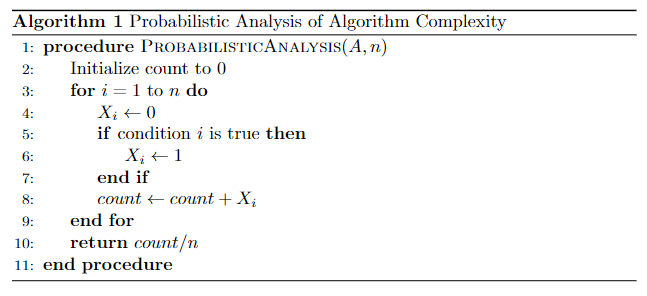

#### 举例

**使用概率分析来计算顺序查找的时间复杂度**

假设每个数都是随机分布的，出现的概率相同，**目标数出现的概率为1\n**

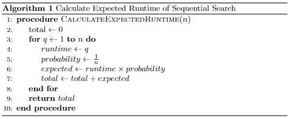

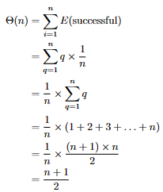

### 2. 均摊分析

**均摊分析（Amortized Analysis）是一种评估算法在一系列操作中平均性能的方法。** 与最坏情况分析不同，均摊分析考虑所有操作的总成本，并将其均摊到每个操作上。这种方法特别适用于那些个别操作可能很慢，但大多数操作却很快的算法和数据结构。

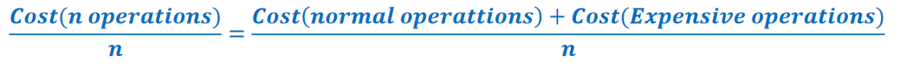

**以动态扩容数组的插入操作为例**

动态扩容的数组是Java中ArrayList和CPP中Vector的底层实现原理。

- 如果插入元素后数组大小足够则不扩容
- 如果插入元素后数组大小不够则将数组容量扩大到2倍(或1.5倍)
- **扩容**：通过先新创建一个大小为原来二倍的新数组，再将原来数组的元素按照顺序拷贝到新数组中

如果我们使用简单分析方法，单次插入操作的最坏情况时间复杂度是 𝑂(𝑛)。通过均摊分析，我们可以更准确地计算平均每次插入操作的时间复杂度。

**均摊分析的三种方法**

#### 聚合分析(Aggregate Analysis)

聚合分析是最简单的一种均摊分析方法。它直接计算一系列操作的总成本，然后将总成本平均分摊到每个操作上。

- **不考虑扩容的情况下每次插入的成本都是O(1)**
- **考虑扩容的情况下每次插入的成本则是O(n)**

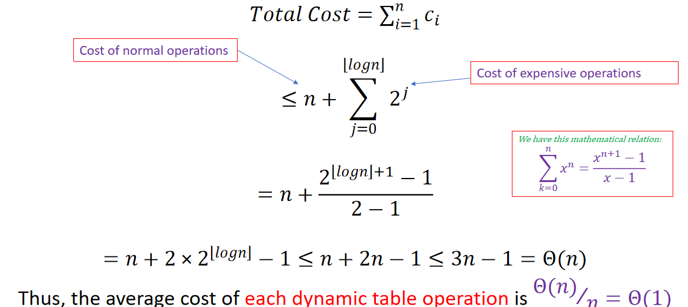

**算法流程**
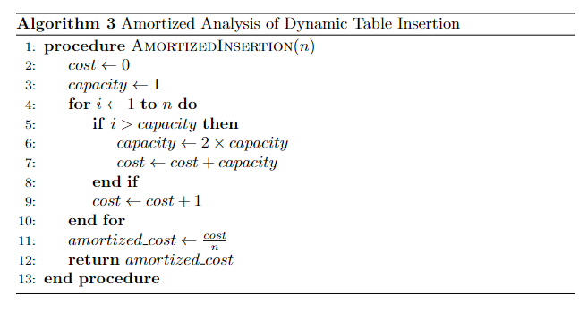

#### 记账方法(Accounting Method)

**记账法是一种将每次操作的成本分摊到一系列操作中的方法。** 通过对每次操作进行“记账”，我们可以确保即使某些操作成本较高，但整体上每次操作的平均成本是合理的。

**使用记账法分析动态数组插入操作**
我们将通过记账法来分析插入操作的均摊时间复杂度。记账法的基本思路是为每次操作分配一个虚拟费用，这个费用可能高于或低于实际成本。我们会为每次插入操作分配一个统一的费用，以支付扩展操作的高成本。

##### 具体步骤

- **分配费用**
    为每次插入操作分配固定费用，假设为3个单位。

- **处理正常插入**
    如果数组未满，插入操作的实际成本是1个单位，剩下的2个单位存入“余额”。
- **处理扩展插入**
    如果数组已满，还要为每次复制操作支付1个单位。

假设我们有一个动态数组，初始容量为1，插入4个元素。

**第1次插入：**

- 分配费用3
- 数组未满，需要插入1个单位，实际成本1
- 存入余额2
- 余额剩余2
- 初始容量0，最大容量1
- 插入后剩余容量0

**第2次插入：**

- 分配费用3
- 数组已满，需要复制1个单位并插入一个单位，实际成本2
- 存入余额1
- 余额剩余3
- 初始容量1，最大容量1
- 扩容后最大容量2
- 插入后剩余容量0

**第3次插入：**

- 分配费用3
- 数组已满，需要复制2个单位并插入一个单位，实际成本3
- 存入余额0
- 余额剩余3
- 初始容量2，最大容量2
- 扩容后最大容量4
- 插入后剩余容量1

**第4次插入：**

- 分配费用3
- 数组未满，需要插入一个单位，实际成本1
- 存入余额2
- 余额剩余5
- 初始容量3，最大容量4
- 不需要扩容
- 插入后剩余容量0


**第5次插入：**

- 分配费用3
- 数组已满，需要复制4个单位并插入一个单位，实际成本5
- 存入余额-2
- 余额剩余3
- 初始容量4，最大容量4
- 扩容后最大容量8
- 插入后剩余容量3

**第6次插入：**

- 分配费用3
- 数组未满，需要插入一个单位，实际成本1
- 存入余额2
- 余额剩余5
- 初始容量5，最大容量8
- 不需要扩容
- 插入后剩余容量2

**通过上述步骤，我们可以看到每次插入的均摊费用为3就可以保证了每次都可以插入。**
均摊分析证明了在动态数组中，**插入操作的均摊时间复杂度为 𝑂(1),与数据规模无关**


**算法流程**

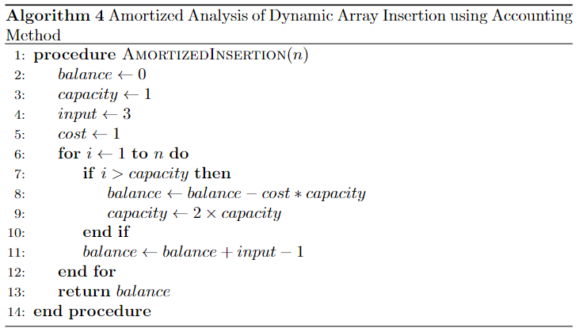


#### 势能法(Potential Method)

**势能法是均摊分析的一种技术，它通过引入一个势能函数（Potential Function）来分析算法或数据结构在一系列操作中的均摊时间复杂度。** 势能函数表示数据结构在某个状态下的“能量”或“势能”。势能法通过分析势能的变化来计算每次操作的均摊成本。

##### 概念

**1.势能函数 Φ**

- **势能函数 Φ(𝐷)** 定义为数据结构 𝐷在某个状态下的势能。

势能函数的选择依赖于具体的问题，并且需要满足两个条件：

- 势能函数的初始值为0。
- 在任何状态下，势能函数的值非负。

**2.实际成本与均摊成本**

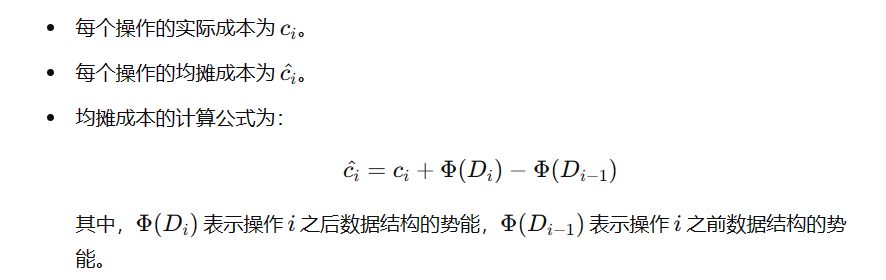


**使用势能法分析动态数组插入操作**

##### 具体步骤

**定义势能函数**

为了使用势能法，我们定义势能函数 Φ(D) 为动态数组当前使用的空间与总容量之差，即：
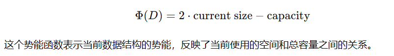

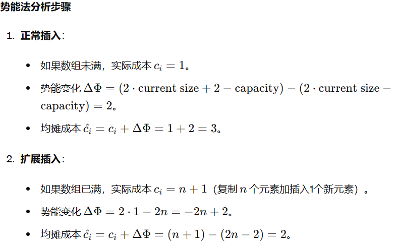

**假设我们有一个动态数组，初始容量为1，需要插入4个元素。**

**第1次插入：**

- size=1,capacity=1,cost=1
- Φ(D)=2 x size-capacity=1
- Φ(1)-Φ(0)=1
- cost_act=cost+Φ(1)-Φ(0)=2

**第2次插入：**

- size=2,capacity=2,cost=2
- Φ(D)=2 x size-capacity=2
- Φ(2)-Φ(1)=1
- cost_act=cost+Φ(2)-Φ(1)=3

**第3次插入：**

- size=3,capacity=4,cost=3
- Φ(D)=2 x size-capacity=2
- Φ(3)-Φ(2)=0
- cost_act=cost+Φ(3)-Φ(2)=3

**第4次插入：**

- size=4,capacity=4,cost=1
- Φ(D)=2 x size-capacity=4
- Φ(4)-Φ(3)=2
- cost_act=cost+Φ(4)-Φ(3)=3

**以此类推，实际消耗始终为3，平均时间复杂度常数级别,与数据规模无关**

**算法流程**

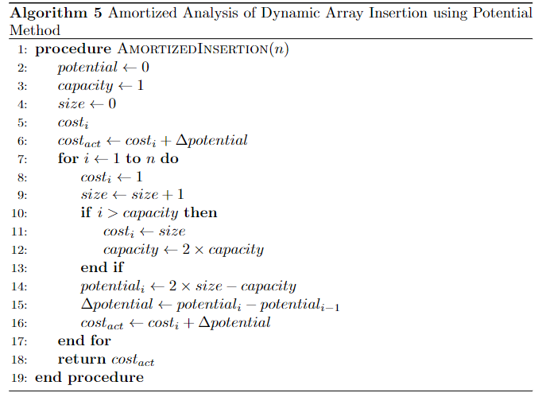


## 五. 递归算法的复杂度计算


### 1.迭代法(The iteration Method)

**迭代法（Iteration Method）** 是求解递归关系的一种方法，通过不断展开递归关系，直到识别出一个模式，并最终找到**闭式解（closed-form solution）**。迭代法的核心思想是将递归关系逐步展开，直到可以直接求解出时间复杂度。

#### **迭代法的步骤**
- 写出递归关系：首先，根据算法写出其递归关系。
- 展开递归关系：将递归关系展开若干次，直至识别出一个规律或模式。
- 识别模式：通过观察展开后的形式，识别递归展开的模式。
- 求解模式：根据识别出的模式，求解出递归关系的闭式解。

#### 举例

##### **Example-1**

计算递归求和的时间复杂度

**递归关系**
\[T(n)=\begin{cases}T(n-1)+1,n>1\\1,n=1\end{cases}\]

**展开递归关系**
\[T(n)=T(n-1)+1\\=T(n-2)+2\\
=T(n-3)+3\\...\\=T(1)+n-1\]

**识别模式**
\[T(n)=1+(n-1)\]

**结论**
\[T(n)=n\]
**复杂度**
\[O(n)\]

##### **Example-2**

计算T(n) = n + 2T(n/2)的时间复杂度

**递归关系**
\[T(n)=\begin{cases}
2 \times T(\frac{n}{2})+n,n>=2\\
1,n=1\end{cases}\]

**展开递归关系**
\[T(n)=2 \times T(\frac{n}{2})+n
= 2 \times (2 \times T(\frac{n}{4})+\frac{n}{2})+n\\
=4 \times T(\frac{n}{4})+2 \times n=...\\
=2^{k} \times T(\frac{n}{2^{k}})+k \times n
\]

**识别模式**
\[\frac{n}{2^{k}}=1—>k=log_{2}n\]

**得出结论**
\[T(n)=n \times T(1)+nlog_{2}n=n+nlog_{2}n\]

**复杂度**
\[O(nlogn)\]

##### **Example-3**

计算T(n) = 1 + 2T(n/2)的时间复杂度

**递归关系**
\[T(n)=\begin{cases}
 T(\frac{n}{2})+1,n>=2\\
1,n=1\end{cases}\]

**展开递归关系**
\[T(n)=T(\frac{n}{2})+1
= (T(\frac{n}{4})+1)+1\\
=T(\frac{n}{4})+2 =...\\
=T(\frac{n}{2^{k}})+k 
\]

**识别模式**
\[\frac{n}{2^{k}}=1—>k=log_{2}n\]

**得出结论**
\[T(n)=\times T(1)+nlog_{2}n=nlog_{2}n\]

**复杂度**
\[O(logn)\]

### 2.替代法(Substitution Method)

### 3.主定理(Master Theorem)


**主定理 (Master Theorem)** 提供了一种简便的方法来求解递归算法的时间复杂度。

**对于递归关系式：**
\[
T(n) = a \times T\left(\frac{n}{b}\right) + f(n)
\]

**其中：**
- \( a \geq 1 \) 和 \( b > 1 \)，\(a\) 和 \(b\) 都是常数。
- \( f(n) \) 是非递归函数。
- \( c = \log_b a \) 是用来表示 \( n^{\log_b a} \) 的指数，即递归部分函数的增长速度的基准。


**根据主定理的解：**
\[
T(n) = 
\begin{cases}
O(n^c), & \text{if } f(n) = O(n^{c-\epsilon}), \text{ for some } \epsilon > 0 \\
O(n^c \log n), & \text{if } f(n) = \Theta(n^c) \\
O(f(n)), & \text{if } f(n) = \Omega(n^{c+\epsilon}), \text{ for some } \epsilon > 0, \text{ and if } af\left(\frac{n}{b}\right) \leq cf(n) \text{ for some } c < 1
\end{cases}
\]

#### 例子


    
### 4.递归树法(Recursion Tree Method)


