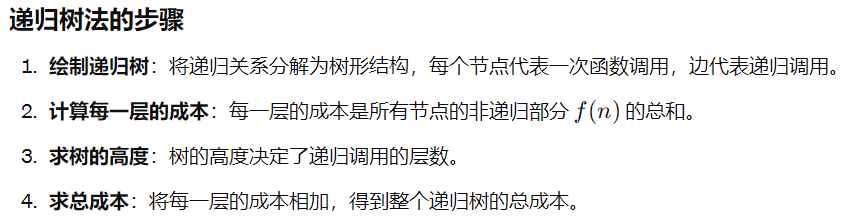
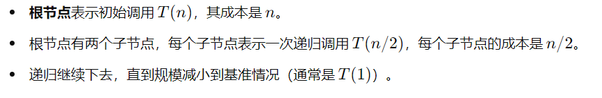
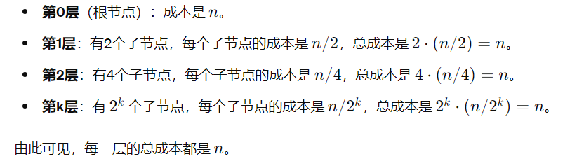
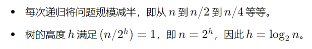
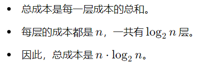
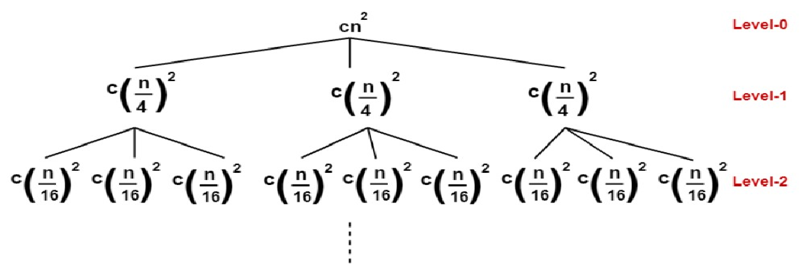
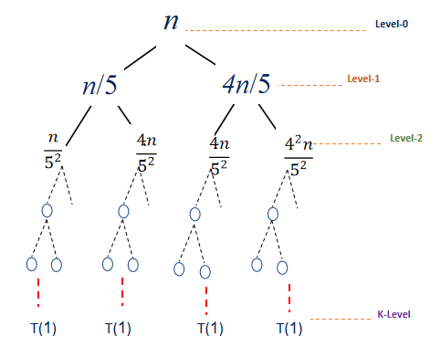

# 递归树法(Recursion Tree Method)


**递归树法（Recurrence Tree Method）** 是一种用来分析递归关系时间复杂度的直观方法。通过将递归关系可视化为树结构，可以更容易地理解和计算递归算法的总成本。

递归树法特别适用于形如 **T(n)=aT(n/b)+f(n)** 的递归关系



## 示例
---
### 使用递归树分析求解时间复杂度
\[T(n)=2T(\frac{n}{2})+n\]

#### **1.绘制递归树**



```
           n
         /   \
       n/2   n/2
      /  \   /  \
    n/4  n/4 n/4 n/4
   ...   ...  ...  ...
```

#### **2.计算每层的成本**



#### **3.求树的高度**



#### **4.计算总成本**



#### 结论
\[T(n) \in O(nlogn)\]

---
### 使用递归树分析求解时间复杂度

\[T(n)=3T(\frac{n}{4})+cn^2\]

#### 1.绘制递归树



#### 2.计算每层成本

\[level-0 \gets 3^0\times c \times (\frac{n}{4^0})^2\]
\[level-1 \gets 3^1\times c \times (\frac{n}{4^1})^2\]
\[level-2 \gets 3^2\times c \times (\frac{n}{4^2})^2\]
\[level-n \gets 3^n\times c \times (\frac{n}{4^n})^2\]
\[cost_{i}=cn^2\times (\frac{3}{16})^{i}\]

#### 3.计算树的深度 K

\[\frac{n}{4^k} =1 \to n=4^{k} \to k = log_{4}n \]

#### 4.计算总成本

\[T(n) =\sum_{i=0}^{log_4 n}cost_i = cn^2 \times \sum_{i=0}^{log_4 n}(\frac{3}{16})^i\]
\[T(n)=cn^2 \times (1+(\frac{3}{16})^1+(\frac{3}{16})^2+.....+(\frac{3}{16})^{log_{4}n})\]
\[T(n)=cn^2 \times \frac{1-(\frac{3}{16})^{log_4 n}}{1-\frac{3}{16}}=\frac{16}{13}cn^2 \]


#### 结论
\[T(n) = \Theta(n^2) \]

---
### 使用递归树分析求解时间复杂度


\[T(n) =T(\frac{n}{5})+T(\frac{4n}{5})+n\]

#### 1.绘制递归树



#### 2.计算每层成本

\[level-0 \gets n\]
\[level-1 \gets n\]
\[level-n \gets n\]
\[cost \gets n\]

#### 3.计算树的深度

\[(\frac{4}{5})^k \times n =1 \to k=log_{\frac{5}{4}}n \]

#### 4.计算总成本

\[T(n)=\sum_{i=0}^{log_{\frac{5}{4}}n} n\]
\[T(n)=\underbrace{n+n+n+...+n}_{log_{\frac{5}{4}}n+1}=n \times log_{\frac{5}{4}}n+n\]

#### 结论

\[T(n)=\Theta (nlogn)\]